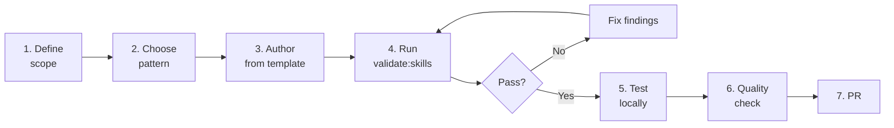

# 07. Extension Patterns - Extending the BMad Framework

> ⚠️ **UNOFFICIAL THIRD-PARTY DOCUMENTATION**
> NOT official BMad docs. See [DISCLAIMER.md](DISCLAIMER.md) | Licensed MIT — see [LICENSE](LICENSE) and [NOTICE](NOTICE)
> Official BMAD-METHOD: <https://github.com/bmad-code-org/BMAD-METHOD>

---

> Detailed guide to extending the framework: new skills, new agents, new modules, customization overrides, new IDEs, new validation rules. Includes complete examples.

---

## Table of Contents

1. [General process](#1-general-process)
2. [Pattern 1: Adding a new Skill (workflow-skill)](#2-pattern-1-adding-a-new-skill-workflow-skill)
3. [Pattern 2: Adding a new Agent persona](#3-pattern-2-adding-a-new-agent-persona)
4. [Pattern 3: Adding a brand-new Module](#4-pattern-3-adding-a-brand-new-module)
5. [Pattern 4: Customizing an existing skill](#5-pattern-4-customizing-an-existing-skill)
6. [Pattern 5: Adding IDE support](#6-pattern-5-adding-ide-support)
7. [Pattern 6: Adding a validation rule](#7-pattern-6-adding-a-validation-rule)
8. [Pattern 7: Writing a sub-agent prompt](#8-pattern-7-writing-a-sub-agent-prompt)
9. [Pattern 8: Adding an external module (registry)](#9-pattern-8-adding-an-external-module-registry)
10. [Common pitfalls & how to avoid them](#10-common-pitfalls--how-to-avoid-them)
11. [Testing checklist for extensions](#11-testing-checklist-for-extensions)

---

## 1. General process

Whichever extension pattern you pick, the process is always the same:



### 1.1 Before starting

1. **Discord discussion** (for large features) — CONTRIBUTING.md requires consulting a maintainer first
2. **Search existing skills** — a skill that does something similar may already exist
3. **Determine scope**:
   - Single function? → skill
   - Persona + menu? → agent
   - Bundle of skills + agents? → module
   - Customize behavior? → TOML override (no new skill required)

### 1.2 Validation workflow

```bash
# Run after every major change
npm run validate:skills path/to/your-skill
npm run validate:refs

# Full quality check before PR
npm run quality
```

---

## 2. Pattern 1: Adding a new Skill (workflow-skill)

### 2.1 Scope

A skill is a **single unit of work** — the user invokes it, it performs one task, and it completes.

Use when:
- The feature is discrete (no persona needed)
- Reusable across agents
- Can be invoked from an agent menu

### 2.2 Directory template

```
src/bmm-skills/4-implementation/bmad-my-skill/
├── SKILL.md                       # Required
├── workflow.md                    # Required
└── steps/                         # Optional
    ├── step-01-init.md
    ├── step-02-execute.md
    └── step-03-finalize.md
```

### 2.3 Step-by-step

**Step 1:** Create the directory (the name must match the `name` frontmatter)

```bash
mkdir -p src/bmm-skills/4-implementation/bmad-my-skill/steps
```

**Step 2:** Write `SKILL.md`

```yaml
---
name: bmad-my-skill
description: 'Generate weekly sprint retrospective summary from sprint-status.yaml. Use when the user says "weekly summary" or "sprint digest".'
---

Follow the instructions in ./workflow.md.
```

**Rules:**
- `name` regex: `^bmad-[a-z0-9]+(-[a-z0-9]+)*$` ✅ `bmad-my-skill`
- `description` must contain a **"Use when"** clause
- The body redirects to workflow.md

**Step 3:** Write `workflow.md`

```yaml
---
start_date: ''
end_date: ''
---

# Weekly Sprint Summary Workflow

**Goal:** Generate a weekly summary from sprint-status.yaml

**Your Role:** You are a scrum master preparing sprint digest for stakeholders.
Communicate in {communication_language}, output in {document_output_language}.

---

## INITIALIZATION

### Configuration Loading
Load config from `{project-root}/_bmad/bmm/config.yaml` and resolve:
- `project_name`, `user_name`
- `communication_language`, `document_output_language`
- `implementation_artifacts`
- `date` as system-generated current datetime

### Paths
- `sprint_status` = `{implementation_artifacts}/sprint-status.yaml`
- `summary_output_file` = `{implementation_artifacts}/sprint-summary-{{date}}.md`

---

## EXECUTION

Read fully and follow: `./steps/step-01-load-status.md`
```

**Step 4:** Write the steps

`steps/step-01-load-status.md`:

```markdown
# Step 01: Load Sprint Status

## YOUR TASK
Load sprint-status.yaml and parse development_status.

## ACTION

1. Read file `{sprint_status}`
2. Parse YAML structure
3. Extract:
   - Total stories
   - Stories by status (ready-for-dev, in-progress, review, done)
   - Recently completed stories (last 7 days)
   - Blockers
4. Store extracted data as `{{sprint_data}}`

## HALT CONDITIONS

- File `{sprint_status}` not found → HALT: "No sprint status file. Run bmad-sprint-planning first."

## NEXT

Read fully and follow: `./step-02-analyze-progress.md`
```

`steps/step-02-analyze-progress.md`:

```markdown
# Step 02: Analyze Progress

## YOUR TASK
Analyze sprint progress and identify patterns.

## ACTION

1. Calculate completion percentage
2. Identify velocity (stories done / time)
3. Flag at-risk stories (in-progress > 3 days)
4. Find blockers
5. Store analysis as `{{progress_analysis}}`

## NEXT

Read fully and follow: `./step-03-generate-summary.md`
```

`steps/step-03-generate-summary.md`:

```markdown
# Step 03: Generate Summary Document

## YOUR TASK
Generate markdown summary from sprint_data + progress_analysis.

## ACTION

Create `{summary_output_file}` with structure:

```markdown
# Sprint Summary - {{date}}

## Overview
- Total stories: {{total}}
- Completed this week: {{completed_count}}
- In progress: {{in_progress_count}}
- Blocked: {{blocked_count}}

## Completed Stories
- {{story_1}}: {{description}}
- {{story_2}}: {{description}}

## At-Risk Stories
- {{story_x}}: blocked for {{days}} days — {{reason}}

## Next Week Focus
{{recommendations}}
```

Then confirm with user and offer to send to Slack/email (out of scope).

## NEXT

Workflow complete. Present summary to user.
```

**Step 5:** Validate

```bash
node tools/validate-skills.js src/bmm-skills/4-implementation/bmad-my-skill --strict
```

If validation fails, address the findings. Each finding includes a `suggestion` field.

**Step 6:** Register in module.yaml (optional — only if you want it installed alongside BMM)

Edit `src/bmm-skills/module.yaml`:

```yaml
# If you want Amelia to invoke this skill:
# Add a menu item to bmad-agent-dev/customize.toml:

# src/bmm-skills/4-implementation/bmad-agent-dev/customize.toml
[[agent.menu]]
code = "WS"
description = "Generate weekly sprint summary"
skill = "bmad-my-skill"
```

**Step 7:** Quality check

```bash
npm run quality
```

All checks must pass: format, lint, docs-build, test:install, validate:refs, validate:skills.

### 2.4 Checklist

- [ ] Directory name = `bmad-*` matches `name:` frontmatter
- [ ] `description` contains "Use when..."
- [ ] `workflow.md` loads config, declares paths, executes the first step
- [ ] Steps numbered `step-NN-*.md`, each step has NEXT (except the final one)
- [ ] No absolute paths
- [ ] No reaching into another skill's folder (PATH-05)
- [ ] `npm run validate:skills --strict` passes
- [ ] Registered in module.yaml or an agent menu (if required)

---

## 3. Pattern 2: Adding a new Agent persona

### 3.1 Scope

An agent is a **persona with a menu of skills**. It has identity, communication style, and principles.

### 3.2 Template

```
src/bmm-skills/N-phase/bmad-agent-security/
├── SKILL.md
├── workflow.md          # Generic agent activation workflow
└── customize.toml       # Persona + menu
```

### 3.3 Step-by-step

**Step 1:** Create the directory

```bash
mkdir -p src/bmm-skills/4-implementation/bmad-agent-security
```

**Step 2:** Write `SKILL.md`

```yaml
---
name: bmad-agent-security
description: 'Activate Sam the Security Expert. Threat modeling, OWASP rigor, dependency audits. Use when user says "talk to Sam" or "request security expert".'
---

Follow the instructions in ./workflow.md.
```

**Step 3:** Write `workflow.md`

The standard agent workflow has 8 steps (per the analysis above):

```markdown
# Sam - Security Expert Activation

**Goal:** Activate Sam persona for security-focused work.

---

## INITIALIZATION

### Configuration Loading
Load config from `{project-root}/_bmad/core/config.yaml` and `_bmad/bmm/config.yaml`:
- `user_name`, `communication_language`, `document_output_language`
- `planning_artifacts`, `implementation_artifacts`, `project_knowledge`
- `date`

### Paths
- `project_context` = `**/project-context.md` (load if exists)

---

## EXECUTION

### Step 1: Resolve Agent Configuration
Invoke resolver:
```bash
python3 {project-root}/_bmad/scripts/resolve_customization.py \
  --skill {skill-root} \
  --key agent
```
Parse merged agent block: persona + menu.

### Step 2: Execute Prepend Hooks
Run all `activation_steps_prepend` from merged config.

### Step 3: Adopt Persona
Adopt identity:
- Name: {{agent.name}}
- Title: {{agent.title}}
- Role: {{agent.role}}
- Communication style: {{agent.communication_style}}
- Principles: {{agent.principles}}

Use {{agent.icon}} prefix for all messages.

### Step 4: Load Persistent Facts
For each entry in `{{agent.persistent_facts}}`:
- If `file:` prefix → expand glob, load content
- If literal → treat as fact

Inject as always-true knowledge.

### Step 5: Load User Config
- Switch to `{communication_language}` for chat
- Remember `{user_name}` for addressing

### Step 6: Greet
Output in `{communication_language}`:
```
{{agent.icon}} Hello {user_name}! I'm {{agent.name}}, your {{agent.title}}.

[Brief intro based on role...]
```

### Step 7: Execute Append Hooks
Run all `activation_steps_append`.

### Step 8: Dispatch
- If user intent clear → invoke matching skill directly
- Else → render menu:

```
What can I help with?

  [TM] Threat model the current feature
  [SA] Security audit of dependencies
  [VR] Vulnerability review of code
  [CC] Compliance check against standard
  [EX] Exit to main

Type the code or describe what you need:
```

Wait for user input (HALT).

When user provides input:
- If code matches menu item:
  - If `skill:` field → Invoke the `<skill-name>` skill
  - If `prompt:` field → Execute prompt
- Else → try infer intent, re-present menu if unclear
```

**Step 4:** Write `customize.toml`

```toml
[agent]
name = "Sam"
title = "Security Expert"
icon = "🛡️"
role = "Threat modeling, security audits, OWASP rigor. Protect the app from attackers and accidents."
identity = "Channels bug bounty hunter skepticism and compliance engineer rigor."
communication_style = "Precise, evidence-based. Questions follow CIA triad: confidentiality, integrity, availability."

principles = [
  "Defense in depth — never rely on single control.",
  "Validate inputs at trust boundaries, not internals.",
  "Assume breach. Minimize blast radius.",
  "Compliance is baseline, not goal.",
  "Every dependency is attack surface.",
]

persistent_facts = [
  "file:{project-root}/**/project-context.md",
  "file:{project-root}/docs/security/*.md",
  "OWASP Top 10 is the baseline, not ceiling.",
]

activation_steps_prepend = []
activation_steps_append = [
  "If PRD exists in {planning_artifacts}/prd.md, offer to threat-model it.",
]

[[agent.menu]]
code = "TM"
description = "Threat model the current feature or architecture"
skill = "bmad-threat-model"

[[agent.menu]]
code = "SA"
description = "Security audit of dependencies (SCA)"
skill = "bmad-security-audit-deps"

[[agent.menu]]
code = "VR"
description = "Vulnerability review of pending code changes"
skill = "bmad-security-review"

[[agent.menu]]
code = "CC"
description = "Compliance check against standard (SOC2, HIPAA, PCI-DSS)"
skill = "bmad-compliance-check"

[[agent.menu]]
code = "EX"
description = "Exit to main BMad interface"
prompt = "Returning to main BMad interface. Call /bmad-agent-security anytime to bring Sam back."
```

**Step 5:** Register in `src/bmm-skills/module.yaml`

```yaml
agents:
  # ... existing agents
  - code: bmad-agent-security
    name: Sam
    title: Security Expert
    icon: "🛡️"
    team: software-development
    description: "Threat modeling, OWASP rigor, dependency audits. Channels bug bounty hunter skepticism."
```

**Step 6:** (Optional) Create the skills listed in the menu

Each skill in the menu (`bmad-threat-model`, `bmad-security-audit-deps`, etc.) is its own skill (Pattern 1). If it doesn't exist yet, create a placeholder or reuse an existing one.

**Step 7:** Validate + test

```bash
node tools/validate-skills.js src/bmm-skills/4-implementation/bmad-agent-security --strict
npm run quality
```

### 3.4 Key decisions when crafting the persona

1. **Name** — easy to pronounce, does not clash with existing names (Mary, John, Sally, Winston, Amelia, Paige)
2. **Icon** — a single representative emoji (🛡️ for security)
3. **Communication style** — a concrete metaphor ("Precise bug hunter", "Paranoid auditor")
4. **Principles** — 3-7 items, specific enough to shape behavior
5. **Menu codes** — 2-letter, intuitive (TM, SA, VR, CC, EX)

---

## 4. Pattern 3: Adding a brand-new Module

### 4.1 Scope

A module is a **bundle of skills + agents + config** that packages a single domain.

Examples: `bmad-tea` (Test Experience Automation), `bmad-bmb` (BMad Builder), `bmad-security` (Security module).

### 4.2 Template

```
src/security-skills/              # Directory name
├── module.yaml                    # Required
├── 1-planning/
│   ├── bmad-agent-security/       # Persona
│   └── bmad-threat-model/         # Skill
├── 2-execution/
│   ├── bmad-security-audit-deps/
│   └── bmad-security-review/
└── 3-compliance/
    └── bmad-compliance-check/
```

### 4.3 Step-by-step

**Step 1:** Create the module directory

```bash
mkdir -p src/security-skills/{1-planning,2-execution,3-compliance}
```

**Step 2:** Write `module.yaml`

```yaml
code: security
name: "BMad Security Module"
description: "Threat modeling, security audits, compliance checks"
default_selected: false             # Do not auto-install

# Inherit from core (user_name, language, output_folder - already declared)

# Custom config variables
security_artifacts:
  prompt: "Where should security artifacts be stored (threat models, audit reports)?"
  default: "{output_folder}/security-artifacts"
  result: "{project-root}/{value}"

compliance_standard:
  prompt: "Target compliance standard?"
  scope: user
  default: "none"
  result: "{value}"
  single-select:
    - value: "none"
      label: "None (general security)"
    - value: "soc2"
      label: "SOC 2"
    - value: "hipaa"
      label: "HIPAA"
    - value: "pci-dss"
      label: "PCI-DSS"

# Directories installer creates
directories:
  - "{security_artifacts}"

# Agents
agents:
  - code: bmad-agent-security
    name: Sam
    title: Security Expert
    icon: "🛡️"
    team: security
    description: "Threat modeling, OWASP rigor..."

# Post-install notes
post-install-notes:
  compliance_standard:
    soc2: |
      SOC 2 compliance selected. Run /bmad-agent-security then [CC] for compliance scan.
    hipaa: |
      HIPAA compliance selected. HIPAA-specific threat model skills enabled.
    pci-dss: |
      PCI-DSS compliance selected. Payment data handling rules active.
```

**Step 3:** Create the skills inside the module

Following Pattern 1 (skills) or Pattern 2 (agent), create:
- `1-planning/bmad-agent-security/` (Pattern 2)
- `1-planning/bmad-threat-model/` (Pattern 1)
- `2-execution/bmad-security-audit-deps/` (Pattern 1)
- `2-execution/bmad-security-review/` (Pattern 1)
- `3-compliance/bmad-compliance-check/` (Pattern 1)

**Step 4:** Register the module

**Option A: Local private module**

When the user installs, pass the custom source:
```bash
npx bmad-method install --custom-source /path/to/security-module
```

**Option B: Git private module**

```bash
npx bmad-method install --custom-source https://github.com/your-org/security-module
```

**Option C: Official BMad community module**

1. Fork the `bmad-plugins-marketplace` repo
2. Edit `registry/official.yaml`:
   ```yaml
   modules:
     # ... existing
     - name: security
       code: security
       display_name: "BMad Security Module"
       description: "Threat modeling, security audits"
       repository: "https://github.com/your-org/bmad-security-module"
       module_definition: "src/module.yaml"
       default_selected: false
       type: "community"
   ```
3. Submit a PR to the marketplace

**Step 5:** Test the install

```bash
# Local test
cd /tmp/test-project
git init
npx --package=/path/to/BMAD-METHOD bmad-method install --modules security
```

**Step 6:** Quality

```bash
npm run quality
```

### 4.4 Module vs. Community guidelines

**Choose "community" type if:**
- The module is not core BMad functionality
- It is maintained by a third party
- It may not be available in the future

**Choose "bmad-org" type if:**
- The module is official BMad
- It is maintained by bmad-code-org
- Long-term support is committed

---

## 5. Pattern 4: Customizing an existing skill

### 5.1 Scope

For when you **don't want to modify the framework source** but still need to adjust a skill's behavior for your team or project.

### 5.2 Options

**Option A: User-interactive** (recommended)

```
# Inside the BMad chat
User: "customize bmad"

# Invokes the bmad-customize skill
# The skill walks you through 6 steps
```

**Option B: Manual override file**

### 5.3 Manual override - step by step

**Example: The team uses stricter TDD and wants the Dev agent (Amelia) to prioritize tests >>>**

**Step 1:** Identify the skill

```bash
ls _bmad/skills/bmm/4-implementation/bmad-agent-dev/
# SKILL.md, workflow.md, customize.toml
```

**Step 2:** Review the default `customize.toml`

```toml
# _bmad/skills/bmm/4-implementation/bmad-agent-dev/customize.toml (default)
[agent]
name = "Amelia"
title = "Senior Software Engineer"
icon = "💻"
role = "..."
# ...
principles = [
  "Red, green, refactor — in that order.",
  "100% pass before review.",
  # ...
]
```

**Step 3:** Create the team override file

```bash
touch _bmad/custom/bmad-agent-dev.toml
```

**Step 4:** Write the override (sparse — deltas only)

```toml
# _bmad/custom/bmad-agent-dev.toml (team override)

[agent]
icon = "🧪"                                    # Change the icon

# Append additional principles (not override — append)
principles = [
  "TDD is non-negotiable — tests FIRST, always.",
  "Coverage < 80% → story cannot be marked done.",
  "Mutation testing required for business logic.",
]

# Add persistent_facts (file paths)
persistent_facts = [
  "file:{project-root}/docs/testing-standards.md",
  "All tests must use Vitest (not Jest).",
  "Integration tests use MSW for API mocking.",
]

# Add a new menu item (will be appended)
[[agent.menu]]
code = "MT"
description = "Run mutation tests on recent changes"
skill = "bmad-mutation-test"

# Override an existing menu item (matched by code "CR")
[[agent.menu]]
code = "CR"
description = "Run STRICT code review (TDD-focused)"
skill = "bmad-code-review"
```

**Step 5:** Verify the merge

```bash
python3 _bmad/scripts/resolve_customization.py \
  --skill _bmad/skills/bmm/4-implementation/bmad-agent-dev \
  --key agent
```

Output: the merged agent config as JSON. Verify:
- `icon` = "🧪" (overridden)
- `principles` = base + your 3 additions (appended)
- Menu `CR` replaced, `MT` appended

**Step 6:** Commit

```bash
git add _bmad/custom/bmad-agent-dev.toml
git commit -m "Customize dev agent for strict TDD workflow"
```

Team members automatically receive the customization through git.

### 5.4 Personal override (.user.toml)

If you want a personal tweak that won't be shared with the team:

```bash
# _bmad/custom/bmad-agent-dev.user.toml (gitignored)

[agent]
communication_style = "Ultra-terse. Vietnamese. No pleasantries."

# Vietnamese-first
persistent_facts = [
  "Always respond in Vietnamese unless user explicitly requests English.",
]
```

`.user.toml` overrides the `.toml` (user > team > default).

### 5.5 When to choose which level

| Requirement | Level |
|-------------|-------|
| "Everyone on the team uses TDD" | Team (`{skill}.toml`) |
| "Org-wide security policy" | Team (`{skill}.toml`) |
| "I prefer Vietnamese" | User (`{skill}.user.toml`) |
| "Personal shortcut" | User (`{skill}.user.toml`) |
| "I'm testing a single skill" | User (`{skill}.user.toml`) |

---

## 6. Pattern 5: Adding IDE support

### 6.1 Scope

BMad supports Claude Code, Cursor, JetBrains, and VS Code out of the box. Want to add another IDE?

### 6.2 Step-by-step

**Step 1:** Research the IDE's skill system

- Where is the config file located?
- Where is the skills directory?
- Config format (JSON/YAML)?
- Is URL fetch allowed?

**Step 2:** Edit `tools/platform-codes.yaml`

```yaml
platforms:
  # ... existing
  my-new-ide:
    displayName: "My New IDE"
    preferred: false                  # true if it is popular
    installer:
      configFile: ".myide/skills.json"
      skillsDir: ".myide/skills"
      allowUrlFetch: false
```

**Step 3:** Test

```bash
cd /tmp/test-project
git init
npx --package=/path/to/BMAD-METHOD bmad-method install --tools my-new-ide
```

**Step 4:** Verify IDE integration

- Was the `.myide/skills/` directory created?
- Does `.myide/skills.json` contain the correct entries?
- Does the IDE recognize the skills?

**Step 5:** If the IDE's format differs — override the handler

If `ConfigDrivenIdeSetup` is not flexible enough:

```js
// tools/installer/ide/my-new-ide-setup.js
class MyNewIdeSetup extends ConfigDrivenIdeSetup {
  async generateIdeConfig(configPath, modules) {
    // Custom logic for this IDE
    const config = {
      version: "1.0",
      skills: [],
      // IDE-specific fields
    };
    
    for (const moduleId of modules) {
      // Transform skill metadata to IDE format
    }
    
    await fs.writeFile(configPath, JSON.stringify(config, null, 2));
  }
}
```

Register it in `tools/installer/ide/manager.js`:
```js
if (code === 'my-new-ide') {
  this.handlers.set(code, new MyNewIdeSetup(code, info));
  continue;
}
```

---

## 7. Pattern 6: Adding a validation rule

### 7.1 Scope

A new rule for enforcing a team convention.

### 7.2 Deterministic rule (JS)

**Step 1:** Edit `tools/validate-skills.js`

```js
// Add a check function
function checkWorkflowHasGoal(skillDir, findings) {
  const workflowPath = path.join(skillDir, 'workflow.md');
  if (!fs.existsSync(workflowPath)) return;
  
  const content = fs.readFileSync(workflowPath, 'utf-8');
  const { body } = parseFrontmatterMultiline(content);
  
  if (!body.match(/^\*\*Goal:\*\*/m)) {
    findings.push({
      rule: 'WF-10',
      severity: 'MEDIUM',
      file: workflowPath,
      message: 'workflow.md must include a "**Goal:**" section',
      suggestion: 'Add "**Goal:** [one sentence description]" after # title'
    });
  }
}

// Register in main:
async function main() {
  // ...
  for (const skillDir of skillDirs) {
    // ... existing checks
    checkWorkflowHasGoal(skillDir, findings);
  }
}
```

**Step 2:** Document the rule in `tools/skill-validator.md`

```markdown
### WF-10 - workflow.md Must Have Goal Statement

- **Severity:** MEDIUM
- **Applies to:** `workflow.md`
- **Rule:** workflow.md body must contain `**Goal:**` section stating the workflow's purpose in one sentence.
- **Detection:** Regex `^\*\*Goal:\*\*` in body.
- **Fix:** Add `**Goal:** [one sentence description]` after `# [Workflow Name]` heading.
```

**Step 3:** Test

```bash
node tools/validate-skills.js src/bmm-skills/4-implementation/bmad-dev-story
```

### 7.3 Inference rule (for LLM)

If the rule can't be checked by simple regex:

**Step 1:** Document it in `tools/skill-validator.md` only

```markdown
### WF-11 - Goal Statement Must Be Concrete

- **Severity:** LOW
- **Applies to:** `workflow.md`
- **Rule:** Goal sentence must be actionable + specific. "Helps user" is too vague. "Generates a PRD from a product brief" is good.
- **Detection:** LLM judgment. Look for vague verbs ("helps", "assists", "supports").
- **Fix:** Rephrase with action verb + specific output.
```

**Step 2:** This rule has no JS enforcement — the LLM reviewer reads `skill-validator.md` and applies it.

---

## 8. Pattern 7: Writing a sub-agent prompt

### 8.1 Scope

Sub-agents are used when a skill needs **parallel processing** or **specialized reasoning** without bloating the main workflow.

Example: `bmad-distillator` uses 2 sub-agents:
- `distillate-compressor.md` — compresses content
- `round-trip-reconstructor.md` — verifies losslessness

### 8.2 Template

```
bmad-my-skill/
└── agents/
    └── my-sub-agent.md
```

**my-sub-agent.md:**

```markdown
# Sub-Agent: [Name]

## ROLE
[One-paragraph role description]

## INPUT
You will receive:
- `source_content`: [description]
- `target_output_path`: [description]
- `parameters`: [description]

## YOUR TASK

1. [Step 1]
2. [Step 2]
3. [Step 3]

## OUTPUT FORMAT

Return JSON:
```json
{
  "status": "success" | "error",
  "output_path": "...",
  "metadata": {
    "key": "value"
  }
}
```

## RULES

- [Rule 1]
- [Rule 2]
- HALT if input invalid
```

### 8.3 Invoking the sub-agent from a workflow

Inside a workflow.md step:

```markdown
## ACTION

Spawn sub-agent via Agent tool:
- Description: "Compress document"
- Prompt: "Read fully and apply `{skill-root}/agents/distillate-compressor.md`.
  Input:
  - source_content: {{source_file}}
  - target_output_path: {{output_path}}
  - parameters: {compression_ratio: 0.1}"

Wait for subagent response.
Parse JSON output.
Continue with {{subagent_result.output_path}}.
```

### 8.4 Party mode pattern

`bmad-party-mode` spawns **multiple subagents in parallel**:

```markdown
## ACTION

For each relevant agent (2-4 per round):
- Spawn via Agent tool
- Prompt: "You are {{agent.name}} ({{agent.role}}). 
         Context: {{context_summary}}
         User question: {{user_question}}
         Respond in your voice, unabridged."

Present all responses unfiltered.
```

---

## 9. Pattern 8: Adding an external module (registry)

### 9.1 Scope

Your team's module is public and you want to register it in the community marketplace.

### 9.2 Steps

**Step 1:** Ensure the module is hosted in a public GitHub repo

```
my-org/bmad-security-module/
├── src/
│   └── module.yaml
├── README.md
└── package.json (optional)
```

**Step 2:** Fork `bmad-code-org/bmad-plugins-marketplace`

**Step 3:** Edit `registry/official.yaml`

```yaml
modules:
  # ... existing
  - name: security
    code: security
    display_name: "BMad Security"
    description: "Threat modeling, security audits, compliance"
    repository: "https://github.com/my-org/bmad-security-module"
    module_definition: "src/module.yaml"
    default_selected: false
    type: "community"
    maintainer: "my-org"
    tags: ["security", "compliance", "owasp"]
```

**Step 4:** Open a PR including:
- Module description
- Demo/screenshots
- License (MIT recommended)
- Maintenance commitment

**Step 5:** Wait for review and address feedback.

**Step 6:** After merge, users can install it with:

```bash
npx bmad-method install
# In module selection: "BMad Security" appears under "Community modules"
```

---

## 10. Common pitfalls & how to avoid them

### 10.1 Pitfall: PATH-05 violation

❌ **Wrong:**
```markdown
# skill A's workflow.md
Read the template from: {project-root}/_bmad/skills/bmm/bmad-other-skill/template.md
```

✅ **Right:**
```markdown
Invoke the `bmad-other-skill` skill to generate the template.
```

### 10.2 Pitfall: Hardcoded paths

❌ **Wrong:**
```markdown
Save to: /Users/alice/project/docs/prd.md
```

✅ **Right:**
```markdown
Save to: {planning_artifacts}/prd.md
```

### 10.3 Pitfall: Forward-loading steps

❌ **Wrong step-01-init.md:**
```markdown
## INIT
Load all steps 01-05 into memory then execute in order.
```

✅ **Right:**
```markdown
## ACTION
Do init tasks.

## NEXT
Read fully and follow: `./step-02-execute.md`
```

Each step should load just-in-time.

### 10.4 Pitfall: name != directory

❌ **Wrong:**
```
src/bmm-skills/4-implementation/mySkill/    # camelCase directory
└── SKILL.md frontmatter: name: bmad-my-skill   # kebab-case name
```

Validator SKILL-05 fails.

✅ **Right:** directory `bmad-my-skill/`, name `bmad-my-skill`.

### 10.5 Pitfall: Menu items without code

❌ **Wrong:**
```toml
[[agent.menu]]
description = "Do something"
skill = "bmad-x"
# ← no code field!
```

✅ **Right:**
```toml
[[agent.menu]]
code = "DS"                    # Required for keyed merge
description = "Do something"
skill = "bmad-x"
```

### 10.6 Pitfall: Description missing "Use when"

❌ **Wrong:**
```yaml
description: 'Helps with brainstorming.'
```

✅ **Right:**
```yaml
description: 'Facilitate brainstorming sessions. Use when the user says "help me brainstorm" or "help me ideate".'
```

### 10.7 Pitfall: Too many / too few steps

- **< 2 steps**: no need for micro-files, inline them in workflow.md
- **> 10 steps**: too complex — split into multiple skills

STEP-07: the sweet spot is **2-10 steps**.

### 10.8 Pitfall: Time estimates

❌ **Wrong:**
```markdown
## Step 02: Discovery (approx. 5 minutes)
```

✅ **Right:**
```markdown
## Step 02: Discovery
```

SEQ-02: AI has changed dev speed, so time estimates go stale quickly.

---

## 11. Testing checklist for extensions

### 11.1 Pre-PR checklist

- [ ] `npm run validate:skills --strict` passes
- [ ] `npm run validate:refs --strict` passes
- [ ] `npm run lint` passes
- [ ] `npm run lint:md` passes
- [ ] `npm run format:check` passes
- [ ] `npm run test:install` passes
- [ ] `npm run docs:build` succeeds
- [ ] `npm run quality` succeeds
- [ ] Manual test: install on a fresh project and verify the skill works

### 11.2 Manual testing

**Test a fresh install:**
```bash
cd /tmp
rm -rf test-project
mkdir test-project && cd test-project
git init

# Install with your module
npx --package=/path/to/BMAD-METHOD bmad-method install --modules core,your-module --tools claude-code
```

**Test skill execution:**
- Open Claude Code in test-project
- Invoke your skill (`/bmad-my-skill` or through an agent menu)
- Verify output files are created at the correct paths
- Verify config variables are resolved

**Test customization:**
- Create `_bmad/custom/your-skill.toml` with an override
- Re-run the skill
- Verify the override is applied

**Test update:**
```bash
# Re-install with modified source
npx --package=/path/to/BMAD-METHOD bmad-method install --action update
```
- Verify customizations are preserved
- Verify new default changes are applied

### 11.3 Edge case tests

- [ ] Empty input (no project-root, no _bmad/)
- [ ] Missing required config variable
- [ ] Circular TOML override reference
- [ ] Glob patterns that match 0 files
- [ ] Very long descriptions (1024 char limit)
- [ ] Unicode in variables (Vietnamese, Chinese)
- [ ] Paths with spaces
- [ ] Multi-language (communication_language ≠ document_output_language)

### 11.4 CI integration

CI (`.github/workflows/quality.yaml`) runs `npm run quality`. PRs fail if:
- Skill validation fails (HIGH+)
- Reference validation fails
- Lint errors
- Format issues
- Test failures

Fix these locally before pushing.

---

## Summary

The 8 extension patterns:

| # | Pattern | When to use | Complexity |
|---|---------|-------------|-----------|
| 1 | Skill workflow | Discrete feature | ⭐⭐ |
| 2 | Agent persona | Persona + menu | ⭐⭐⭐ |
| 3 | New module | Domain bundle | ⭐⭐⭐⭐ |
| 4 | Customize a skill | Tweak an existing one | ⭐ |
| 5 | IDE support | New IDE | ⭐⭐⭐ |
| 6 | Validation rule | Enforce a convention | ⭐⭐ |
| 7 | Sub-agent prompt | Parallel processing | ⭐⭐⭐ |
| 8 | External module | Registry | ⭐⭐⭐⭐ |

**Golden rules:**
1. Validate early, validate often
2. Use existing skills before creating new ones
3. Customize before modifying source
4. Discuss on Discord before submitting a large PR
5. Test on a fresh project, not just the dev repo

---

**Continue reading:** [README.md](README.md) — Master index for the entire developer documentation.
