# 10. Maintainer Diagrams - 10 Mermaid Diagrams

> ⚠️ **UNOFFICIAL THIRD-PARTY DOCUMENTATION**
> NOT official BMad docs. See [DISCLAIMER.md](DISCLAIMER.md) | Licensed MIT — see [LICENSE](LICENSE) and [NOTICE](NOTICE)
> Official BMAD-METHOD: <https://github.com/bmad-code-org/BMAD-METHOD>

---

> Diagrams for maintainers diving deep into the installer, validator, and build pipeline architecture. Use when debugging or rewriting.

---

## Table of Contents

1. [Installer state machine (detect → prepare → install → restore)](#1-installer-state-machine)
2. [File-level data flow in the installer](#2-file-level-data-flow-in-the-installer)
3. [Resolver algorithm flowchart (keyed merge vs append)](#3-resolver-algorithm-flowchart)
4. [Validator execution flow](#4-validator-execution-flow)
5. [IDE handler class hierarchy + sequence](#5-ide-handler-class-hierarchy--sequence)
6. [External module lifecycle](#6-external-module-lifecycle)
7. [Skill invocation sequence (agent ↔ skill ↔ sub-skill ↔ Agent tool)](#7-skill-invocation-sequence)
8. [Backup-restore flow during update](#8-backup-restore-flow-during-update)
9. [Customization merge visualization](#9-customization-merge-visualization)
10. [package.json scripts dependency graph](#10-packagejson-scripts-dependency-graph)

---

## 1. Installer state machine

Detailed 8-phase install with error paths.

```mermaid
stateDiagram-v2
    [*] --> Start
    
    Start: bmad install command
    BuildConfig: Build Config<br/>(immutable, frozen)
    BuildPaths: Create InstallPaths<br/>(bmadDir, configDir, customDir)
    DetectExisting: Detect existing<br/>ExistingInstall.detect()
    
    Start --> BuildConfig
    BuildConfig --> BuildPaths
    BuildPaths --> DetectExisting
    
    DetectExisting --> FreshInstall: No existing
    DetectExisting --> UpdateCheck: Existing found
    
    state UpdateCheck {
        [*] --> RemoveDeselected
        RemoveDeselected: Remove deselected modules<br/>fs.remove(moduleDir)
        PrepareState: Prepare update state<br/>detectCustomFiles + backup
        RemoveIDEs: Remove deselected IDEs<br/>cleanup handler
        
        [*] --> RemoveDeselected
        RemoveDeselected --> PrepareState
        PrepareState --> RemoveIDEs
        RemoveIDEs --> [*]
    }
    
    FreshInstall: Fresh install path
    ValidateIDE: Validate IDE selection<br/>(fail fast)
    
    UpdateCheck --> ValidateIDE
    FreshInstall --> ValidateIDE
    
    ValidateIDE --> ValidateFail: Unknown IDE
    ValidateIDE --> InstallModules: Valid
    ValidateFail: ❌ Error<br/>Unknown IDE
    
    state InstallModules {
        [*] --> InstallShared
        InstallShared: Install shared scripts<br/>src/scripts → _bmad/scripts
        LoopModules: For each module
        ResolveVersion: Resolve version<br/>(cache > yaml > git)
        CopyFiles: Copy src → _bmad/{module}
        GenConfigs: Generate config.yaml
        
        [*] --> InstallShared
        InstallShared --> LoopModules
        LoopModules --> ResolveVersion
        ResolveVersion --> CopyFiles
        CopyFiles --> GenConfigs
        GenConfigs --> LoopModules: More modules
        LoopModules --> [*]: Done
    }
    
    state SetupIDEs {
        [*] --> LoadPlatforms
        LoadPlatforms: Load platform-codes.yaml
        LoopIDEs: For each IDE
        AncestorCheck: Ancestor conflict check
        CleanupOld: Cleanup old legacy targets
        InstallSkills: installVerbatimSkills<br/>(from skill-manifest.csv)
        UpdateSettings: Update IDE settings
        
        [*] --> LoadPlatforms
        LoadPlatforms --> LoopIDEs
        LoopIDEs --> AncestorCheck
        AncestorCheck --> CleanupOld
        CleanupOld --> InstallSkills
        InstallSkills --> UpdateSettings
        UpdateSettings --> LoopIDEs: More IDEs
        LoopIDEs --> [*]: Done
    }
    
    InstallModules --> SetupIDEs
    SetupIDEs --> CleanupSkillDirs
    
    CleanupSkillDirs: Cleanup _bmad/skills/<br/>(moved to IDE dirs)
    RestoreFiles: Restore user files<br/>(merge custom + modified)
    
    CleanupSkillDirs --> RestoreFiles
    RestoreFiles --> GenManifests
    
    GenManifests: Generate manifests<br/>manifest.yaml, skill-manifest.csv,<br/>files-manifest.csv
    Summary: Render summary<br/>(results, customFiles, modifiedFiles)
    
    GenManifests --> Summary
    Summary --> Success
    
    Success: ✅ Success<br/>Return { path, modules, ides }
    
    Success --> [*]
    ValidateFail --> [*]
    
    note right of UpdateCheck
        If any error here:
        - Remove tempBackupDir
        - Remove tempModifiedBackupDir
        - Re-throw error
    end note
```

---

## 2. File-level data flow in the installer

Data flows between source, temp backups, and target dirs with checksum diff logic.

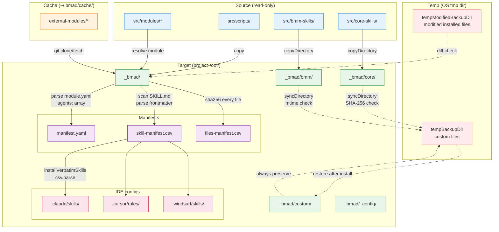

### Key flows

1. **Install:** Source → Target (direct copy)
2. **Update:** Target → Temp (backup) → Source → Target (install) → Temp → Target (restore)
3. **Manifest:** Target scan → Manifests (JSON/YAML/CSV)
4. **IDE:** Manifest → IDE target dirs (verbatim skill copy)

---

## 3. Resolver algorithm flowchart

Shape-based merge with keyed detection.

```mermaid
flowchart TD
    Start([deep_merge&#40;base, override&#41;])
    
    CheckShape{What type is<br/>base + override?}
    
    Start --> CheckShape
    
    CheckShape -->|Both dicts| DictMerge[Deep recursive merge<br/>for each key]
    CheckShape -->|Both arrays| ArrayCheck{Array element<br/>type?}
    CheckShape -->|Scalars or mixed| ScalarMerge[override wins<br/>return override ?? base]
    
    DictMerge --> CopyBase[result = &#123;...base&#125;]
    CopyBase --> IterKeys[For each key in override]
    IterKeys --> RecurseKey["result[key] = deep_merge&#40;base[key], override[key]&#41;"]
    RecurseKey --> NextKey{More keys?}
    NextKey -->|Yes| IterKeys
    NextKey -->|No| ReturnDict[Return result]
    
    ArrayCheck -->|Items are dicts| KeyedCheck{All items have<br/>same key field?}
    ArrayCheck -->|Items are scalars| AppendArray[Return base + override<br/>&#40;append&#41;]
    ArrayCheck -->|Mixed types| AppendArray
    
    KeyedCheck -->|Check 'code'| CheckCode{ALL have 'code'<br/>field?}
    CheckCode -->|Yes| KeyedMerge[Merge by 'code'<br/>replace matches<br/>append new]
    CheckCode -->|No| CheckId{ALL have 'id'<br/>field?}
    CheckId -->|Yes| KeyedMergeId[Merge by 'id'<br/>replace matches<br/>append new]
    CheckId -->|No| AppendArray
    
    KeyedMerge --> IterBase[For each item in base:<br/>register by code]
    IterBase --> IterOverride[For each item in override:<br/>if match found → replace<br/>else → append]
    IterOverride --> ReturnKeyed[Return merged array]
    
    KeyedMergeId --> SameAsCode[&#40;same logic as code&#41;]
    SameAsCode --> ReturnKeyed
    
    AppendArray --> ReturnAppend[Return combined array]
    
    ScalarMerge --> ReturnScalar[Return]
    ReturnDict --> Done([Return merged])
    ReturnKeyed --> Done
    ReturnAppend --> Done
    ReturnScalar --> Done
    
    classDef decision fill:#fff3e0
    classDef process fill:#e3f2fd
    classDef result fill:#c8e6c9
    
    class CheckShape,ArrayCheck,KeyedCheck,CheckCode,CheckId,NextKey decision
    class DictMerge,CopyBase,IterKeys,RecurseKey,AppendArray,KeyedMerge,KeyedMergeId,IterBase,IterOverride,SameAsCode,ScalarMerge process
    class ReturnDict,ReturnKeyed,ReturnAppend,ReturnScalar,Done result
```

### Key insight

**Keyed detection is STRICT:** All items must have same identifier field. Mixed → append fallback. This prevents subtle bugs where user thinks they're replacing but actually appending.

---

## 4. Validator execution flow

`validate-skills.js` execution with 14 deterministic rules.

```mermaid
flowchart TB
    Start([node validate-skills.js])
    
    ParseArgs[Parse CLI args<br/>--strict --json --path]
    
    CollectSkills[Collect skill dirs<br/>recursive walk src/]
    
    Start --> ParseArgs
    ParseArgs --> CollectSkills
    
    CollectSkills --> LoopSkills[For each skill dir]
    LoopSkills --> CheckSKILL01[SKILL-01:<br/>SKILL.md exists?]
    
    CheckSKILL01 -->|No| AddCritical1[Add finding CRITICAL<br/>SKILL.md missing]
    AddCritical1 --> NextSkill
    CheckSKILL01 -->|Yes| ParseFM[parseFrontmatterMultiline&#40;&#41;<br/>hand-rolled YAML]
    
    ParseFM --> CheckSKILL02[SKILL-02:<br/>has name?]
    CheckSKILL02 -->|No| AddCritical2[Add finding CRITICAL]
    CheckSKILL02 -->|Yes| CheckSKILL03[SKILL-03:<br/>has description?]
    AddCritical2 --> CheckSKILL03
    
    CheckSKILL03 -->|No| AddCritical3[Add finding CRITICAL]
    CheckSKILL03 -->|Yes| CheckSKILL04[SKILL-04:<br/>name matches regex?]
    AddCritical3 --> CheckSKILL04
    
    CheckSKILL04 -->|No| AddHigh1[Add finding HIGH]
    CheckSKILL04 -->|Yes| CheckSKILL05[SKILL-05:<br/>name matches dir?]
    AddHigh1 --> CheckSKILL05
    
    CheckSKILL05 -->|No| AddHigh2[Add HIGH]
    CheckSKILL05 -->|Yes| CheckSKILL06[SKILL-06:<br/>description quality]
    AddHigh2 --> CheckSKILL06
    
    CheckSKILL06 --> CheckSKILL07[SKILL-07:<br/>body non-empty?]
    CheckSKILL07 --> CheckOtherMDFiles[For each other .md file]
    
    CheckOtherMDFiles --> CheckWF01[WF-01:<br/>no name in frontmatter]
    CheckWF01 --> CheckWF02[WF-02:<br/>no description]
    CheckWF02 --> CheckPATH02[PATH-02:<br/>no installed_path]
    CheckPATH02 --> CheckSEQ02[SEQ-02:<br/>no time estimates]
    
    CheckSEQ02 --> CheckStepsDir{Steps dir<br/>exists?}
    CheckStepsDir -->|Yes| CheckSTEP01[STEP-01:<br/>filename format]
    CheckStepsDir -->|No| NextSkill
    
    CheckSTEP01 --> CheckSTEP06[STEP-06:<br/>no name/description]
    CheckSTEP06 --> CheckSTEP07[STEP-07:<br/>2-10 steps]
    CheckSTEP07 --> NextSkill
    
    NextSkill{More skills?}
    NextSkill -->|Yes| LoopSkills
    NextSkill -->|No| Format{Output<br/>format?}
    
    Format -->|--json| JSONOutput[Write JSON to stdout]
    Format -->|Table| TableOutput[Render table to stdout]
    
    JSONOutput --> CheckStrict{--strict flag?}
    TableOutput --> CheckStrict
    
    CheckStrict -->|Yes + HIGH+ findings| Exit1[exit&#40;1&#41;]
    CheckStrict -->|No or no HIGH+| Exit0[exit&#40;0&#41;]
    
    classDef decision fill:#fff3e0
    classDef process fill:#e3f2fd
    classDef finding fill:#ffebee
    classDef result fill:#c8e6c9
    
    class CheckSKILL01,CheckSKILL02,CheckSKILL03,CheckSKILL04,CheckSKILL05,CheckStepsDir,NextSkill,Format,CheckStrict decision
    class ParseFM,CheckSKILL06,CheckSKILL07,CheckWF01,CheckWF02,CheckPATH02,CheckSEQ02,CheckSTEP01,CheckSTEP06,CheckSTEP07 process
    class AddCritical1,AddCritical2,AddCritical3,AddHigh1,AddHigh2 finding
    class Exit0,Exit1,JSONOutput,TableOutput result
```

### Sample finding output

```json
{
  "rule": "SKILL-04",
  "title": "name Format",
  "severity": "HIGH",
  "file": "src/bmm-skills/my-skill/SKILL.md",
  "detail": "name \"my-skill\" does not match pattern: /^bmad-[a-z0-9]+(-[a-z0-9]+)*$/",
  "fix": "Rename to comply with lowercase letters, numbers, and hyphens only (max 64 chars)."
}
```

---

## 5. IDE handler class hierarchy + sequence

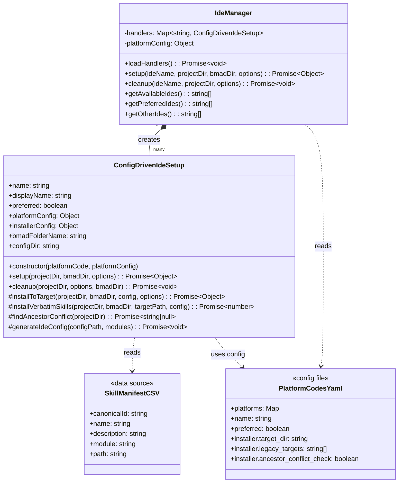

### Sequence: setup Claude Code

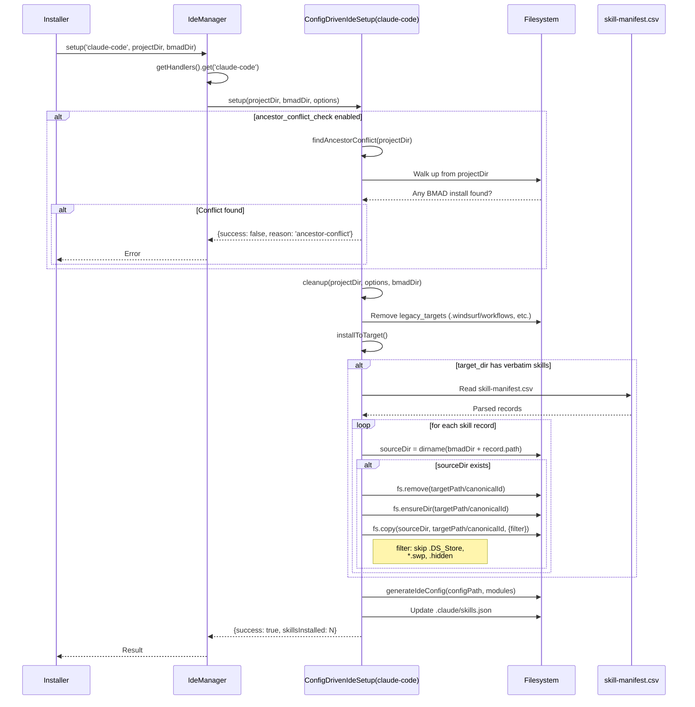

---

## 6. External module lifecycle

Git clone → cache → version resolve → install.

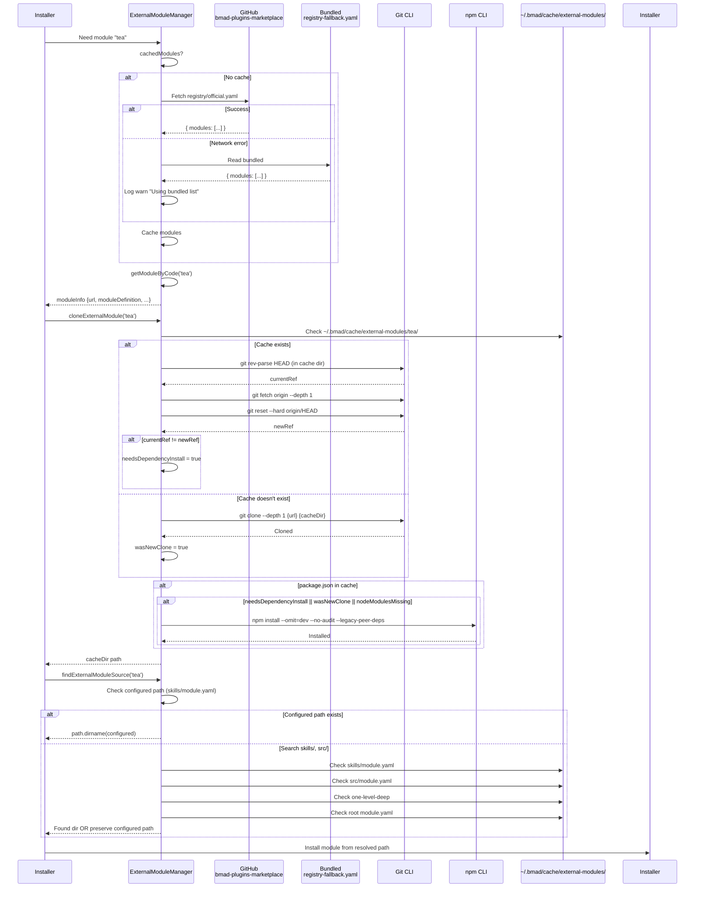

### Layout variants (4)

```mermaid
graph LR
    Cache[~/.bmad/cache/external-modules/tea/]
    
    V1[V1: skills/module.yaml]
    V2[V2: src/module.yaml]
    V3[V3: src/SUBDIR/module.yaml]
    V4[V4: module.yaml &#40;root&#41;]
    
    Cache --> V1
    Cache --> V2
    Cache --> V3
    Cache --> V4
    
    classDef variant fill:#e3f2fd
    class V1,V2,V3,V4 variant
```

---

## 7. Skill invocation sequence

Agent ↔ Skill ↔ Sub-skill ↔ Agent tool (party mode).

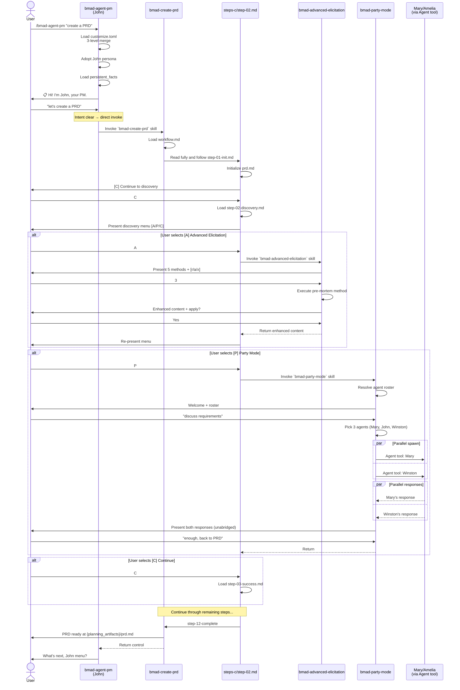

### Invocation patterns summary

| Pattern | Syntax | Context |
|---------|--------|---------|
| **Intra-skill step** | "Read fully and follow `./steps/step-02.md`" | Within skill, load next step |
| **Cross-skill invoke** | "Invoke the `bmad-xxx` skill" | Delegate to another skill |
| **Sub-agent spawn** | Agent tool with prompt | Party mode, distillator |
| **External CLI** | `npx @kayvan/markdown-tree-parser`, `python3 resolve_*.py` | Deterministic logic |

---

## 8. Backup-restore flow during update

Preserve user modifications across framework updates.

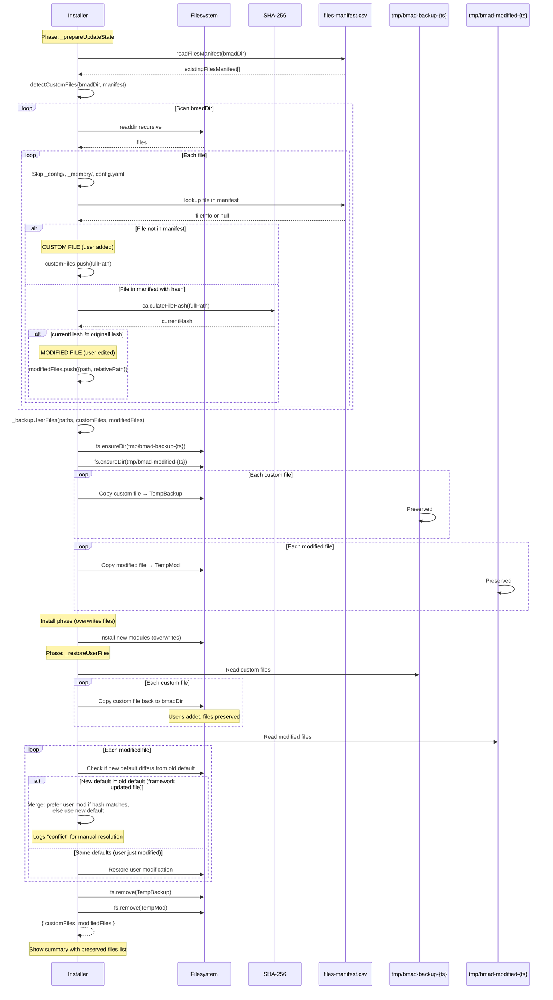

### Decision table for restoration

| Situation | Action |
|-----------|--------|
| Custom file (not in manifest) | Always restore |
| Modified file, new default == old default | Restore user modification |
| Modified file, new default != old default (framework changed) | Restore user modification, log conflict |
| Modified file, user's content matches new default | Use new default (no conflict) |

---

## 9. Customization merge visualization

3-level skill customization + 4-level central config visualization.

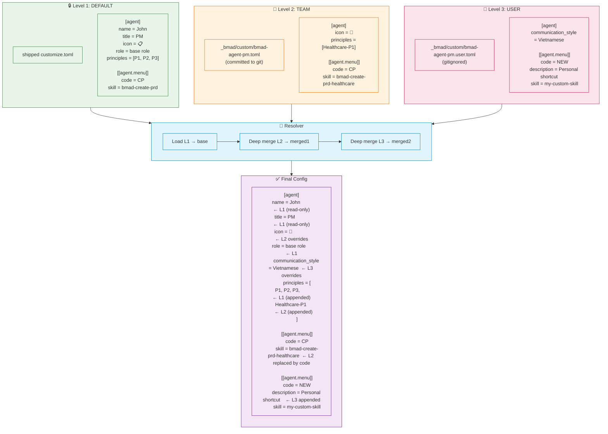

### Merge rules summary

| Input type | Rule |
|-----------|------|
| Scalars (icon, role) | Override replaces |
| Read-only (name, title) | Silent ignore override |
| Arrays (principles, persistent_facts) | Append |
| Arrays of tables with `code` field | Merge by code (replace or append) |
| Arrays of tables with `id` field | Merge by id |
| Mixed arrays | Append (fallback) |

---

## 10. package.json scripts dependency graph

Chain dependencies between npm scripts.

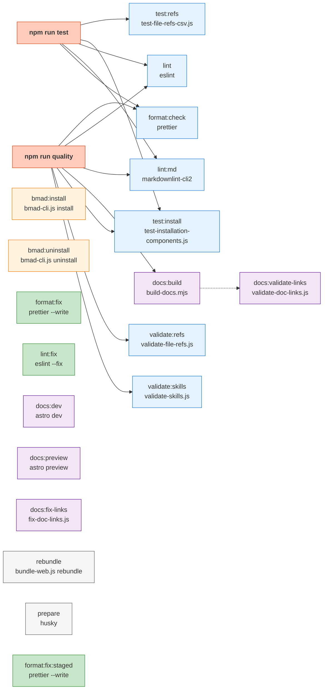

### CI workflow

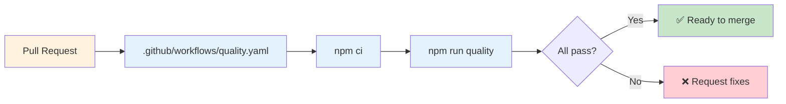

---

## Summary

10 maintainer-focused diagrams sufficient to:
- Debug install/update failures (diagrams 1, 2, 8)
- Implement resolver (diagram 3)
- Debug/extend validator (diagram 4)
- Add new IDE support (diagram 5)
- Handle external module issues (diagram 6)
- Understand skill invocation (diagram 7)
- Extend customization system (diagram 9)
- CI/CD pipeline (diagram 10)

**In total, the project has:**
- 16 user-facing diagrams (file 05)
- 10 maintainer diagrams (this file)
- Type variety: state, sequence, class, flowchart, graph

---

**Read next:** [11-testing-and-quality.md](11-testing-and-quality.md) — Testing infrastructure + quality metrics.
