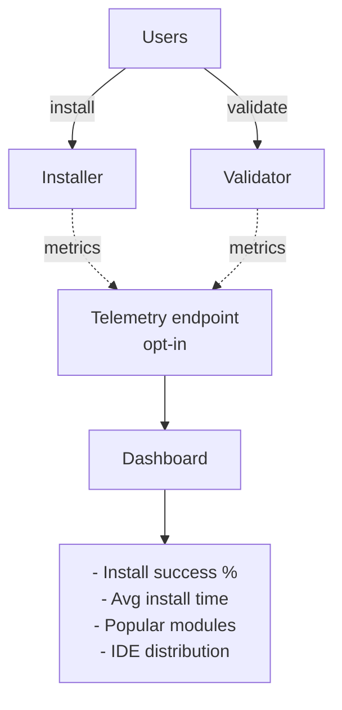

# 13. Operational Runbook

> ⚠️ **UNOFFICIAL THIRD-PARTY DOCUMENTATION**
> NOT official BMad docs. See [DISCLAIMER.md](DISCLAIMER.md) | Licensed MIT — see [LICENSE](LICENSE) and [NOTICE](NOTICE)
> Official BMAD-METHOD: <https://github.com/bmad-code-org/BMAD-METHOD>

---

> Release process, handling user bug reports, security considerations, performance tuning, troubleshooting. For maintainers.

---

## Table of Contents

1. [Release process](#1-release-process)
2. [Handling user bug reports](#2-handling-user-bug-reports)
3. [Security considerations](#3-security-considerations)
4. [Performance tuning](#4-performance-tuning)
5. [Troubleshooting guide](#5-troubleshooting-guide)
6. [Monitoring & observability](#6-monitoring--observability)
7. [Incident response](#7-incident-response)

---

## 1. Release process

### Version strategy

BMad uses **trunk-based development**:
- Every push to `main` → auto-publish to npm `next` tag
- Weekly release cut → `latest` tag (stable)

### Release cadence

| Type | Frequency | Trigger | Versioning |
|------|-----------|---------|------------|
| **Next** (bleeding edge) | Every merge to main | Auto CI | No bump (uses commit SHA) |
| **Stable** (`latest`) | Weekly | Manual cut | Semver bump |
| **Patch** | As needed | Critical bug | Patch version |
| **Major** | ~6-12 months | Breaking changes | Major version |

### Stable release checklist

**Pre-release:**
- [ ] Check open issues — no CRITICAL bugs blocking
- [ ] Run full quality check: `npm run quality`
- [ ] Test fresh install: `npx .` in clean dir
- [ ] Test upgrade from previous stable
- [ ] Update `CHANGELOG.md` with release notes
- [ ] Bump version in `package.json`:
  ```bash
  npm version minor  # or patch / major
  ```

**Release:**
- [ ] Tag commit: `git tag v6.4.0`
- [ ] Push tag: `git push --tags`
- [ ] Publish to npm:
  ```bash
  npm publish --tag latest
  ```
- [ ] Verify published: `npm view bmad-method versions`

**Post-release:**
- [ ] Announce on Discord
- [ ] Tweet / LinkedIn post
- [ ] Update documentation site (auto via docs:build)
- [ ] Monitor GitHub issues for regressions (next 48h)

### Hotfix release

For critical bugs:

```bash
# Create hotfix branch from last stable tag
git checkout -b hotfix/critical-bug v6.3.0

# Fix + test
# ...

# Merge to main
git checkout main
git merge hotfix/critical-bug

# Cut patch release
npm version patch
npm publish --tag latest
```

### CHANGELOG.md format

```markdown
# Changelog

## [6.4.0] - 2026-04-24

### Added
- New feature X for Y use case
- bmad-Z skill for custom workflows

### Changed
- Improved validator performance (~2x faster)
- Updated `bmad-agent-pm` principles

### Fixed
- Fixed issue with IDE ancestor conflict detection
- Fixed crash when `_bmad/_config/` missing

### Deprecated
- `{installed_path}` variable (migration guide in docs)

### Removed
- Removed legacy path patterns from v5

### Security
- Sanitized file paths in external module resolution
```

---

## 2. Handling user bug reports

### GitHub issue triage

**Label system:**

| Label | Meaning | SLA |
|-------|---------|-----|
| `bug:critical` | Data loss, security, complete failure | 24h |
| `bug:high` | Major feature broken | 3 days |
| `bug:medium` | Minor feature issues | 1 week |
| `bug:low` | Cosmetic, edge cases | Best-effort |
| `feature-request` | New features | Backlog, Discord discussion |
| `question` | User needs help | Close with link to docs |
| `documentation` | Docs unclear/missing | 1 week |
| `needs-repro` | Can't reproduce | Ask reporter for more info |
| `wontfix` | Not in scope | Explain + close |

### Issue template (bug report)

Users fill in `.github/ISSUE_TEMPLATE/bug_report.md`:

```markdown
## Bug Description
[Clear description]

## Steps to Reproduce
1. ...
2. ...
3. ...

## Expected Behavior
...

## Actual Behavior
...

## Environment
- BMad version: `npx bmad-method --version`
- Node version: `node --version`
- OS: macOS / Windows / Linux
- IDE: Claude Code / Cursor / ...

## Screenshots / Logs
[Attach]
```

### Triage process

**Daily (or every 2 days):**
1. Review new issues
2. Label appropriately
3. Ask for repro if unclear
4. Assign to maintainer if possible

**Response template for can't-repro:**
```
Thanks for the report! I'm unable to reproduce on my side.

Could you provide:
- Exact BMad version (`npx bmad-method --version`)
- Node version
- Full install command used
- Contents of `_bmad/_config/manifest.yaml`
- Full error output

Labeled as `needs-repro`. Will reopen when info provided.
```

### Common bug categories

**Install failures:**
- Network issues (git clone timeouts) → retry logic, fallback registry
- Permission errors → check directory writable
- Platform-specific (Windows WSL) → known issues documented

**Validation failures:**
- User customization violates rules → better error messages, docs
- Framework skills failing validation → our bug, fix source

**IDE integration:**
- Skills not recognized by IDE → check platform-codes.yaml, IDE version
- Ancestor conflicts → clear guidance in error message

**Update failures:**
- Customization lost → improve backup/restore logic
- Merge conflicts → improve merge semantics

---

## 3. Security considerations

### Threat model

**Assets:**
- User's codebase (read + write access)
- User's `_bmad/` configuration (may include secrets)
- User's local filesystem (installer writes)
- User's network (git clone, web research)

**Threat actors:**
- Malicious custom module (via `--custom-source` or registry compromise)
- Prompt injection via user input
- Supply chain (compromised npm packages)

### Installer security

**File operations:**
- ✅ Validate paths (no `../../../etc/passwd`)
- ✅ Sanitize user input (skill names, module codes)
- ✅ Use native `fs/promises` (not graceful-fs, avoid monkey-patching)
- ⚠️ External modules: `execSync('git clone')` — **risk:** untrusted git URL

**Glob expansion:**
- ✅ Resolved against a fixed base (`{project-root}`)
- ✅ No symlink following outside project root
- ⚠️ User-provided globs in `persistent_facts` — **risk:** glob injection (e.g., `../../../`)

### External module security

**Current mitigations:**
- Registry hosted on GitHub (bmad-plugins-marketplace)
- Users confirm before clone (prompt shows URL)
- Sparse checkout (only `src/` or `skills/`)
- `npm install --omit=dev` to reduce attack surface

**Risks:**
- Compromised registry → all users affected
- Compromised module repo → users install malicious code
- npm packages in module dependencies → transitive risk

**Recommended:** Use only trusted modules (`type: bmad-org` or audited community).

### Skill execution security

**BMad doesn't execute code itself** — the LLM reads markdown and generates code.

**Risks from the LLM:**
- LLM writes malicious code based on injected prompts
- LLM uses wrong commands with user confirmation

**Mitigations:**
- Users review generated code (BMad pattern: review step before commit)
- `bmad-code-review` catches issues
- `bmad-checkpoint-preview` human-in-loop

**Known limitation:** No sandboxing. If the LLM writes `rm -rf /`, the user must catch it before execution.

### Secrets handling

**Config files:**
- `_bmad/config.yaml` — OK to commit (team config)
- `_bmad/config.user.toml` — **gitignored** (personal, may contain paths)
- `_bmad/custom/*.toml` — **committed** (team overrides)
- `_bmad/custom/*.user.toml` — **gitignored** (personal)

**Best practices:**
- Don't put API keys in customize.toml (use env vars)
- Don't put secrets in persistent_facts
- Don't put passwords in project-context.md

**Installer checks:**
- Warns if user tries to commit `.user.toml`
- Skip secrets in manifest CSV

### Supply chain security

**npm dependencies (package.json):**
- Audit regularly: `npm audit`
- Dependabot enabled
- Lock versions: `package-lock.json` committed

**External module dependencies:**
- Module authors responsible for their deps
- BMad warns if a module has many transitive deps
- User should review `node_modules/` after install (non-trivial)

### Reporting vulnerabilities

See [SECURITY.md](../SECURITY.md):
- Private disclosure: `security@bmad-method.org`
- GitHub security advisories
- 90-day disclosure timeline

---

## 4. Performance tuning

### Installer performance

**Current bottlenecks:**

1. **File copy:** 300+ files per module, sequential
   - **Potential fix:** Parallel copy with semaphore limit
   - **Impact:** ~30% faster on SSD

2. **SHA-256 hashing:** Every file on scan + update
   - **Potential fix:** Cache hashes with mtime check
   - **Impact:** ~50% faster updates

3. **Git clone:** External modules fetch full history
   - **Current:** `--depth 1` already used
   - **Potential fix:** Lazy-load (only when invoked)

4. **npm install:** External modules with heavy deps
   - **Potential fix:** Skip if deps unchanged (check package-lock.json hash)

### Validator performance

**Very fast** (~500ms for 39 skills). No optimization needed.

Future optimizations if needed:
- Parallel skill validation (currently sequential)
- Skip unchanged skills (file mtime check)
- JIT validation (only on save)

### Docs build performance

**Current:** ~30-60s for full build.

**Bottlenecks:**
- Astro build (~70% of time)
- llms-full.txt generation (~15%)
- Link validation (~10%)

**Optimization:**
- Incremental builds (Astro supports)
- Parallel llms.txt generation
- Cache link validation results

### LLM execution (user-side)

BMad doesn't control LLM speed, but workflows can be optimized:

**Optimizations in skills:**
- ✅ Micro-file architecture (load only current step)
- ✅ Distillate pattern (compress long docs)
- ✅ Shard docs (split before context overflow)

**User-side tips:**
- Use Claude Sonnet/Haiku for simple tasks (faster)
- Use Claude Opus for complex reasoning
- Pre-generate distillate before long workflows

---

## 5. Troubleshooting guide

### Install failures

#### Error: "Cannot find module 'bmad-method'"

**Cause:** npm install failed, or wrong version.

**Fix:**
```bash
npm cache clean --force
npx bmad-method@latest install
```

#### Error: "Directory is not writable"

**Cause:** Permission issue.

**Fix:**
```bash
# Fix permissions
chmod -R u+w /path/to/project

# Or install with sudo (not recommended)
```

#### Error: "External module clone failed"

**Cause:** Network, git auth, or invalid URL.

**Fix:**
```bash
# Test git clone manually
git clone https://github.com/org/module /tmp/test

# If fails: check GITHUB_TOKEN or network
# If works: report bug to BMad
```

#### Error: "No manifest.yaml found in _bmad/_config"

**Cause:** Corrupted install.

**Fix:**
```bash
rm -rf _bmad
npx bmad-method@latest install
```

### Validation failures

#### "SKILL-04: name does not match pattern"

**Fix:** Rename skill to match regex `^bmad-[a-z0-9]+(-[a-z0-9]+)*$`.

```bash
mv src/bmm-skills/my_skill src/bmm-skills/bmad-my-skill
# Update SKILL.md frontmatter: name: bmad-my-skill
```

#### "WF-01: non-SKILL.md file has 'name' in frontmatter"

**Fix:** Remove `name:` from non-SKILL.md files.

```diff
# workflow.md
---
- name: my-workflow
context_file: ''
---
```

#### "PATH-02: installed_path variable found"

**Fix:** Replace `{installed_path}` with relative paths.

```diff
- Read file: {installed_path}/template.md
+ Read file: ./template.md
```

#### "STEP-07: step count 11 (expected 2-10)"

**Fix:** Split into multiple skills, or combine steps.

### Customization issues

#### "My override isn't applied"

**Debug:**
```bash
# Run resolver manually
python3 _bmad/scripts/resolve_customization.py \
  --skill _bmad/bmm/agents/bmad-agent-pm \
  --key agent

# Check merged output for your changes
```

**Common causes:**
- Override file in wrong location (check `.toml` vs `.user.toml`)
- Trying to override read-only field (name, title)
- TOML syntax error (validate with `toml` parser)

#### "Menu item not showing"

**Check:**
- `code` field unique (doesn't conflict with base)
- Arrays of tables with `code` — merge by code
- If trying to override existing menu item: use same `code`

### IDE integration issues

#### "Skills not showing in Claude Code"

**Check:**
- `.claude/skills/` directory exists
- Each skill has `SKILL.md`
- Claude Code version supports Skills (v1.0+)
- Restart Claude Code after install

**Debug:**
```bash
ls -la .claude/skills/
cat .claude/skills/bmad-create-prd/SKILL.md | head -10
```

#### "Ancestor conflict detected"

**Cause:** BMad also installed in a parent directory.

**Fix:**
```bash
# Find ancestor install
find ~ -name "_bmad" -type d 2>/dev/null

# Remove ancestor install if not needed
rm -rf /path/to/ancestor/_bmad

# Or install to a different subdirectory
```

### Update issues

#### "Customizations lost after update"

**Debug:**
```bash
# Check backup dirs in /tmp
ls /tmp/bmad-backup-* /tmp/bmad-modified-*

# If they exist: manually restore from backup
```

**Prevention:**
- Keep custom files in `_bmad/custom/`
- Don't edit framework files directly

#### "Some files have merge conflicts"

**Cause:** User modified a file that the framework also updated.

**Fix:**
- Review conflict (backup vs new default)
- Choose: keep user modification OR accept new default
- Commit resolution

---

## 6. Monitoring & observability

### Metrics to track (for framework team)

**Usage metrics** (if telemetry enabled — currently opt-in):
- Install count per version
- Module popularity
- IDE usage distribution
- Skill invocation frequency

**Health metrics:**
- Install success rate
- Update success rate
- Validation pass rate
- GitHub issue volume

**Performance:**
- Install time (p50, p95, p99)
- Validator time
- Docs build time

### Dashboard (suggested)

If implementing telemetry:



### Log locations (user-side)

BMad doesn't write log files by default. If debug mode is on:

```bash
# Verbose install
npx bmad-method install --verbose

# Debug logs go to stdout
# Users can pipe to file:
npx bmad-method install --verbose 2>&1 | tee install.log
```

---

## 7. Incident response

### Severity levels

| Level | Example | Response time |
|-------|---------|---------------|
| **SEV1** | Registry compromised, malicious code published | Immediate (hours) |
| **SEV2** | Install broken for all users | 24h |
| **SEV3** | Some users affected (specific platform) | 3 days |
| **SEV4** | Edge case, workaround available | Next release |

### SEV1 response

**Example: Registry compromised**

1. **Detect** — monitor GitHub activity, user reports
2. **Contain** — Revoke registry access, notify npm
3. **Communicate** — Discord announcement, GitHub advisory, email mailing list
4. **Remediate** — Remove malicious version from npm, publish fixed version
5. **Postmortem** — Write public incident report within 72h

### SEV2 response

**Example: Install broken on Windows**

1. **Triage** — Verify, reproduce locally
2. **Workaround** — Document in GitHub issue + Discord pin
3. **Fix** — Hotfix PR, test on Windows
4. **Release** — Patch version, announce
5. **Regression test** — Add Windows CI job

### Communication templates

**SEV1 notice (Discord):**
```
🚨 SECURITY NOTICE 🚨

BMad registry compromise detected in version 6.3.2.

Action required:
1. If installed 6.3.2, uninstall immediately: `npx bmad-method uninstall`
2. Do NOT install until 6.3.3 is released
3. Watch for further updates

Investigation in progress. Public post-mortem within 72h.
```

**SEV2 notice:**
```
⚠️ Install issue on Windows

We're aware of install failures on Windows for version 6.3.0.

Workaround: Use WSL or install version 6.2.5 for now.

Fix tracked in #1234. Expected within 24h.
```

---

## Summary

**Release:**
- Trunk-based, weekly stable
- Next tag auto-published on merge
- Semver + changelog

**Bug handling:**
- GitHub issues with labels
- Triage daily
- Response template for repro

**Security:**
- Validate paths, sanitize input
- External modules = supply chain risk
- No sandboxing (user reviews)
- Private disclosure via SECURITY.md

**Performance:**
- Installer: parallel copy potential
- Validator: fast (no optimization needed)
- Docs: incremental builds potential

**Troubleshooting:**
- Common issues documented
- Debug commands provided
- Rollback plan (backup → restore)

**Incidents:**
- SEV1-SEV4 with response times
- Communication templates
- Postmortem culture

---

**Read next:** [14-rewrite-blueprint.md](14-rewrite-blueprint.md) — Blueprint for rewriting BMad from scratch.
