# 05. Flows & Diagrams - Mermaid Visualization

> ⚠️ **UNOFFICIAL THIRD-PARTY DOCUMENTATION**
> Không phải official BMad docs. Xem [DISCLAIMER.md](DISCLAIMER.md) | Licensed MIT — xem [LICENSE](LICENSE) và [NOTICE](NOTICE)
> Official BMAD-METHOD: <https://github.com/bmad-code-org/BMAD-METHOD>

---

> Các flow quan trọng của BMad được visualize bằng Mermaid: architecture, lifecycle, workflow, customization, validation, installer.

---

## Mục lục

1. [Big picture - Framework architecture](#1-big-picture---framework-architecture)
2. [Lifecycle - 4 phases end-to-end](#2-lifecycle---4-phases-end-to-end)
3. [Skill anatomy - Class diagram](#3-skill-anatomy---class-diagram)
4. [Agent activation flow](#4-agent-activation-flow)
5. [Config + customization resolution](#5-config--customization-resolution)
6. [bmad-dev-story - detailed workflow](#6-bmad-dev-story---detailed-workflow)
7. [bmad-brainstorming - micro-file branching](#7-bmad-brainstorming---micro-file-branching)
8. [Sprint status state machine](#8-sprint-status-state-machine)
9. [Story lifecycle state diagram](#9-story-lifecycle-state-diagram)
10. [Installer flow](#10-installer-flow)
11. [Validation pipeline](#11-validation-pipeline)
12. [Party mode multi-agent orchestration](#12-party-mode-multi-agent-orchestration)
13. [Correct course decision tree](#13-correct-course-decision-tree)
14. [Data flow artifacts between phases](#14-data-flow-artifacts-between-phases)
15. [Sequence - user triggers full flow](#15-sequence---user-triggers-full-flow)

---

## 1. Big picture - Framework architecture

Tầng cao nhất: BMad framework gồm các layer nào.

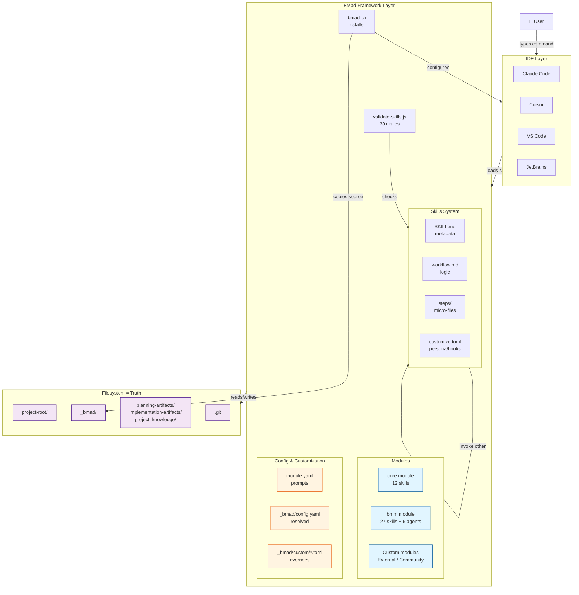
```mermaid
graph TB
    User[👤 User]

    subgraph IDE["IDE Layer"]
        ClaudeCode[Claude Code]
        Cursor[Cursor]
        VSCode[VS Code]
        JetBrains[JetBrains]
    end

    subgraph Framework["BMad Framework Layer"]
        Installer[bmad-cli<br/>Installer]

        subgraph Modules["Modules"]
            CoreModule[core module<br/>12 skills]
            BMMModule[bmm module<br/>27 skills + 6 agents]
            CustomModule[Custom modules<br/>External / Community]
        end

        subgraph Config["Config & Customization"]
            ModuleYaml[module.yaml<br/>prompts]
            ConfigYaml[_bmad/config.yaml<br/>resolved]
            CustomTOML[_bmad/custom/*.toml<br/>overrides]
        end

        subgraph Skills["Skills System"]
            SKILL[SKILL.md<br/>metadata]
            Workflow[workflow.md<br/>logic]
            Steps[steps/<br/>micro-files]
            CustomizeTOML[customize.toml<br/>persona/hooks]
        end

        Validator[validate-skills.js<br/>30+ rules]
    end

    subgraph Filesystem["Filesystem = Truth"]
        ProjectRoot[project-root/]
        BmadDir[_bmad/]
        Artifacts[planning-artifacts/<br/>implementation-artifacts/<br/>project_knowledge/]
        Git[.git]
    end

    User -->|types command| IDE
    IDE -->|loads skill| Framework
    Framework -->|reads/writes| Filesystem
    Installer -->|copies source| BmadDir
    Installer -->|configures| IDE

    Skills -->|invoke other| Skills
    Validator -->|checks| Skills

    classDef module fill:#e1f5ff,stroke:#01579b
    classDef config fill:#fff4e1,stroke:#e65100
    classDef fs fill:#f3e5f5,stroke:#4a148c
    class CoreModule,BMMModule,CustomModule module
    class ModuleYaml,ConfigYaml,CustomTOML config
    class ProjectRoot,BmadDir,Artifacts,Git fs
```

---

## 2. Lifecycle - 4 phases end-to-end

Từ ý tưởng → code ship, dòng chảy qua 4 phase.

```mermaid
flowchart LR
    Idea[💡 Idea]

    subgraph P1["PHASE 1: Analysis"]
        direction TB
        Mary[Mary 📊<br/>Analyst]
        Brainstorm[bmad-brainstorming]
        Brief[bmad-product-brief]
        PRFAQ[bmad-prfaq]
        DocProject[bmad-document-project]
    end

    subgraph P2["PHASE 2: Planning"]
        direction TB
        John[John 📋<br/>PM]
        Sally[Sally 🎨<br/>UX]
        CreatePRD[bmad-create-prd]
        ValidatePRD[bmad-validate-prd]
        CreateUX[bmad-create-ux-design]
    end

    subgraph P3["PHASE 3: Solutioning"]
        direction TB
        Winston[Winston 🏗️<br/>Architect]
        CreateArch[bmad-create-architecture]
        CreateEpics[bmad-create-epics-and-stories]
        GenContext[bmad-generate-project-context]
        CheckReady[bmad-check-implementation-readiness]
    end

    subgraph P4["PHASE 4: Implementation"]
        direction TB
        Amelia[Amelia 💻<br/>Dev]
        SprintPlan[bmad-sprint-planning]
        CreateStory[bmad-create-story]
        DevStory[bmad-dev-story]
        CodeReview[bmad-code-review]
        Retro[bmad-retrospective]
    end

    Ship[🚀 Ship]

    Idea --> P1
    P1 -->|"Product Brief<br/>PRFAQ"| P2
    P2 -->|"PRD<br/>UX Design"| P3
    P3 -->|"Architecture<br/>Epics + Stories"| P4
    P4 --> Ship

    Ship -->|"Correct Course<br/>(if needed)"| P3
    P4 -.->|"Retrospective<br/>→ Next Epic"| P3

    style P1 fill:#e3f2fd
    style P2 fill:#fff3e0
    style P3 fill:#f3e5f5
    style P4 fill:#e8f5e9
```

---

## 3. Skill anatomy - Class diagram

Mối quan hệ giữa Module, Agent, Skill, Workflow, Step.

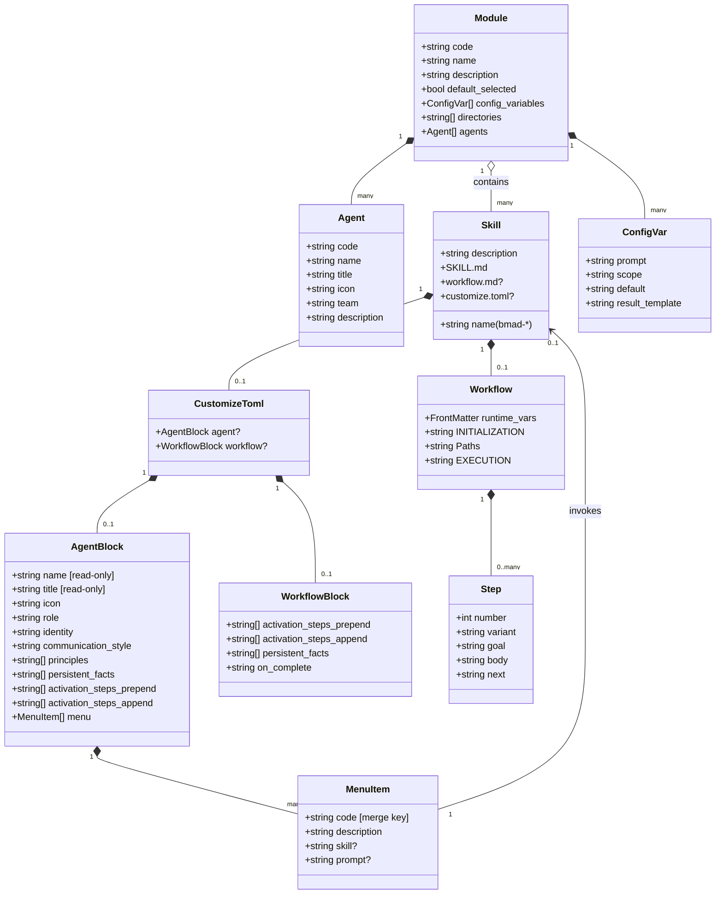
```mermaid
classDiagram
    class Module {
        +string code
        +string name
        +string description
        +bool default_selected
        +ConfigVar[] config_variables
        +string[] directories
        +Agent[] agents
    }

    class Agent {
        +string code
        +string name
        +string title
        +string icon
        +string team
        +string description
    }

    class Skill {
        +string name (bmad-*)
        +string description
        +SKILL.md
        +workflow.md?
        +customize.toml?
    }

    class CustomizeToml {
        +AgentBlock agent?
        +WorkflowBlock workflow?
    }

    class AgentBlock {
        +string name [read-only]
        +string title [read-only]
        +string icon
        +string role
        +string identity
        +string communication_style
        +string[] principles
        +string[] persistent_facts
        +string[] activation_steps_prepend
        +string[] activation_steps_append
        +MenuItem[] menu
    }

    class WorkflowBlock {
        +string[] activation_steps_prepend
        +string[] activation_steps_append
        +string[] persistent_facts
        +string on_complete
    }

    class MenuItem {
        +string code [merge key]
        +string description
        +string skill?
        +string prompt?
    }

    class Workflow {
        +FrontMatter runtime_vars
        +string INITIALIZATION
        +string Paths
        +string EXECUTION
    }

    class Step {
        +int number
        +string variant
        +string goal
        +string body
        +string next
    }

    Module "1" *-- "many" ConfigVar
    Module "1" *-- "many" Agent
    Module "1" o-- "many" Skill : contains
    Skill "1" *-- "0..1" CustomizeToml
    CustomizeToml "1" *-- "0..1" AgentBlock
    CustomizeToml "1" *-- "0..1" WorkflowBlock
    AgentBlock "1" *-- "many" MenuItem
    Skill "1" *-- "0..1" Workflow
    Workflow "1" *-- "0..many" Step
    MenuItem "1" --> "0..1" Skill : invokes

    class ConfigVar {
        +string prompt
        +string scope
        +string default
        +string result_template
    }
```

---

## 4. Agent activation flow

Khi user gọi `/bmad-agent-pm` — chuyện gì xảy ra.

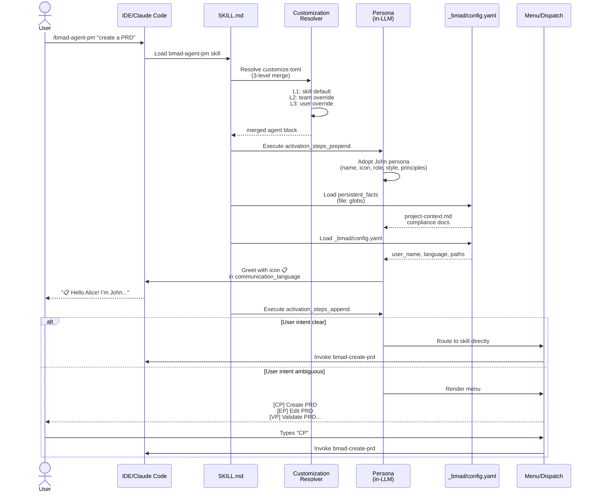
```mermaid
sequenceDiagram
    actor User
    participant IDE as IDE/Claude Code
    participant SKILL as SKILL.md
    participant Resolver as Customization<br/>Resolver
    participant Persona as Persona<br/>(in-LLM)
    participant Config as _bmad/config.yaml
    participant Menu as Menu/Dispatch

    User->>IDE: /bmad-agent-pm "create a PRD"
    IDE->>SKILL: Load bmad-agent-pm skill
    SKILL->>Resolver: Resolve customize.toml<br/>(3-level merge)
    Resolver->>Resolver: L1: skill default<br/>L2: team override<br/>L3: user override
    Resolver-->>SKILL: merged agent block

    SKILL->>Persona: Execute activation_steps_prepend
    Persona->>Persona: Adopt John persona<br/>(name, icon, role, style, principles)

    SKILL->>Config: Load persistent_facts<br/>(file: globs)
    Config-->>Persona: project-context.md<br/>compliance docs
    SKILL->>Config: Load _bmad/config.yaml
    Config-->>Persona: user_name, language, paths

    Persona->>IDE: Greet with icon 📋<br/>in communication_language
    IDE-->>User: "📋 Hello Alice! I'm John..."

    SKILL->>Persona: Execute activation_steps_append

    alt User intent clear
        Persona->>Menu: Route to skill directly
        Menu->>IDE: Invoke bmad-create-prd
    else User intent ambiguous
        Persona->>Menu: Render menu
        Menu-->>User: [CP] Create PRD<br/>[EP] Edit PRD<br/>[VP] Validate PRD...
        User->>Menu: Types "CP"
        Menu->>IDE: Invoke bmad-create-prd
    end
```

---

## 5. Config + customization resolution

Cách biến được resolve từ nhiều layer.

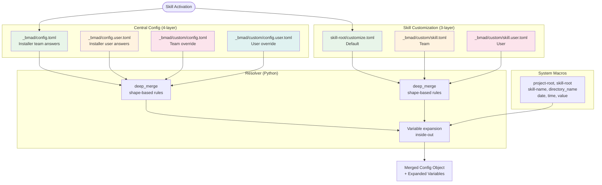
```mermaid
flowchart TB
    Start([Skill Activation])

    subgraph Central["Central Config (4-layer)"]
        L1C[_bmad/config.toml<br/>Installer team answers]
        L2C[_bmad/config.user.toml<br/>Installer user answers]
        L3C[_bmad/custom/config.toml<br/>Team override]
        L4C[_bmad/custom/config.user.toml<br/>User override]
    end

    subgraph Skill["Skill Customization (3-layer)"]
        L1S[skill-root/customize.toml<br/>Default]
        L2S[_bmad/custom/skill.toml<br/>Team]
        L3S[_bmad/custom/skill.user.toml<br/>User]
    end

    subgraph Macros["System Macros"]
        Macro["project-root, skill-root<br/>skill-name, directory_name<br/>date, time, value"]
    end

    subgraph Resolver["Resolver (Python)"]
        MergeCentral[deep_merge<br/>shape-based rules]
        MergeSkill[deep_merge<br/>shape-based rules]
        Expand[Variable expansion<br/>inside-out]
    end

    Output["Merged Config Object<br/>+ Expanded Variables"]

    Start --> L1C
    L1C --> MergeCentral
    L2C --> MergeCentral
    L3C --> MergeCentral
    L4C --> MergeCentral

    Start --> L1S
    L1S --> MergeSkill
    L2S --> MergeSkill
    L3S --> MergeSkill

    MergeCentral --> Expand
    MergeSkill --> Expand
    Macro --> Expand

    Expand --> Output

    classDef level1 fill:#e8f5e9
    classDef level2 fill:#fff3e0
    classDef level3 fill:#fce4ec
    classDef level4 fill:#e0f2f1
    class L1C,L1S level1
    class L2C,L2S level2
    class L3C,L3S level3
    class L4C level4
```

### Merge rules

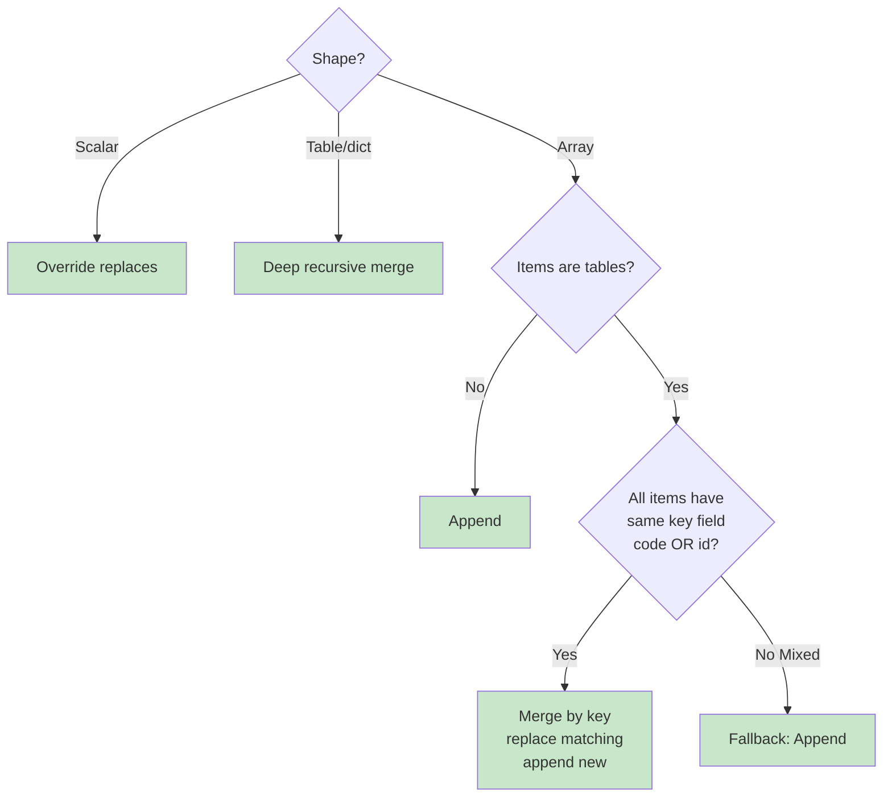
```mermaid
flowchart TD
    Start{Shape?}
    Start -->|Scalar| Scalar[Override replaces]
    Start -->|Table/dict| Table[Deep recursive merge]
    Start -->|Array| Array{Items are tables?}

    Array -->|No| Append1[Append]
    Array -->|Yes| Keyed{All items have<br/>same key field<br/>code OR id?}

    Keyed -->|Yes| KeyMerge[Merge by key<br/>replace matching<br/>append new]
    Keyed -->|No Mixed| Append2[Fallback: Append]

    classDef result fill:#c8e6c9
    class Scalar,Table,Append1,Append2,KeyMerge result
```

---

## 6. bmad-dev-story - detailed workflow

10 steps của dev-story với validation gates.

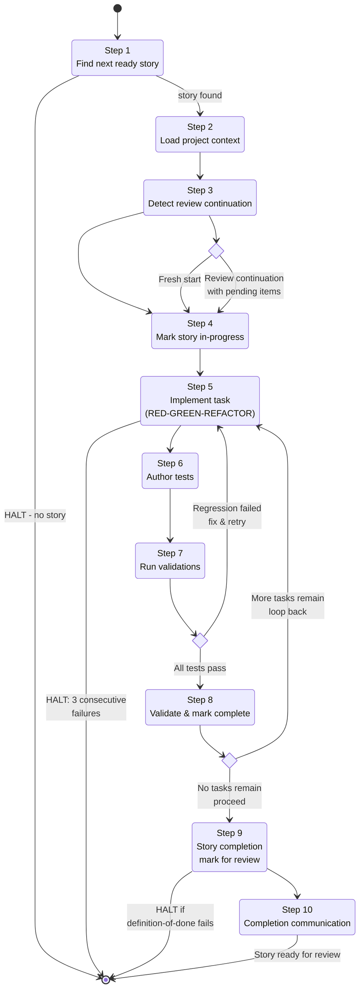
```mermaid
stateDiagram-v2
    [*] --> Step1

    Step1: Step 1<br/>Find next ready story
    Step2: Step 2<br/>Load project context
    Step3: Step 3<br/>Detect review continuation
    Step4: Step 4<br/>Mark story in-progress
    Step5: Step 5<br/>Implement task<br/>(RED-GREEN-REFACTOR)
    Step6: Step 6<br/>Author tests
    Step7: Step 7<br/>Run validations
    Step8: Step 8<br/>Validate & mark complete
    Step9: Step 9<br/>Story completion<br/>mark for review
    Step10: Step 10<br/>Completion communication

    Step1 --> Step2: story found
    Step1 --> [*]: HALT - no story

    Step2 --> Step3
    Step3 --> Step4

    state Step3_Branch <<choice>>
    Step3 --> Step3_Branch
    Step3_Branch --> Step4: Fresh start
    Step3_Branch --> Step4: Review continuation<br/>with pending items

    Step4 --> Step5

    Step5 --> Step6
    Step5 --> [*]: HALT: 3 consecutive<br/>failures

    Step6 --> Step7

    state Step7_Validation <<choice>>
    Step7 --> Step7_Validation
    Step7_Validation --> Step8: All tests pass
    Step7_Validation --> Step5: Regression failed<br/>fix & retry

    state Step8_Gate <<choice>>
    Step8 --> Step8_Gate
    Step8_Gate --> Step5: More tasks remain<br/>loop back
    Step8_Gate --> Step9: No tasks remain<br/>proceed

    Step9 --> Step10
    Step9 --> [*]: HALT if<br/>definition-of-done fails

    Step10 --> [*]: Story ready for review
```

### RED-GREEN-REFACTOR inside Step 5

```mermaid
flowchart LR
    Load[Load current<br/>task/subtask]

    subgraph RED["🔴 RED Phase"]
        WriteTests[Write FAILING tests]
        ConfirmFail[Confirm tests fail]
    end

    subgraph GREEN["🟢 GREEN Phase"]
        MinCode[Implement MINIMAL code]
        RunTests1[Run tests]
        ConfirmPass[Confirm pass]
    end

    subgraph REFACTOR["♻️ REFACTOR Phase"]
        Improve[Improve structure]
        KeepGreen[Tests remain green]
    end

    Document[Document in<br/>Dev Agent Record]

    Load --> WriteTests
    WriteTests --> ConfirmFail
    ConfirmFail --> MinCode
    MinCode --> RunTests1
    RunTests1 --> ConfirmPass
    ConfirmPass --> Improve
    Improve --> KeepGreen
    KeepGreen --> Document

    classDef red fill:#ffebee
    classDef green fill:#e8f5e9
    classDef refactor fill:#e3f2fd
    class WriteTests,ConfirmFail red
    class MinCode,RunTests1,ConfirmPass green
    class Improve,KeepGreen refactor
```

---

## 7. bmad-brainstorming - micro-file branching

Micro-file architecture với 4 branching paths.

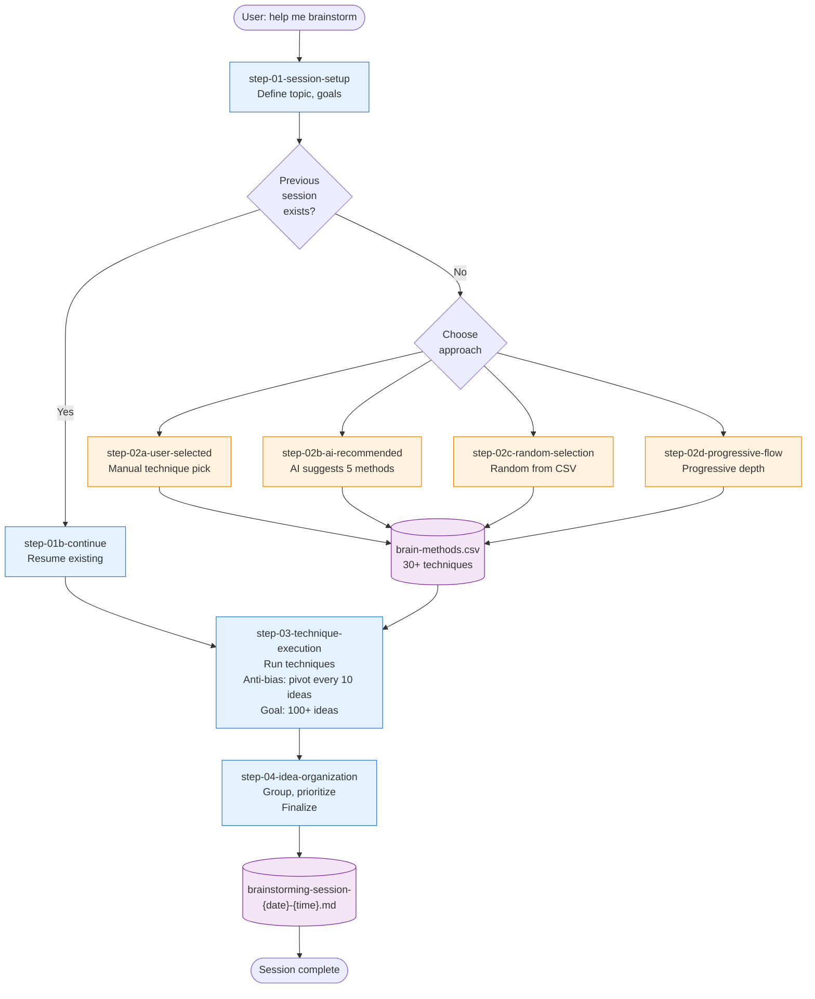
```mermaid
flowchart TB
    Start([User: help me brainstorm])
    Step01[step-01-session-setup<br/>Define topic, goals]

    Check{Previous<br/>session<br/>exists?}

    Step01b[step-01b-continue<br/>Resume existing]

    Approach{Choose<br/>approach}

    Step02a[step-02a-user-selected<br/>Manual technique pick]
    Step02b[step-02b-ai-recommended<br/>AI suggests 5 methods]
    Step02c[step-02c-random-selection<br/>Random from CSV]
    Step02d[step-02d-progressive-flow<br/>Progressive depth]

    CSV[(brain-methods.csv<br/>30+ techniques)]

    Step03[step-03-technique-execution<br/>Run techniques<br/>Anti-bias: pivot every 10 ideas<br/>Goal: 100+ ideas]

    Step04[step-04-idea-organization<br/>Group, prioritize<br/>Finalize]

    Output[("brainstorming-session-<br/>{date}-{time}.md")]

    End([Session complete])

    Start --> Step01
    Step01 --> Check
    Check -->|Yes| Step01b
    Check -->|No| Approach
    Step01b --> Step03

    Approach --> Step02a
    Approach --> Step02b
    Approach --> Step02c
    Approach --> Step02d

    Step02a --> CSV
    Step02b --> CSV
    Step02c --> CSV
    Step02d --> CSV

    CSV --> Step03

    Step03 --> Step04
    Step04 --> Output
    Output --> End

    classDef step fill:#e3f2fd,stroke:#1976d2
    classDef branch fill:#fff3e0,stroke:#f57c00
    classDef data fill:#f3e5f5,stroke:#7b1fa2
    class Step01,Step01b,Step03,Step04 step
    class Step02a,Step02b,Step02c,Step02d branch
    class CSV,Output data
```

---

## 8. Sprint status state machine

Trạng thái của cả sprint (từ planning → retrospective).

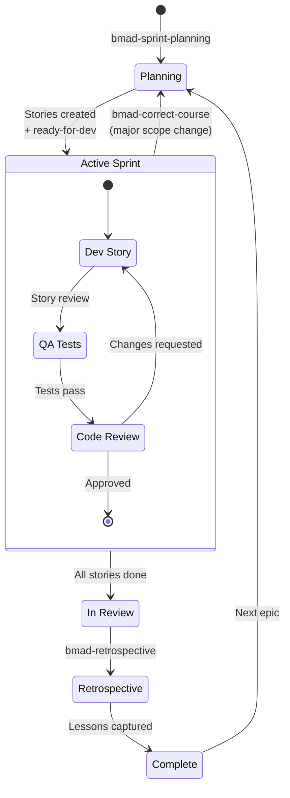
```mermaid
stateDiagram-v2
    [*] --> Planning: bmad-sprint-planning

    Planning: Planning
    Active: Active Sprint
    Review: In Review
    Retrospective: Retrospective
    Complete: Complete

    Planning --> Active: Stories created<br/>+ ready-for-dev

    state Active {
        [*] --> Dev
        Dev: Dev Story
        QA: QA Tests
        CR: Code Review

        Dev --> QA: Story review
        QA --> CR: Tests pass
        CR --> Dev: Changes requested
        CR --> [*]: Approved
    }

    Active --> Review: All stories done
    Review --> Retrospective: bmad-retrospective
    Retrospective --> Complete: Lessons captured
    Complete --> Planning: Next epic

    Active --> Planning: bmad-correct-course<br/>(major scope change)
```

---

## 9. Story lifecycle state diagram

Một story đi qua các state nào.

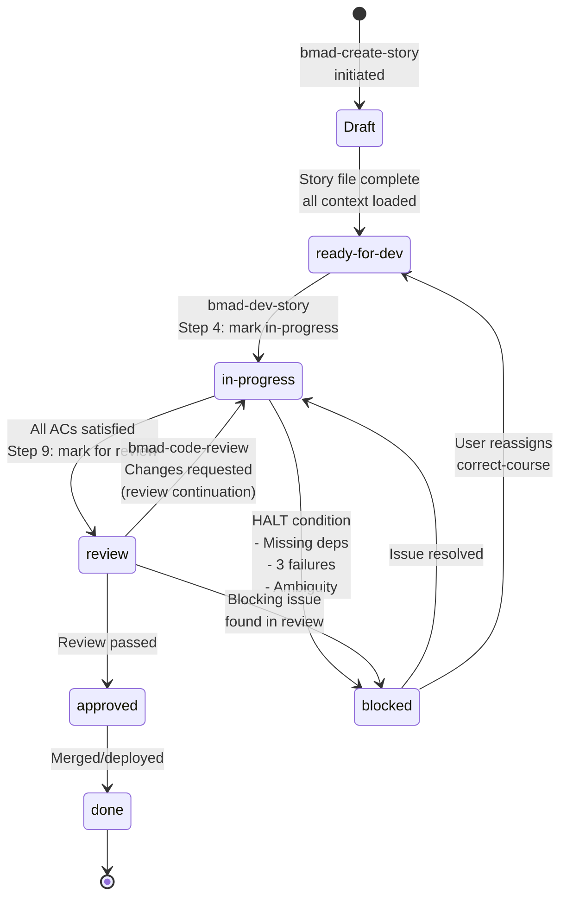
```mermaid
stateDiagram-v2
    [*] --> Draft: bmad-create-story<br/>initiated

    Draft: Draft
    ReadyForDev: ready-for-dev
    InProgress: in-progress
    ReviewPending: review
    Approved: approved
    Done: done
    Blocked: blocked

    Draft --> ReadyForDev: Story file complete<br/>all context loaded
    ReadyForDev --> InProgress: bmad-dev-story<br/>Step 4: mark in-progress
    InProgress --> ReviewPending: All ACs satisfied<br/>Step 9: mark for review
    InProgress --> Blocked: HALT condition<br/>- Missing deps<br/>- 3 failures<br/>- Ambiguity
    Blocked --> InProgress: Issue resolved
    Blocked --> ReadyForDev: User reassigns<br/>correct-course

    ReviewPending --> InProgress: bmad-code-review<br/>Changes requested<br/>(review continuation)
    ReviewPending --> Approved: Review passed
    Approved --> Done: Merged/deployed
    Done --> [*]

    ReviewPending --> Blocked: Blocking issue<br/>found in review
```

---

## 10. Installer flow

`npx bmad-method install` hoạt động thế nào.

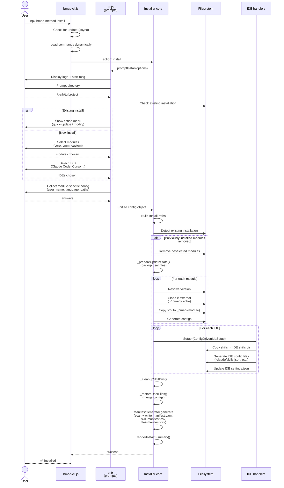
```mermaid
sequenceDiagram
    actor User
    participant CLI as bmad-cli.js
    participant UI as ui.js<br/>(prompts)
    participant Core as Installer core
    participant FS as Filesystem
    participant IDE as IDE handlers

    User->>CLI: npx bmad-method install
    CLI->>CLI: Check for update (async)
    CLI->>CLI: Load commands dynamically
    CLI->>Core: action: install

    Core->>UI: promptInstall(options)
    UI->>User: Display logo + start msg
    UI->>User: Prompt directory
    User-->>UI: /path/to/project

    UI->>FS: Check existing installation
    alt Existing install
        UI->>User: Show action menu<br/>(quick-update / modify)
    else New install
        UI->>User: Select modules<br/>(core, bmm, custom)
        User-->>UI: modules chosen
        UI->>User: Select IDEs<br/>(Claude Code, Cursor...)
        User-->>UI: IDEs chosen
    end

    UI->>User: Collect module-specific config<br/>(user_name, language, paths)
    User-->>UI: answers
    UI-->>Core: unified config object

    Core->>Core: Build InstallPaths
    Core->>FS: Detect existing installation

    alt Previously installed modules removed
        Core->>FS: Remove deselected modules
    end

    Core->>Core: _prepareUpdateState()<br/>(backup user files)

    loop For each module
        Core->>FS: Resolve version
        Core->>FS: Clone if external<br/>(~/.bmad/cache)
        Core->>FS: Copy src/ to _bmad/{module}
        Core->>FS: Generate configs
    end

    loop For each IDE
        Core->>IDE: Setup (ConfigDrivenIdeSetup)
        IDE->>FS: Copy skills → IDE skills dir
        IDE->>FS: Generate IDE config files<br/>(.claude/skills.json, etc.)
        IDE->>FS: Update IDE settings.json
    end

    Core->>Core: _cleanupSkillDirs()
    Core->>Core: _restoreUserFiles()<br/>(merge configs)

    Core->>Core: ManifestGenerator.generate<br/>(scan + write manifest.yaml,<br/>skill-manifest.csv,<br/>files-manifest.csv)

    Core->>Core: renderInstallSummary()
    Core-->>CLI: success
    CLI-->>User: ✅ Installed
```

---

## 11. Validation pipeline

Cách `npm run quality` chạy validate skills.

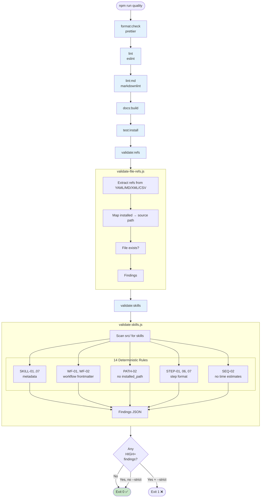
```mermaid
flowchart TB
    Start([npm run quality])

    Fmt[format:check<br/>prettier]
    Lint[lint<br/>eslint]
    LintMD[lint:md<br/>markdownlint]
    DocsBuild[docs:build]
    TestInstall[test:install]
    VRefs[validate:refs]
    VSkills[validate:skills]

    subgraph Skills["validate:skills.js"]
        direction TB
        Scan[Scan src/ for skills]

        subgraph DeterministicRules["14 Deterministic Rules"]
            R1[SKILL-01..07<br/>metadata]
            R2[WF-01, WF-02<br/>workflow frontmatter]
            R3[PATH-02<br/>no installed_path]
            R4[STEP-01, 06, 07<br/>step format]
            R5[SEQ-02<br/>no time estimates]
        end

        Report[Findings JSON]

        Scan --> R1 & R2 & R3 & R4 & R5
        R1 & R2 & R3 & R4 & R5 --> Report
    end

    subgraph Refs["validate-file-refs.js"]
        direction TB
        ScanRefs[Extract refs from YAML/MD/XML/CSV]
        Resolve[Map installed → source path]
        CheckExists[File exists?]
        ReportRefs[Findings]

        ScanRefs --> Resolve
        Resolve --> CheckExists
        CheckExists --> ReportRefs
    end

    Gate{Any<br/>HIGH+<br/>findings?}

    Exit0([Exit 0 ✅])
    Exit1([Exit 1 ❌])

    Start --> Fmt
    Fmt --> Lint
    Lint --> LintMD
    LintMD --> DocsBuild
    DocsBuild --> TestInstall
    TestInstall --> VRefs
    VRefs --> Refs
    Refs --> VSkills
    VSkills --> Skills
    Skills --> Gate

    Gate -->|No| Exit0
    Gate -->|Yes + --strict| Exit1
    Gate -->|Yes, no --strict| Exit0

    classDef checker fill:#e3f2fd
    classDef result fill:#c8e6c9
    class Fmt,Lint,LintMD,DocsBuild,TestInstall,VRefs,VSkills checker
    class Exit0 result
```

---

## 12. Party mode multi-agent orchestration

Cách party-mode spawn nhiều subagent parallel.

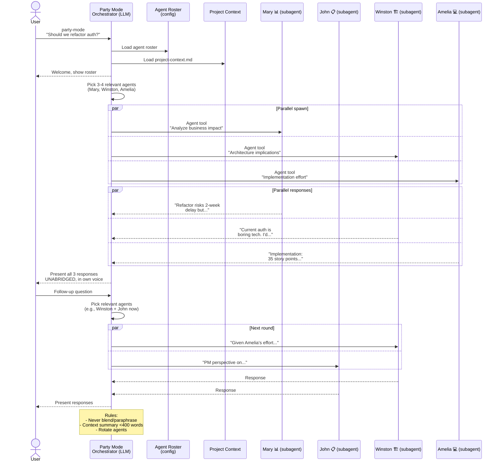
```mermaid
sequenceDiagram
    actor User
    participant Orchestrator as Party Mode<br/>Orchestrator (LLM)
    participant Roster as Agent Roster<br/>(config)
    participant Context as Project Context

    participant Mary as Mary 📊 (subagent)
    participant John as John 📋 (subagent)
    participant Winston as Winston 🏗️ (subagent)
    participant Amelia as Amelia 💻 (subagent)

    User->>Orchestrator: party-mode<br/>"Should we refactor auth?"
    Orchestrator->>Roster: Load agent roster
    Orchestrator->>Context: Load project-context.md
    Orchestrator-->>User: Welcome, show roster

    Orchestrator->>Orchestrator: Pick 3-4 relevant agents<br/>(Mary, Winston, Amelia)

    par Parallel spawn
        Orchestrator->>Mary: Agent tool<br/>"Analyze business impact"
        and
        Orchestrator->>Winston: Agent tool<br/>"Architecture implications"
        and
        Orchestrator->>Amelia: Agent tool<br/>"Implementation effort"
    end

    par Parallel responses
        Mary-->>Orchestrator: "Refactor risks 2-week<br/>delay but..."
        and
        Winston-->>Orchestrator: "Current auth is<br/>boring tech. I'd..."
        and
        Amelia-->>Orchestrator: "Implementation:<br/>35 story points..."
    end

    Orchestrator-->>User: Present all 3 responses<br/>UNABRIDGED, in own voice

    User->>Orchestrator: Follow-up question

    Orchestrator->>Orchestrator: Pick relevant agents<br/>(e.g., Winston + John now)

    par Next round
        Orchestrator->>Winston: "Given Amelia's effort..."
        and
        Orchestrator->>John: "PM perspective on..."
    end

    Winston-->>Orchestrator: Response
    John-->>Orchestrator: Response

    Orchestrator-->>User: Present responses

    Note over Orchestrator: Rules:<br/>- Never blend/paraphrase<br/>- Context summary <400 words<br/>- Rotate agents
```

---

## 13. Correct course decision tree

`bmad-correct-course` — khi và sao để pivot.

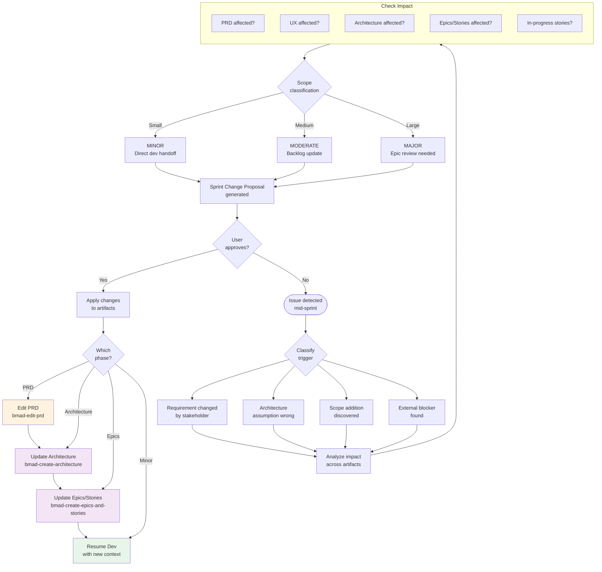
```mermaid
flowchart TD
    Start([Issue detected<br/>mid-sprint])

    Classify{Classify<br/>trigger}

    ReqChange[Requirement changed<br/>by stakeholder]
    ArchAssumption[Architecture<br/>assumption wrong]
    ScopeChange[Scope addition<br/>discovered]
    Blocker[External blocker<br/>found]

    ImpactAnalysis[Analyze impact<br/>across artifacts]

    subgraph Impact["Check Impact"]
        direction TB
        PRD[PRD affected?]
        UX[UX affected?]
        Arch[Architecture affected?]
        Epics[Epics/Stories affected?]
        InProg[In-progress stories?]
    end

    ScopeClass{Scope<br/>classification}

    Minor[MINOR<br/>Direct dev handoff]
    Moderate[MODERATE<br/>Backlog update]
    Major[MAJOR<br/>Epic review needed]

    Proposal[Sprint Change Proposal<br/>generated]

    Approve{User<br/>approves?}

    Apply[Apply changes<br/>to artifacts]
    BackToPhase{Which<br/>phase?}

    Phase2Edit[Edit PRD<br/>bmad-edit-prd]
    Phase3Arch[Update Architecture<br/>bmad-create-architecture]
    Phase3Epics[Update Epics/Stories<br/>bmad-create-epics-and-stories]
    Phase4Dev[Resume Dev<br/>with new context]

    Start --> Classify
    Classify --> ReqChange
    Classify --> ArchAssumption
    Classify --> ScopeChange
    Classify --> Blocker

    ReqChange --> ImpactAnalysis
    ArchAssumption --> ImpactAnalysis
    ScopeChange --> ImpactAnalysis
    Blocker --> ImpactAnalysis

    ImpactAnalysis --> Impact
    Impact --> ScopeClass

    ScopeClass -->|Small| Minor
    ScopeClass -->|Medium| Moderate
    ScopeClass -->|Large| Major

    Minor --> Proposal
    Moderate --> Proposal
    Major --> Proposal

    Proposal --> Approve
    Approve -->|Yes| Apply
    Approve -->|No| Start

    Apply --> BackToPhase
    BackToPhase -->|PRD| Phase2Edit
    BackToPhase -->|Architecture| Phase3Arch
    BackToPhase -->|Epics| Phase3Epics
    BackToPhase -->|Minor| Phase4Dev

    Phase2Edit --> Phase3Arch
    Phase3Arch --> Phase3Epics
    Phase3Epics --> Phase4Dev

    classDef phase2 fill:#fff3e0
    classDef phase3 fill:#f3e5f5
    classDef phase4 fill:#e8f5e9
    class Phase2Edit phase2
    class Phase3Arch,Phase3Epics phase3
    class Phase4Dev phase4
```

---

## 14. Data flow artifacts between phases

Cách các file artifact được tạo và tiêu thụ.

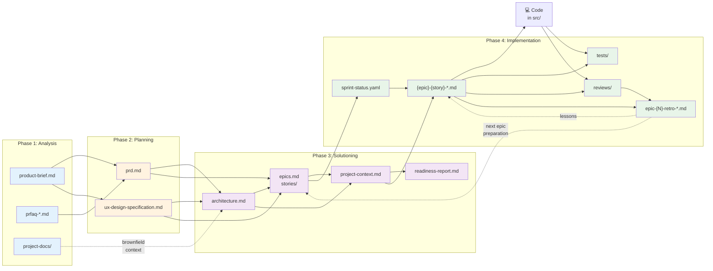
```mermaid
graph LR
    subgraph P1["Phase 1: Analysis"]
        direction TB
        PB[product-brief.md]
        PRFAQ[prfaq-*.md]
        DP[project-docs/]
    end

    subgraph P2["Phase 2: Planning"]
        direction TB
        PRD[prd.md]
        UXD[ux-design-specification.md]
    end

    subgraph P3["Phase 3: Solutioning"]
        direction TB
        ARCH[architecture.md]
        EPICS[epics.md<br/>stories/]
        PC[project-context.md]
        READY[readiness-report.md]
    end

    subgraph P4["Phase 4: Implementation"]
        direction TB
        SS[sprint-status.yaml]
        STORY["{epic}-{story}-*.md"]
        TESTS[tests/]
        REVIEWS[reviews/]
        RETRO["epic-{N}-retro-*.md"]
    end

    Code[💻 Code<br/>in src/]

    PB --> PRD
    PB --> UXD
    PRFAQ --> PRD
    DP -.->|brownfield<br/>context| ARCH

    PRD --> ARCH
    PRD --> EPICS
    UXD --> ARCH
    UXD --> EPICS

    ARCH --> EPICS
    ARCH --> PC
    EPICS --> PC
    PC --> READY

    EPICS --> SS
    SS --> STORY
    PC --> STORY

    STORY --> Code
    STORY --> TESTS
    STORY --> REVIEWS

    Code --> TESTS
    Code --> REVIEWS

    STORY --> RETRO
    REVIEWS --> RETRO

    RETRO -.->|lessons| STORY
    RETRO -.->|next epic<br/>preparation| EPICS

    classDef p1 fill:#e3f2fd
    classDef p2 fill:#fff3e0
    classDef p3 fill:#f3e5f5
    classDef p4 fill:#e8f5e9
    class PB,PRFAQ,DP p1
    class PRD,UXD p2
    class ARCH,EPICS,PC,READY p3
    class SS,STORY,TESTS,REVIEWS,RETRO p4
```

---

## 15. Sequence - user triggers full flow

End-to-end: user có idea → code shipped, qua các agent.

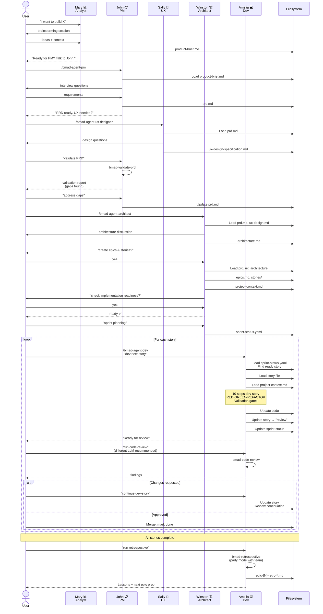
```mermaid
sequenceDiagram
    actor User
    participant Mary as Mary 📊<br/>Analyst
    participant John as John 📋<br/>PM
    participant Sally as Sally 🎨<br/>UX
    participant Winston as Winston 🏗️<br/>Architect
    participant Amelia as Amelia 💻<br/>Dev
    participant FS as Filesystem

    User->>Mary: "I want to build X"
    Mary->>User: brainstorming session
    User->>Mary: ideas + context
    Mary->>FS: product-brief.md
    Mary-->>User: "Ready for PM? Talk to John."

    User->>John: /bmad-agent-pm
    John->>FS: Load product-brief.md
    John->>User: interview questions
    User->>John: requirements
    John->>FS: prd.md
    John-->>User: "PRD ready. UX needed?"

    User->>Sally: /bmad-agent-ux-designer
    Sally->>FS: Load prd.md
    Sally->>User: design questions
    Sally->>FS: ux-design-specification.md

    User->>John: "validate PRD"
    John->>John: bmad-validate-prd
    John-->>User: validation report<br/>(gaps found)
    User->>John: "address gaps"
    John->>FS: Update prd.md

    User->>Winston: /bmad-agent-architect
    Winston->>FS: Load prd.md, ux-design.md
    Winston->>User: architecture discussion
    Winston->>FS: architecture.md

    Winston->>User: "create epics & stories?"
    User->>Winston: yes
    Winston->>FS: Load prd, ux, architecture
    Winston->>FS: epics.md, stories/
    Winston->>FS: project-context.md

    Winston->>User: "check implementation readiness?"
    User->>Winston: yes
    Winston-->>User: ready ✅

    User->>Winston: "sprint planning"
    Winston->>FS: sprint-status.yaml

    loop For each story
        User->>Amelia: /bmad-agent-dev<br/>"dev next story"
        Amelia->>FS: Load sprint-status.yaml<br/>Find ready story
        Amelia->>FS: Load story file
        Amelia->>FS: Load project-context.md

        Note over Amelia: 10 steps dev-story<br/>RED-GREEN-REFACTOR<br/>Validation gates

        Amelia->>FS: Update code
        Amelia->>FS: Update story → "review"
        Amelia->>FS: Update sprint-status

        Amelia-->>User: "Ready for review"

        User->>Amelia: "run code-review"<br/>(different LLM recommended)
        Amelia->>Amelia: bmad-code-review
        Amelia-->>User: findings

        alt Changes requested
            User->>Amelia: "continue dev-story"
            Amelia->>FS: Update story<br/>Review continuation
        else Approved
            User->>FS: Merge, mark done
        end
    end

    Note over User,FS: All stories complete

    User->>Amelia: "run retrospective"
    Amelia->>Amelia: bmad-retrospective<br/>(party mode with team)
    Amelia->>FS: epic-{N}-retro-*.md

    Amelia-->>User: Lessons + next epic prep
```

---

## 16. Hierarchy - Module → Agent → Skill → Step

Một góc nhìn khác: cấu trúc hierarchy.

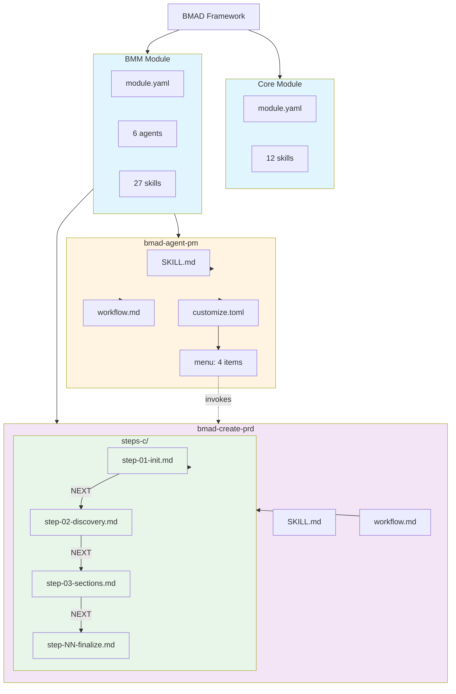
```mermaid
graph TB
    BMAD[BMAD Framework]

    subgraph CoreM[Core Module]
        CoreYaml[module.yaml]
        CoreSkills[12 skills]
    end

    subgraph BMMM[BMM Module]
        BMMYaml[module.yaml]
        BMMAgents[6 agents]
        BMMSkills[27 skills]
    end

    subgraph Agent1[bmad-agent-pm]
        A1S[SKILL.md]
        A1W[workflow.md]
        A1C[customize.toml]
        A1M[menu: 4 items]
    end

    subgraph Skill1[bmad-create-prd]
        S1S[SKILL.md]
        S1W[workflow.md]
        subgraph Steps1[steps-c/]
            S1Step1[step-01-init.md]
            S1Step2[step-02-discovery.md]
            S1Step3[step-03-sections.md]
            S1StepN[step-NN-finalize.md]
        end
    end

    BMAD --> CoreM
    BMAD --> BMMM

    BMMM --> Agent1
    BMMM --> Skill1

    A1M -.->|invokes| Skill1

    Agent1 --> A1S
    Agent1 --> A1W
    Agent1 --> A1C
    A1C --> A1M

    Skill1 --> S1S
    Skill1 --> S1W
    S1W --> Steps1
    Steps1 --> S1Step1
    S1Step1 -->|NEXT| S1Step2
    S1Step2 -->|NEXT| S1Step3
    S1Step3 -->|NEXT| S1StepN

    classDef module fill:#e1f5ff
    classDef agent fill:#fff4e1
    classDef skill fill:#f3e5f5
    classDef step fill:#e8f5e9
    class CoreM,BMMM module
    class Agent1 agent
    class Skill1 skill
    class Steps1,S1Step1,S1Step2,S1Step3,S1StepN step
```

---

**Đọc tiếp:** [06-installer-internals.md](06-installer-internals.md) — Internals của installer, validator, build.
