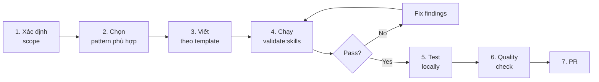

# 07. Extension Patterns - Mở rộng BMad Framework

> ⚠️ **UNOFFICIAL THIRD-PARTY DOCUMENTATION**
> Không phải official BMad docs. Xem [DISCLAIMER.md](DISCLAIMER.md) | Licensed MIT — xem [LICENSE](LICENSE) và [NOTICE](NOTICE)
> Official BMAD-METHOD: <https://github.com/bmad-code-org/BMAD-METHOD>

---

> Hướng dẫn chi tiết cách mở rộng: skill mới, agent mới, module mới, customization override, IDE mới, validation rule mới. Với examples đầy đủ.

---

## Mục lục

1. [Quy trình tổng quát](#1-quy-trình-tổng-quát)
2. [Pattern 1: Thêm Skill mới (workflow-skill)](#2-pattern-1-thêm-skill-mới-workflow-skill)
3. [Pattern 2: Thêm Agent persona mới](#3-pattern-2-thêm-agent-persona-mới)
4. [Pattern 3: Thêm Module hoàn toàn mới](#4-pattern-3-thêm-module-hoàn-toàn-mới)
5. [Pattern 4: Customize skill có sẵn](#5-pattern-4-customize-skill-có-sẵn)
6. [Pattern 5: Thêm IDE support](#6-pattern-5-thêm-ide-support)
7. [Pattern 6: Thêm validation rule](#7-pattern-6-thêm-validation-rule)
8. [Pattern 7: Viết sub-agent prompt](#8-pattern-7-viết-sub-agent-prompt)
9. [Pattern 8: Thêm external module (registry)](#9-pattern-8-thêm-external-module-registry)
10. [Common pitfalls & how to avoid](#10-common-pitfalls--how-to-avoid)
11. [Testing checklist cho extension](#11-testing-checklist-cho-extension)

---

## 1. Quy trình tổng quát

Dù mở rộng theo pattern nào, quy trình luôn là:



### 1.1 Before starting

1. **Discord discussion** (cho feature lớn) — CONTRIBUTING.md bắt buộc hỏi maintainer trước
2. **Search existing skills** — có thể đã có skill làm điều tương tự
3. **Determine scope**:
   - Single function? → skill
   - Persona + menu? → agent
   - Gói skills + agents? → module
   - Customize behavior? → TOML override (không cần skill mới)

### 1.2 Validation workflow

```bash
# Chạy sau mỗi major change
npm run validate:skills path/to/your-skill
npm run validate:refs

# Full quality check trước PR
npm run quality
```

---

## 2. Pattern 1: Thêm Skill mới (workflow-skill)

### 2.1 Scope

Skill là **đơn vị công việc đơn lẻ** — user gọi → làm một việc → xong.

Dùng khi:
- Feature discrete (không cần persona)
- Reusable across agents
- Có thể được invoke từ agent menu

### 2.2 Template directory

```
src/bmm-skills/4-implementation/bmad-my-skill/
├── SKILL.md                       # Bắt buộc
├── workflow.md                    # Bắt buộc
└── steps/                         # Optional
    ├── step-01-init.md
    ├── step-02-execute.md
    └── step-03-finalize.md
```

### 2.3 Step-by-step

**Bước 1:** Tạo thư mục (tên phải match `name` frontmatter)

```bash
mkdir -p src/bmm-skills/4-implementation/bmad-my-skill/steps
```

**Bước 2:** Viết `SKILL.md`

```yaml
---
name: bmad-my-skill
description: 'Generate weekly sprint retrospective summary from sprint-status.yaml. Use when the user says "weekly summary" or "sprint digest".'
---

Follow the instructions in ./workflow.md.
```

**Quy tắc:**
- `name` regex: `^bmad-[a-z0-9]+(-[a-z0-9]+)*$` ✅ `bmad-my-skill`
- `description` phải có **"Use when"** clause
- Body redirect tới workflow.md

**Bước 3:** Viết `workflow.md`

```yaml
---
start_date: ''
end_date: ''
---

# Weekly Sprint Summary Workflow

**Goal:** Generate a weekly summary from sprint-status.yaml

**Your Role:** You are a scrum master preparing sprint digest for stakeholders.
Communicate in {communication_language}, output in {document_output_language}.

---

## INITIALIZATION

### Configuration Loading
Load config from `{project-root}/_bmad/bmm/config.yaml` and resolve:
- `project_name`, `user_name`
- `communication_language`, `document_output_language`
- `implementation_artifacts`
- `date` as system-generated current datetime

### Paths
- `sprint_status` = `{implementation_artifacts}/sprint-status.yaml`
- `summary_output_file` = `{implementation_artifacts}/sprint-summary-{{date}}.md`

---

## EXECUTION

Read fully and follow: `./steps/step-01-load-status.md`
```

**Bước 4:** Viết steps

`steps/step-01-load-status.md`:

```markdown
# Step 01: Load Sprint Status

## YOUR TASK
Load sprint-status.yaml và parse development_status.

## ACTION

1. Read file `{sprint_status}`
2. Parse YAML structure
3. Extract:
   - Total stories
   - Stories by status (ready-for-dev, in-progress, review, done)
   - Recently completed stories (last 7 days)
   - Blockers
4. Store extracted data as `{{sprint_data}}`

## HALT CONDITIONS

- File `{sprint_status}` not found → HALT: "No sprint status file. Run bmad-sprint-planning first."

## NEXT

Read fully and follow: `./step-02-analyze-progress.md`
```

`steps/step-02-analyze-progress.md`:

```markdown
# Step 02: Analyze Progress

## YOUR TASK
Analyze sprint progress and identify patterns.

## ACTION

1. Calculate completion percentage
2. Identify velocity (stories done / time)
3. Flag at-risk stories (in-progress > 3 days)
4. Find blockers
5. Store analysis as `{{progress_analysis}}`

## NEXT

Read fully and follow: `./step-03-generate-summary.md`
```

`steps/step-03-generate-summary.md`:

```markdown
# Step 03: Generate Summary Document

## YOUR TASK
Generate markdown summary from sprint_data + progress_analysis.

## ACTION

Create `{summary_output_file}` with structure:

```markdown
# Sprint Summary - {{date}}

## Overview
- Total stories: {{total}}
- Completed this week: {{completed_count}}
- In progress: {{in_progress_count}}
- Blocked: {{blocked_count}}

## Completed Stories
- {{story_1}}: {{description}}
- {{story_2}}: {{description}}

## At-Risk Stories
- {{story_x}}: blocked for {{days}} days — {{reason}}

## Next Week Focus
{{recommendations}}
```

Then confirm with user and offer to send to Slack/email (out of scope).

## NEXT

Workflow complete. Present summary to user.
```

**Bước 5:** Validate

```bash
node tools/validate-skills.js src/bmm-skills/4-implementation/bmad-my-skill --strict
```

Nếu fail, fix findings. Mỗi finding có `suggestion` field.

**Bước 6:** Register trong module.yaml (optional — nếu muốn install cùng BMM)

Edit `src/bmm-skills/module.yaml`:

```yaml
# Nếu muốn agent Amelia invoke skill này:
# Thêm menu item vào bmad-agent-dev/customize.toml:

# src/bmm-skills/4-implementation/bmad-agent-dev/customize.toml
[[agent.menu]]
code = "WS"
description = "Generate weekly sprint summary"
skill = "bmad-my-skill"
```

**Bước 7:** Quality check

```bash
npm run quality
```

Must pass all: format, lint, docs-build, test:install, validate:refs, validate:skills.

### 2.4 Checklist

- [ ] Directory name = `bmad-*` matches `name:` frontmatter
- [ ] `description` có "Use when..."
- [ ] `workflow.md` load config, declare paths, execute first step
- [ ] Steps numbered `step-NN-*.md`, mỗi step có NEXT (trừ step cuối)
- [ ] Không dùng absolute paths
- [ ] Không reach vào folder skill khác (PATH-05)
- [ ] `npm run validate:skills --strict` pass
- [ ] Registered trong module.yaml hoặc agent menu (nếu cần)

---

## 3. Pattern 2: Thêm Agent persona mới

### 3.1 Scope

Agent = **persona with menu of skills**. Có identity, có communication style, có principles.

### 3.2 Template

```
src/bmm-skills/N-phase/bmad-agent-security/
├── SKILL.md
├── workflow.md          # Generic agent activation workflow
└── customize.toml       # Persona + menu
```

### 3.3 Step-by-step

**Bước 1:** Tạo directory

```bash
mkdir -p src/bmm-skills/4-implementation/bmad-agent-security
```

**Bước 2:** Viết `SKILL.md`

```yaml
---
name: bmad-agent-security
description: 'Activate Sam the Security Expert. Threat modeling, OWASP rigor, dependency audits. Use when user says "talk to Sam" or "request security expert".'
---

Follow the instructions in ./workflow.md.
```

**Bước 3:** Viết `workflow.md`

Agent workflow standard gồm 8 bước (từ phân tích ở trên):

```markdown
# Sam - Security Expert Activation

**Goal:** Activate Sam persona for security-focused work.

---

## INITIALIZATION

### Configuration Loading
Load config from `{project-root}/_bmad/core/config.yaml` and `_bmad/bmm/config.yaml`:
- `user_name`, `communication_language`, `document_output_language`
- `planning_artifacts`, `implementation_artifacts`, `project_knowledge`
- `date`

### Paths
- `project_context` = `**/project-context.md` (load if exists)

---

## EXECUTION

### Step 1: Resolve Agent Configuration
Invoke resolver:
```bash
python3 {project-root}/_bmad/scripts/resolve_customization.py \
  --skill {skill-root} \
  --key agent
```
Parse merged agent block: persona + menu.

### Step 2: Execute Prepend Hooks
Run all `activation_steps_prepend` from merged config.

### Step 3: Adopt Persona
Adopt identity:
- Name: {{agent.name}}
- Title: {{agent.title}}
- Role: {{agent.role}}
- Communication style: {{agent.communication_style}}
- Principles: {{agent.principles}}

Use {{agent.icon}} prefix for all messages.

### Step 4: Load Persistent Facts
For each entry in `{{agent.persistent_facts}}`:
- If `file:` prefix → expand glob, load content
- If literal → treat as fact

Inject as always-true knowledge.

### Step 5: Load User Config
- Switch to `{communication_language}` for chat
- Remember `{user_name}` for addressing

### Step 6: Greet
Output in `{communication_language}`:
```
{{agent.icon}} Hello {user_name}! I'm {{agent.name}}, your {{agent.title}}.

[Brief intro based on role...]
```

### Step 7: Execute Append Hooks
Run all `activation_steps_append`.

### Step 8: Dispatch
- If user intent clear → invoke matching skill directly
- Else → render menu:

```
What can I help with?

  [TM] Threat model the current feature
  [SA] Security audit of dependencies
  [VR] Vulnerability review of code
  [CC] Compliance check against standard
  [EX] Exit to main

Type the code or describe what you need:
```

Wait for user input (HALT).

When user provides input:
- If code matches menu item:
  - If `skill:` field → Invoke the `<skill-name>` skill
  - If `prompt:` field → Execute prompt
- Else → try infer intent, re-present menu if unclear
```

**Bước 4:** Viết `customize.toml`

```toml
[agent]
name = "Sam"
title = "Security Expert"
icon = "🛡️"
role = "Threat modeling, security audits, OWASP rigor. Protect the app from attackers and accidents."
identity = "Channels bug bounty hunter skepticism and compliance engineer rigor."
communication_style = "Precise, evidence-based. Questions follow CIA triad: confidentiality, integrity, availability."

principles = [
  "Defense in depth — never rely on single control.",
  "Validate inputs at trust boundaries, not internals.",
  "Assume breach. Minimize blast radius.",
  "Compliance is baseline, not goal.",
  "Every dependency is attack surface.",
]

persistent_facts = [
  "file:{project-root}/**/project-context.md",
  "file:{project-root}/docs/security/*.md",
  "OWASP Top 10 is the baseline, not ceiling.",
]

activation_steps_prepend = []
activation_steps_append = [
  "If PRD exists in {planning_artifacts}/prd.md, offer to threat-model it.",
]

[[agent.menu]]
code = "TM"
description = "Threat model the current feature or architecture"
skill = "bmad-threat-model"

[[agent.menu]]
code = "SA"
description = "Security audit of dependencies (SCA)"
skill = "bmad-security-audit-deps"

[[agent.menu]]
code = "VR"
description = "Vulnerability review of pending code changes"
skill = "bmad-security-review"

[[agent.menu]]
code = "CC"
description = "Compliance check against standard (SOC2, HIPAA, PCI-DSS)"
skill = "bmad-compliance-check"

[[agent.menu]]
code = "EX"
description = "Exit to main BMad interface"
prompt = "Returning to main BMad interface. Call /bmad-agent-security anytime to bring Sam back."
```

**Bước 5:** Register trong `src/bmm-skills/module.yaml`

```yaml
agents:
  # ... existing agents
  - code: bmad-agent-security
    name: Sam
    title: Security Expert
    icon: "🛡️"
    team: software-development
    description: "Threat modeling, OWASP rigor, dependency audits. Channels bug bounty hunter skepticism."
```

**Bước 6:** (Optional) Tạo các skill trong menu

Mỗi skill trong menu (`bmad-threat-model`, `bmad-security-audit-deps`, etc.) là skill riêng (Pattern 1). Nếu chưa có, tạo placeholder hoặc reuse existing.

**Bước 7:** Validate + test

```bash
node tools/validate-skills.js src/bmm-skills/4-implementation/bmad-agent-security --strict
npm run quality
```

### 3.4 Key decisions khi viết persona

1. **Name** — easy pronounce, không clash với existing (Mary, John, Sally, Winston, Amelia, Paige)
2. **Icon** — 1 emoji representative (🛡️ for security)
3. **Communication style** — metaphor cụ thể ("Precise bug hunter", "Paranoid auditor")
4. **Principles** — 3-7 items, specific enough để shape behavior
5. **Menu codes** — 2-letter, intuitive (TM, SA, VR, CC, EX)

---

## 4. Pattern 3: Thêm Module hoàn toàn mới

### 4.1 Scope

Module = **gói skills + agents + config** đóng gói một domain.

Ví dụ: `bmad-tea` (Test Experience Automation), `bmad-bmb` (BMad Builder), `bmad-security` (Security module).

### 4.2 Template

```
src/security-skills/              # Directory name
├── module.yaml                    # Bắt buộc
├── 1-planning/
│   ├── bmad-agent-security/       # Persona
│   └── bmad-threat-model/         # Skill
├── 2-execution/
│   ├── bmad-security-audit-deps/
│   └── bmad-security-review/
└── 3-compliance/
    └── bmad-compliance-check/
```

### 4.3 Step-by-step

**Bước 1:** Tạo thư mục module

```bash
mkdir -p src/security-skills/{1-planning,2-execution,3-compliance}
```

**Bước 2:** Viết `module.yaml`

```yaml
code: security
name: "BMad Security Module"
description: "Threat modeling, security audits, compliance checks"
default_selected: false             # Không auto-install

# Inherit from core (user_name, language, output_folder - đã declared)

# Custom config variables
security_artifacts:
  prompt: "Where should security artifacts be stored (threat models, audit reports)?"
  default: "{output_folder}/security-artifacts"
  result: "{project-root}/{value}"

compliance_standard:
  prompt: "Target compliance standard?"
  scope: user
  default: "none"
  result: "{value}"
  single-select:
    - value: "none"
      label: "None (general security)"
    - value: "soc2"
      label: "SOC 2"
    - value: "hipaa"
      label: "HIPAA"
    - value: "pci-dss"
      label: "PCI-DSS"

# Directories installer creates
directories:
  - "{security_artifacts}"

# Agents
agents:
  - code: bmad-agent-security
    name: Sam
    title: Security Expert
    icon: "🛡️"
    team: security
    description: "Threat modeling, OWASP rigor..."

# Post-install notes
post-install-notes:
  compliance_standard:
    soc2: |
      SOC 2 compliance selected. Run /bmad-agent-security then [CC] for compliance scan.
    hipaa: |
      HIPAA compliance selected. HIPAA-specific threat model skills enabled.
    pci-dss: |
      PCI-DSS compliance selected. Payment data handling rules active.
```

**Bước 3:** Tạo skills trong module

Theo Pattern 1 (skills) hoặc Pattern 2 (agent), tạo:
- `1-planning/bmad-agent-security/` (Pattern 2)
- `1-planning/bmad-threat-model/` (Pattern 1)
- `2-execution/bmad-security-audit-deps/` (Pattern 1)
- `2-execution/bmad-security-review/` (Pattern 1)
- `3-compliance/bmad-compliance-check/` (Pattern 1)

**Bước 4:** Đăng ký module

**Option A: Local private module**

Khi user install, truyền custom source:
```bash
npx bmad-method install --custom-source /path/to/security-module
```

**Option B: Git private module**

```bash
npx bmad-method install --custom-source https://github.com/your-org/security-module
```

**Option C: Official BMad community module**

1. Fork `bmad-plugins-marketplace` repo
2. Edit `registry/official.yaml`:
   ```yaml
   modules:
     # ... existing
     - name: security
       code: security
       display_name: "BMad Security Module"
       description: "Threat modeling, security audits"
       repository: "https://github.com/your-org/bmad-security-module"
       module_definition: "src/module.yaml"
       default_selected: false
       type: "community"
   ```
3. PR tới marketplace

**Bước 5:** Test install

```bash
# Local test
cd /tmp/test-project
git init
npx --package=/path/to/BMAD-METHOD bmad-method install --modules security
```

**Bước 6:** Quality

```bash
npm run quality
```

### 4.4 Module vs Community guidelines

**Chọn "community" type nếu:**
- Module không phải core BMad functionality
- Maintained bởi bên thứ ba
- Có thể không available trong future

**Chọn "bmad-org" type nếu:**
- Module official BMad
- Maintained bởi bmad-code-org
- Long-term support committed

---

## 5. Pattern 4: Customize skill có sẵn

### 5.1 Scope

Khi bạn **không muốn modify framework source**, nhưng cần adjust skill behavior cho team/project.

### 5.2 Phương án

**Option A: User-interactive** (khuyến nghị)

```
# Trong chat với BMad
User: "customize bmad"

# Invokes bmad-customize skill
# Skill guides bạn qua 6 steps
```

**Option B: Manual override file**

### 5.3 Manual override - step by step

**Ví dụ: Team dùng TDD stricter, muốn Dev agent (Amelia) prioritize tests >>>**

**Bước 1:** Identify skill

```bash
ls _bmad/skills/bmm/4-implementation/bmad-agent-dev/
# SKILL.md, workflow.md, customize.toml
```

**Bước 2:** Review default `customize.toml`

```toml
# _bmad/skills/bmm/4-implementation/bmad-agent-dev/customize.toml (default)
[agent]
name = "Amelia"
title = "Senior Software Engineer"
icon = "💻"
role = "..."
# ...
principles = [
  "Red, green, refactor — in that order.",
  "100% pass before review.",
  # ...
]
```

**Bước 3:** Tạo team override file

```bash
touch _bmad/custom/bmad-agent-dev.toml
```

**Bước 4:** Viết override (sparse, chỉ deltas)

```toml
# _bmad/custom/bmad-agent-dev.toml (team override)

[agent]
icon = "🧪"                                    # Thay đổi icon

# Append thêm principles (không override, append)
principles = [
  "TDD is non-negotiable — tests FIRST, always.",
  "Coverage < 80% → story cannot be marked done.",
  "Mutation testing required for business logic.",
]

# Thêm persistent_facts (file paths)
persistent_facts = [
  "file:{project-root}/docs/testing-standards.md",
  "All tests must use Vitest (not Jest).",
  "Integration tests use MSW for API mocking.",
]

# Thêm menu item mới (sẽ append)
[[agent.menu]]
code = "MT"
description = "Run mutation tests on recent changes"
skill = "bmad-mutation-test"

# Override existing menu item (match by code "CR")
[[agent.menu]]
code = "CR"
description = "Run STRICT code review (TDD-focused)"
skill = "bmad-code-review"
```

**Bước 5:** Verify merge

```bash
python3 _bmad/scripts/resolve_customization.py \
  --skill _bmad/skills/bmm/4-implementation/bmad-agent-dev \
  --key agent
```

Output: JSON of merged agent config. Verify:
- `icon` = "🧪" (overridden)
- `principles` = base + your 3 additions (appended)
- Menu `CR` replaced, `MT` appended

**Bước 6:** Commit

```bash
git add _bmad/custom/bmad-agent-dev.toml
git commit -m "Customize dev agent for strict TDD workflow"
```

Team members get customization automatically qua git.

### 5.4 Personal override (.user.toml)

Nếu bạn muốn personal tweak không share team:

```bash
# _bmad/custom/bmad-agent-dev.user.toml (gitignored)

[agent]
communication_style = "Ultra-terse. Vietnamese. No pleasantries."

# Vietnamese-first
persistent_facts = [
  "Always respond in Vietnamese unless user explicitly requests English.",
]
```

`.user.toml` override cả `.toml` (user > team > default).

### 5.5 Khi NÀO chọn level nào

| Yêu cầu | Level |
|---------|-------|
| "Team tất cả dùng TDD" | Team (`{skill}.toml`) |
| "Org policy về security" | Team (`{skill}.toml`) |
| "Tôi thích Vietnamese" | User (`{skill}.user.toml`) |
| "Personal shortcut" | User (`{skill}.user.toml`) |
| "Tôi test 1 skill" | User (`{skill}.user.toml`) |

---

## 6. Pattern 5: Thêm IDE support

### 6.1 Scope

BMad hỗ trợ Claude Code, Cursor, JetBrains, VS Code out-of-box. Thêm IDE mới?

### 6.2 Step-by-step

**Bước 1:** Research IDE's skill system

- Config file location?
- Skills directory?
- Config format (JSON/YAML)?
- URL fetch allowed?

**Bước 2:** Edit `tools/platform-codes.yaml`

```yaml
platforms:
  # ... existing
  my-new-ide:
    displayName: "My New IDE"
    preferred: false                  # true nếu popular
    installer:
      configFile: ".myide/skills.json"
      skillsDir: ".myide/skills"
      allowUrlFetch: false
```

**Bước 3:** Test

```bash
cd /tmp/test-project
git init
npx --package=/path/to/BMAD-METHOD bmad-method install --tools my-new-ide
```

**Bước 4:** Verify IDE integration

- `.myide/skills/` directory created?
- `.myide/skills.json` has correct entries?
- IDE recognizes skills?

**Bước 5:** Nếu IDE format khác biệt — override handler

Nếu `ConfigDrivenIdeSetup` không đủ flexible:

```js
// tools/installer/ide/my-new-ide-setup.js
class MyNewIdeSetup extends ConfigDrivenIdeSetup {
  async generateIdeConfig(configPath, modules) {
    // Custom logic cho IDE này
    const config = {
      version: "1.0",
      skills: [],
      // IDE-specific fields
    };
    
    for (const moduleId of modules) {
      // Transform skill metadata to IDE format
    }
    
    await fs.writeFile(configPath, JSON.stringify(config, null, 2));
  }
}
```

Register trong `tools/installer/ide/manager.js`:
```js
if (code === 'my-new-ide') {
  this.handlers.set(code, new MyNewIdeSetup(code, info));
  continue;
}
```

---

## 7. Pattern 6: Thêm validation rule

### 7.1 Scope

Rule mới để enforce convention mới của team.

### 7.2 Deterministic rule (JS)

**Bước 1:** Edit `tools/validate-skills.js`

```js
// Thêm function check
function checkWorkflowHasGoal(skillDir, findings) {
  const workflowPath = path.join(skillDir, 'workflow.md');
  if (!fs.existsSync(workflowPath)) return;
  
  const content = fs.readFileSync(workflowPath, 'utf-8');
  const { body } = parseFrontmatterMultiline(content);
  
  if (!body.match(/^\*\*Goal:\*\*/m)) {
    findings.push({
      rule: 'WF-10',
      severity: 'MEDIUM',
      file: workflowPath,
      message: 'workflow.md phải có "**Goal:**" section',
      suggestion: 'Add "**Goal:** [one sentence description]" after # title'
    });
  }
}

// Register trong main:
async function main() {
  // ...
  for (const skillDir of skillDirs) {
    // ... existing checks
    checkWorkflowHasGoal(skillDir, findings);
  }
}
```

**Bước 2:** Document trong `tools/skill-validator.md`

```markdown
### WF-10 - workflow.md Must Have Goal Statement

- **Severity:** MEDIUM
- **Applies to:** `workflow.md`
- **Rule:** workflow.md body must contain `**Goal:**` section stating the workflow's purpose in one sentence.
- **Detection:** Regex `^\*\*Goal:\*\*` in body.
- **Fix:** Add `**Goal:** [one sentence description]` after `# [Workflow Name]` heading.
```

**Bước 3:** Test

```bash
node tools/validate-skills.js src/bmm-skills/4-implementation/bmad-dev-story
```

### 7.3 Inference rule (for LLM)

Nếu rule không check được bằng regex đơn giản:

**Bước 1:** Chỉ document trong `tools/skill-validator.md`

```markdown
### WF-11 - Goal Statement Must Be Concrete

- **Severity:** LOW
- **Applies to:** `workflow.md`
- **Rule:** Goal sentence must be actionable + specific. "Helps user" is too vague. "Generates a PRD from a product brief" is good.
- **Detection:** LLM judgment. Look for vague verbs ("helps", "assists", "supports").
- **Fix:** Rephrase with action verb + specific output.
```

**Bước 2:** Rule này không có JS enforcement — LLM reviewer reads `skill-validator.md` và apply.

---

## 8. Pattern 7: Viết sub-agent prompt

### 8.1 Scope

Sub-agent dùng khi skill cần **parallel processing** hoặc **specialized reasoning** mà không muốn bloat main workflow.

Ví dụ: `bmad-distillator` có 2 sub-agents:
- `distillate-compressor.md` — nén content
- `round-trip-reconstructor.md` — verify lossless

### 8.2 Template

```
bmad-my-skill/
└── agents/
    └── my-sub-agent.md
```

**my-sub-agent.md:**

```markdown
# Sub-Agent: [Name]

## ROLE
[One-paragraph role description]

## INPUT
You will receive:
- `source_content`: [description]
- `target_output_path`: [description]
- `parameters`: [description]

## YOUR TASK

1. [Step 1]
2. [Step 2]
3. [Step 3]

## OUTPUT FORMAT

Return JSON:
```json
{
  "status": "success" | "error",
  "output_path": "...",
  "metadata": {
    "key": "value"
  }
}
```

## RULES

- [Rule 1]
- [Rule 2]
- HALT if input invalid
```

### 8.3 Invoke sub-agent từ workflow

Trong workflow.md step:

```markdown
## ACTION

Spawn sub-agent via Agent tool:
- Description: "Compress document"
- Prompt: "Read fully and apply `{skill-root}/agents/distillate-compressor.md`.
  Input:
  - source_content: {{source_file}}
  - target_output_path: {{output_path}}
  - parameters: {compression_ratio: 0.1}"

Wait for subagent response.
Parse JSON output.
Continue with {{subagent_result.output_path}}.
```

### 8.4 Party mode pattern

`bmad-party-mode` spawn **multiple subagents parallel**:

```markdown
## ACTION

For each relevant agent (2-4 per round):
- Spawn via Agent tool
- Prompt: "You are {{agent.name}} ({{agent.role}}). 
         Context: {{context_summary}}
         User question: {{user_question}}
         Respond in your voice, unabridged."

Present all responses unfiltered.
```

---

## 9. Pattern 8: Thêm external module (registry)

### 9.1 Scope

Module của team bạn public cho community → đăng ký marketplace.

### 9.2 Steps

**Bước 1:** Module đã host trên GitHub public

```
my-org/bmad-security-module/
├── src/
│   └── module.yaml
├── README.md
└── package.json (optional)
```

**Bước 2:** Fork `bmad-code-org/bmad-plugins-marketplace`

**Bước 3:** Edit `registry/official.yaml`

```yaml
modules:
  # ... existing
  - name: security
    code: security
    display_name: "BMad Security"
    description: "Threat modeling, security audits, compliance"
    repository: "https://github.com/my-org/bmad-security-module"
    module_definition: "src/module.yaml"
    default_selected: false
    type: "community"
    maintainer: "my-org"
    tags: ["security", "compliance", "owasp"]
```

**Bước 4:** PR with:
- Module description
- Demo/screenshots
- License (MIT recommended)
- Maintenance commitment

**Bước 5:** Wait for review, address feedback.

**Bước 6:** After merge, users can install:

```bash
npx bmad-method install
# In module selection: "BMad Security" appears under "Community modules"
```

---

## 10. Common pitfalls & how to avoid

### 10.1 Pitfall: PATH-05 violation

❌ **Wrong:**
```markdown
# skill A's workflow.md
Read the template from: {project-root}/_bmad/skills/bmm/bmad-other-skill/template.md
```

✅ **Right:**
```markdown
Invoke the `bmad-other-skill` skill to generate the template.
```

### 10.2 Pitfall: Hardcoded paths

❌ **Wrong:**
```markdown
Save to: /Users/alice/project/docs/prd.md
```

✅ **Right:**
```markdown
Save to: {planning_artifacts}/prd.md
```

### 10.3 Pitfall: Forward-loading steps

❌ **Wrong step-01-init.md:**
```markdown
## INIT
Load all steps 01-05 into memory then execute in order.
```

✅ **Right:**
```markdown
## ACTION
Do init tasks.

## NEXT
Read fully and follow: `./step-02-execute.md`
```

Mỗi step load just-in-time.

### 10.4 Pitfall: name != directory

❌ **Wrong:**
```
src/bmm-skills/4-implementation/mySkill/    # camelCase directory
└── SKILL.md frontmatter: name: bmad-my-skill   # kebab-case name
```

Validator SKILL-05 fails.

✅ **Right:** directory `bmad-my-skill/`, name `bmad-my-skill`.

### 10.5 Pitfall: Menu items without code

❌ **Wrong:**
```toml
[[agent.menu]]
description = "Do something"
skill = "bmad-x"
# ← no code field!
```

✅ **Right:**
```toml
[[agent.menu]]
code = "DS"                    # Required for keyed merge
description = "Do something"
skill = "bmad-x"
```

### 10.6 Pitfall: Description missing "Use when"

❌ **Wrong:**
```yaml
description: 'Helps with brainstorming.'
```

✅ **Right:**
```yaml
description: 'Facilitate brainstorming sessions. Use when the user says "help me brainstorm" or "help me ideate".'
```

### 10.7 Pitfall: Too many / too few steps

- **< 2 steps**: không cần micro-file, inline trong workflow.md
- **> 10 steps**: quá phức tạp, tách thành multiple skills

STEP-07: sweet spot là **2-10 steps**.

### 10.8 Pitfall: Time estimates

❌ **Wrong:**
```markdown
## Step 02: Discovery (approx. 5 minutes)
```

✅ **Right:**
```markdown
## Step 02: Discovery
```

SEQ-02: AI changed dev speed, time estimates outdated fast.

---

## 11. Testing checklist cho extension

### 11.1 Pre-PR checklist

- [ ] `npm run validate:skills --strict` pass
- [ ] `npm run validate:refs --strict` pass
- [ ] `npm run lint` pass
- [ ] `npm run lint:md` pass
- [ ] `npm run format:check` pass
- [ ] `npm run test:install` pass
- [ ] `npm run docs:build` succeeds
- [ ] `npm run quality` succeeds
- [ ] Manual test: install trên fresh project, verify skill works

### 11.2 Manual testing

**Test fresh install:**
```bash
cd /tmp
rm -rf test-project
mkdir test-project && cd test-project
git init

# Install with your module
npx --package=/path/to/BMAD-METHOD bmad-method install --modules core,your-module --tools claude-code
```

**Test skill execution:**
- Open Claude Code in test-project
- Invoke your skill (`/bmad-my-skill` or through agent menu)
- Verify output files created in correct paths
- Verify config variables resolved

**Test customization:**
- Create `_bmad/custom/your-skill.toml` with override
- Re-run skill
- Verify override applied

**Test update:**
```bash
# Re-install with modified source
npx --package=/path/to/BMAD-METHOD bmad-method install --action update
```
- Verify customizations preserved
- Verify new default changes applied

### 11.3 Edge case tests

- [ ] Empty input (no project-root, no _bmad/)
- [ ] Missing required config variable
- [ ] Circular TOML override reference
- [ ] Glob patterns that match 0 files
- [ ] Very long descriptions (1024 char limit)
- [ ] Unicode in variables (Vietnamese, Chinese)
- [ ] Paths with spaces
- [ ] Multi-language (communication_language ≠ document_output_language)

### 11.4 CI integration

CI (`.github/workflows/quality.yaml`) chạy `npm run quality`. PR fail nếu:
- Validate skills fail (HIGH+)
- Validate refs fail
- Lint errors
- Format issues
- Test failures

Fix locally trước khi push.

---

## Tóm lược

8 extension patterns:

| # | Pattern | Khi dùng | Độ phức tạp |
|---|---------|----------|------|
| 1 | Skill workflow | Feature discrete | ⭐⭐ |
| 2 | Agent persona | Persona + menu | ⭐⭐⭐ |
| 3 | Module mới | Gói domain | ⭐⭐⭐⭐ |
| 4 | Customize skill | Tweak existing | ⭐ |
| 5 | IDE support | New IDE | ⭐⭐⭐ |
| 6 | Validation rule | Enforce convention | ⭐⭐ |
| 7 | Sub-agent prompt | Parallel processing | ⭐⭐⭐ |
| 8 | External module | Registry | ⭐⭐⭐⭐ |

**Quy tắc vàng:**
1. Validate early, validate often
2. Use existing skills trước khi tạo mới
3. Customize trước khi modify source
4. Discord trước khi PR lớn
5. Test trên fresh project, không chỉ dev repo

---

**Đọc tiếp:** [README.md](README.md) — Index tổng cho toàn bộ tài liệu dev.
