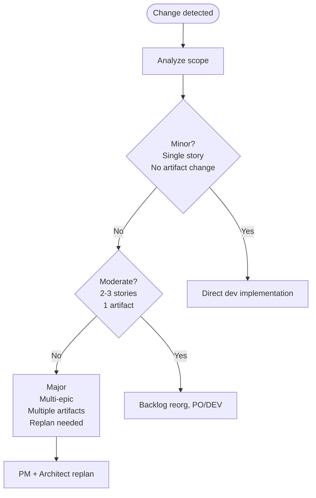

# 09d. Phase 4 Skills - Deep Dive (11 Skills)

> ⚠️ **UNOFFICIAL THIRD-PARTY DOCUMENTATION**
> Không phải official BMad docs. Xem [DISCLAIMER.md](DISCLAIMER.md) | Licensed MIT — xem [LICENSE](LICENSE) và [NOTICE](NOTICE)
> Official BMAD-METHOD: <https://github.com/bmad-code-org/BMAD-METHOD>

---

> **Phase 4 - Implementation:** Phase phức tạp nhất của BMM. Dev-story với RED-GREEN-REFACTOR + 8-level validation gate. Party-mode retrospective. Mid-sprint change management.

---

## Mục lục

- [4-1. bmad-agent-dev (Amelia 💻)](#4-1-bmad-agent-dev-amelia)
- [4-2. bmad-create-story](#4-2-bmad-create-story)
- [4-3. bmad-dev-story](#4-3-bmad-dev-story)
- [4-4. bmad-code-review](#4-4-bmad-code-review)
- [4-5. bmad-checkpoint-preview](#4-5-bmad-checkpoint-preview)
- [4-6. bmad-correct-course](#4-6-bmad-correct-course)
- [4-7. bmad-quick-dev](#4-7-bmad-quick-dev)
- [4-8. bmad-qa-generate-e2e-tests](#4-8-bmad-qa-generate-e2e-tests)
- [4-9. bmad-sprint-planning](#4-9-bmad-sprint-planning)
- [4-10. bmad-sprint-status](#4-10-bmad-sprint-status)
- [4-11. bmad-retrospective](#4-11-bmad-retrospective)

---

## 4-1. bmad-agent-dev (Amelia 💻)

### Persona

```toml
[agent]
name = "Amelia"
title = "Senior Software Engineer"
icon = "💻"
role = "Implement approved stories with test-first discipline and ship working, verified code during BMad Method implementation phase"
identity = "Disciplined in Kent Beck's TDD and Pragmatic Programmer's precision"
communication_style = "Ultra-succinct. Speaks in file paths and AC IDs — every statement citable"

principles = [
  "No task complete without passing tests.",
  "Red, green, refactor — in that order.",
  "Tasks executed in the sequence written.",
]

persistent_facts = [
  "file:{project-root}/**/project-context.md",
]

[[agent.menu]]
code = "DS"
description = "Write the next or specified story's tests and code"
skill = "bmad-dev-story"

[[agent.menu]]
code = "QD"
description = "Unified flow: clarify, plan, implement, review, present"
skill = "bmad-quick-dev"

[[agent.menu]]
code = "QA"
description = "Generate API and E2E tests for existing features"
skill = "bmad-qa-generate-e2e-tests"

[[agent.menu]]
code = "CR"
description = "Comprehensive multi-facet code review"
skill = "bmad-code-review"

[[agent.menu]]
code = "SP"
description = "Generate sprint plan sequencing tasks"
skill = "bmad-sprint-planning"

[[agent.menu]]
code = "CS"
description = "Prepare story with all required context"
skill = "bmad-create-story"

[[agent.menu]]
code = "ER"
description = "Party mode review of all epic work"
skill = "bmad-retrospective"
```

Menu mở rộng nhất trong tất cả agents (7 items).

---

## 4-2. bmad-create-story

### Metadata
- **Path:** `src/bmm-skills/4-implementation/bmad-create-story/`
- **Files:** SKILL.md, customize.toml, `workflow.md` (XML), `discover-inputs.md`, `template.md`, `checklist.md`
- **Type:** XML workflow (6 steps)

### Frontmatter
```yaml
name: bmad-create-story
description: 'Create story file with ALL context developer needs. Use when "create the next story" or "create story [id]".'
```

### Mục đích sâu

**Ultimate Story Context Engine.** ZERO LLM mistakes prevention:
- Reinventing wheels
- Wrong libraries
- Wrong file locations
- Regressions
- Vague implementations
- Lying (fake completion claims)
- Not learning from previous stories
- Ignoring UX

**Principle:** EXHAUSTIVE ANALYSIS REQUIRED — do NOT be lazy or skim!

### 6-step workflow (XML)

#### Step 1: Determine Target Story

```xml
<step n="1" goal="Determine target story">
  <check if="{{story_path}} provided">
    <action>Parse (epic.story format)</action>
    <action>Extract epic_num, story_num, story_title</action>
    <goto step="2">Load artifacts</goto>
  </check>
  
  <check if="{{sprint_status}} file exists">
    <critical>MUST read COMPLETE file from start to end</critical>
    <action>Load FULL {{sprint_status}}</action>
    <action>Find FIRST backlog story (top-to-bottom)</action>
    <action>Extract story_key (pattern: number-number-name)</action>
    <action>If first story in epic: mark epic as "in-progress"</action>
    
    <check if="no backlog stories">
      <output>No backlog stories found
        1. Run bmad-create-epics-and-stories to create more stories
        2. Re-run bmad-sprint-planning
      </output>
      <ask>Choose [1] or [2]</ask>
    </check>
    
    <check if="epic marked 'done'">
      <action>HALT: Cannot add story to completed epic</action>
    </check>
  </check>
  
  <check if="no sprint_status">
    <ask>Provide epic.story format (e.g., '1.2') or story file path</ask>
  </check>
</step>
```

#### Step 2: Load + Analyze Core Artifacts

**Discovery strategy:** `SELECTIVE_LOAD` cho epics + previous story, `FULL_LOAD` cho architecture + PRD.

```xml
<step n="2" goal="Load core artifacts">
  <!-- Epic context -->
  <action>SELECTIVE_LOAD epics file, extract Epic {{epic_num}}:
    - Objectives
    - All stories in epic
    - OUR story requirements
    - Technical constraints
    - Dependencies
    - Source hints (traceability to PRD)
  </action>
  
  <!-- Previous story learnings -->
  <check if="story_num > 1">
    <action>Load previous story file ({{epic_num}}-{{story_num - 1}}-*.md)</action>
    <action>Extract:
      - Dev notes
      - Struggles encountered
      - Review feedback
      - Files created/modified
      - Testing approaches
      - Problems + solutions
      - Code patterns established
    </action>
  </check>
  
  <!-- Git intelligence -->
  <check if="git available">
    <action>git log -n 5 --oneline</action>
    <action>For each of last 5 commits:
      - Analyze files changed
      - Identify code patterns
      - Detect dependencies added
      - Note architecture decisions
      - Observe testing patterns
    </action>
  </check>
</step>
```

#### Step 3: Architecture Analysis

```xml
<step n="3" goal="Architecture guardrails">
  <action>Scan architecture document (whole or sharded)</action>
  <action>Extract story-relevant requirements:
    CRITICAL: Technical stack (languages, frameworks, versions)
    - Code structure + naming conventions
    - API patterns + data contracts
    - Database schemas
    - Security requirements
    - Performance requirements
    - Testing standards
    - Deployment patterns
    - Integration patterns
  </action>
  <action>Extract story-specific + architectural overrides</action>
</step>
```

#### Step 4: Web Research for Latest Tech

```xml
<step n="4" goal="Latest tech research">
  <action>Identify critical libraries/frameworks from architecture</action>
  <action>Research latest stable version + key changes:
    - API documentation + breaking changes
    - Security updates
    - Performance improvements
    - Best practices
  </action>
  <action>Include in story:
    - Specific versions
    - Critical info
    - Migration considerations (if applicable)
  </action>
</step>
```

#### Step 5: Create Comprehensive Story File

```xml
<step n="5" goal="Create story file">
  <action>Initialize from template.md</action>
  
  <!-- Story header -->
  <action>Fill: story_key, story_title, status="ready-for-dev"</action>
  
  <!-- Story body -->
  <action>As a / I want / So that format from epics</action>
  
  <!-- Acceptance Criteria -->
  <action>Copy ACs from epics file verbatim</action>
  
  <!-- Tasks/Subtasks -->
  <action>Break story into tasks:
    - Task 1 (AC: #1)
      - Subtask 1.1
      - Subtask 1.2
    - Task 2 (AC: #2, #3)
      - Subtask 2.1
  </action>
  
  <!-- Dev Notes (CRITICAL - all context developer needs) -->
  <action>Include:
    CRITICAL: Technical requirements section
    - Architecture compliance section
    - Library/framework requirements (exact versions)
    - File structure requirements (where to create files)
    - Testing requirements
    - Previous story learnings (if applicable)
    - Git intelligence summary (if available)
    - Latest tech info (from research)
    - Project context reference
  </action>
  
  <!-- Dev Agent Record placeholder -->
  <action>Initialize empty:
    - Agent Model Used:
    - Debug Log References:
    - Completion Notes:
    - File List:
    - Change Log:
  </action>
</step>
```

#### Step 6: Update Sprint Status + Finalize

```xml
<step n="6" goal="Finalize">
  <action>Validate story against checklist.md</action>
  <action>Save story file at {{implementation_artifacts}}/{{story_key}}.md</action>
  
  <check if="{{sprint_status}} exists">
    <action>Load FULL {{sprint_status}}</action>
    <action>Find {{story_key}}, change status "backlog" → "ready-for-dev"</action>
    <action>Save, preserving all comments/structure</action>
  </check>
  
  <output>Story {{story_key}} created
    Status: ready-for-dev
    Path: {{implementation_artifacts}}/{{story_key}}.md
    
    Next: Run bmad-dev-story to implement
    Optional: Run bmad-code-review with different LLM after implementation
  </output>
</step>
```

### Template (template.md)

```markdown
# Story {{epic_num}}.{{story_num}}: {{story_title}}

Status: ready-for-dev

## Story
As a {{role}}, I want {{action}}, so that {{benefit}}.

## Acceptance Criteria

1. [AC from epics/PRD]

## Tasks / Subtasks

- [ ] Task 1 (AC: #)
  - [ ] Subtask 1.1

## Dev Notes

### Architecture Patterns and Constraints
- {{architecture_constraints}}

### Source Tree Components to Touch
- {{file_locations}}

### Testing Standards Summary
- {{testing_standards}}

### Previous Story Intelligence
- {{previous_learnings}}

### References
- Technical details with source paths

## Dev Agent Record

### Agent Model Used

### Debug Log References

### Completion Notes

### File List

### Change Log
```

### Checklist (checklist.md - Quality Competition Prompt)

**Critical Mission:** Prevent LLM mistakes through systematic analysis.

**8-step competitive approach:**

1. Load workflow config + story file + extract metadata
2. Exhaustive source document analysis:
   - Epics
   - Architecture
   - Previous story
   - Git history
   - Latest tech research
3. **Disaster prevention gap analysis** (5 categories):

| Category | Examples |
|----------|----------|
| **Reinvention prevention** | Existing lib available but new one chosen |
| **Technical specification disasters** | Versions, API contracts, database, security, performance |
| **File structure disasters** | Locations, standards, integration, deployment |
| **Regression disasters** | Breaking changes, test failures, UX violations, learning failures |
| **Implementation disasters** | Vague tasks, completion lies, scope creep, quality |

4. LLM-Dev-Agent optimization:
   - Verbosity (too much? too little?)
   - Ambiguity
   - Context overload
   - Missing signals
   - Structure

5. Improvement recommendations:
   - Critical Misses (must fix)
   - Enhancements (should add)
   - Optimizations (nice to have)

6. Present interactively, get selection:
   - All / Critical / Select specific / None / Details

7. Apply selected improvements (seamlessly integrated)

8. Confirmation + next steps

### State machine

```
[Entry]
  ↓
[Step 1: Determine target]
  ├─ story_path → step 2
  ├─ sprint backlog → step 2
  └─ no backlog → HALT, offer create-epics or sprint-planning
    ↓
[Step 2: Load artifacts]
  ↓
[Step 3: Architecture analysis]
  ↓
[Step 4: Web research]
  ↓
[Step 5: Create story file from template]
  ↓
[Step 6: Update sprint status + validate checklist]
  ↓
[Report completion]
```

---

## 4-3. bmad-dev-story

### Metadata
- **Path:** `src/bmm-skills/4-implementation/bmad-dev-story/`
- **Files:** SKILL.md (7 dòng), `workflow.md` (~450 dòng XML), `checklist.md`
- **Type:** Inline XML workflow (10 steps)

### Frontmatter
```yaml
name: bmad-dev-story
description: 'Execute story implementation following a context filled story spec file. Use when the user says "dev this story [story file]" or "implement the next story in the sprint plan"'
```

### Mục đích sâu

**Test-First Implementation Engine** với RED-GREEN-REFACTOR cycle.

**CRITICAL PRINCIPLE:** NO STOPPING for milestones/progress/session boundaries — continue until COMPLETE unless HALT condition.

### Critical rules (đặt đầu workflow.md)

```xml
<critical>Communicate all responses in {communication_language} and language MUST be tailored to {user_skill_level}</critical>
<critical>Generate all documents in {document_output_language}</critical>
<critical>Only modify the story file in these areas: Tasks/Subtasks checkboxes, Dev Agent Record (Debug Log, Completion Notes), File List, Change Log, and Status</critical>
<critical>Execute ALL steps in exact order; do NOT skip steps</critical>
<critical>Absolutely DO NOT stop because of "milestones", "significant progress", or "session boundaries". Continue in a single execution until the story is COMPLETE (all ACs satisfied and all tasks/subtasks checked) UNLESS a HALT condition is triggered or the USER gives other instruction.</critical>
<critical>Do NOT schedule a "next session" or request review pauses unless a HALT condition applies. Only Step 6 decides completion.</critical>
<critical>User skill level ({user_skill_level}) affects conversation style ONLY, not code updates.</critical>
```

### 10-step workflow (high-level)

#### Step 1: Find Next Ready Story + Load

```xml
<step n="1" goal="Find next ready story and load it" tag="sprint-status">
  <check if="{{story_path}} is provided">
    <action>Use {{story_path}} directly</action>
    <action>Read COMPLETE story file</action>
    <action>Extract story_key from filename or metadata</action>
    <goto anchor="task_check" />
  </check>
  
  <check if="{{sprint_status}} file exists">
    <critical>MUST read COMPLETE sprint-status.yaml file from start to end to preserve order</critical>
    <action>Load the FULL file: {{sprint_status}}</action>
    <action>Find the FIRST story where status="ready-for-dev"</action>
    
    <check if="no ready-for-dev story found">
      <output>📋 No ready-for-dev stories found
        1. Run create-story to create next story
        2. Run *validate-create-story to improve existing stories
        3. Specify a particular story file
        4. Check sprint-status.yaml
      </output>
      <ask>Choose [1], [2], [3], or [4]</ask>
      <!-- ... handle each choice -->
    </check>
  </check>
  
  <anchor id="task_check" />
  <action>Parse sections: Story, ACs, Tasks/Subtasks, Dev Notes, Dev Agent Record, File List, Change Log, Status</action>
  <action>Load comprehensive context from Dev Notes</action>
  <action>Identify first incomplete task (unchecked [ ])</action>
  
  <action if="no incomplete tasks"><goto step="6">Completion</goto></action>
  <action if="story file inaccessible">HALT: "Cannot develop story without access to story file"</action>
</step>
```

#### Step 2: Load Project Context + Story Information

- Load `{project_context}` cho coding standards
- Parse story sections completely
- Extract developer guidance from Dev Notes

#### Step 3: Detect Review Continuation

```xml
<step n="3" goal="Detect review continuation">
  <action>Check if "Senior Developer Review (AI)" section exists</action>
  <action>Check if "Review Follow-ups (AI)" subsection exists under Tasks/Subtasks</action>
  
  <check if="Senior Developer Review section exists">
    <action>Set review_continuation = true</action>
    <action>Extract:
      - Review outcome (Approve/Changes Requested/Blocked)
      - Review date
      - Total action items with checkboxes (count checked vs unchecked)
      - Severity breakdown (High/Med/Low counts)
    </action>
    <action>Count unchecked [ ] review follow-up tasks</action>
    <action>Store list as {{pending_review_items}}</action>
    <output>⏯️ Resuming Story After Code Review ({{review_date}})
      **Review Outcome:** {{review_outcome}}
      **Action Items:** {{unchecked_review_count}} remaining
      **Priorities:** {{high_count}} High, {{med_count}} Medium, {{low_count}} Low
      **Strategy:** Prioritize [AI-Review] marked tasks before regular tasks
    </output>
  </check>
  
  <check if="Senior Developer Review section does NOT exist">
    <action>Set review_continuation = false</action>
    <output>🚀 Starting Fresh Implementation</output>
  </check>
</step>
```

#### Step 4: Mark Story In-Progress

```xml
<step n="4" goal="Mark story in-progress" tag="sprint-status">
  <check if="{{sprint_status}} file exists">
    <action>Load FULL file</action>
    <action>Get current status for {{story_key}}</action>
    
    <check if="current status == 'ready-for-dev' OR review_continuation">
      <action>Update to "in-progress"</action>
      <action>Update last_updated</action>
      <output>🚀 Starting work on {{story_key}}</output>
    </check>
    
    <check if="current status == 'in-progress'">
      <output>⏯️ Resuming work on {{story_key}}</output>
    </check>
  </check>
</step>
```

#### Step 5: Implement Task (RED-GREEN-REFACTOR) - CORE LOOP

```xml
<step n="5" goal="Implement task following red-green-refactor cycle">
  <critical>FOLLOW THE STORY FILE TASKS/SUBTASKS SEQUENCE EXACTLY AS WRITTEN - NO DEVIATION</critical>
  
  <action>Review current task/subtask from story file</action>
  <action>Plan implementation following red-green-refactor</action>
  
  <!-- RED PHASE -->
  <action>Write FAILING tests first for the task functionality</action>
  <action>Confirm tests fail before implementation</action>
  
  <!-- GREEN PHASE -->
  <action>Implement MINIMAL code to make tests pass</action>
  <action>Run tests to confirm they pass</action>
  <action>Handle error conditions + edge cases as specified</action>
  
  <!-- REFACTOR PHASE -->
  <action>Improve code structure while keeping tests green</action>
  <action>Ensure code follows architecture patterns from Dev Notes</action>
  
  <action>Document technical approach in Dev Agent Record → Implementation Plan</action>
  
  <action if="new dependencies required beyond story spec">HALT: "Additional dependencies need user approval"</action>
  <action if="3 consecutive implementation failures occur">HALT and request guidance</action>
  <action if="required configuration missing">HALT: "Cannot proceed without necessary configuration files"</action>
  
  <critical>NEVER implement anything not mapped to a specific task/subtask in the story file</critical>
  <critical>NEVER proceed to next task until current task is complete AND tests pass</critical>
  <critical>Execute continuously without pausing until all tasks complete or explicit HALT</critical>
</step>
```

#### Step 6: Author Comprehensive Tests

- Unit tests for business logic + core functionality
- Integration tests for component interactions
- E2E tests for critical flows (when required)
- Edge cases + error handling from Dev Notes

#### Step 7: Run Validations + Tests

```xml
<step n="7" goal="Run validations and tests">
  <action>Determine test framework (infer from project)</action>
  <action>Run ALL existing tests (regression check)</action>
  <action>Run new tests (verify implementation)</action>
  <action>Run linting + code quality checks</action>
  <action>Validate implementation meets ALL ACs; enforce quantitative thresholds</action>
  
  <action if="regression tests fail">STOP and fix before continuing</action>
  <action if="new tests fail">STOP and fix before continuing</action>
</step>
```

#### Step 8: Validate + Mark Complete (8-level validation gate)

```xml
<step n="8" goal="Validate and mark task complete ONLY when fully done">
  <critical>NEVER mark a task complete unless ALL conditions are met - NO LYING OR CHEATING</critical>
  
  <!-- VALIDATION GATES -->
  <action>Verify ALL tests for this task ACTUALLY EXIST and PASS 100%</action>
  <action>Confirm implementation matches EXACTLY what task specifies</action>
  <action>Validate ALL acceptance criteria related to task satisfied</action>
  <action>Run full test suite to ensure NO regressions</action>
  
  <!-- REVIEW FOLLOW-UP HANDLING -->
  <check if="task has [AI-Review] prefix">
    <action>Extract severity, description, related AC/file</action>
    <action>Add to {{resolved_review_items}}</action>
    <action>Mark task [x] in "Tasks/Subtasks → Review Follow-ups (AI)" section</action>
    <action>Find matching action item in "Senior Developer Review (AI) → Action Items"</action>
    <action>Mark that action item [x] as resolved</action>
    <action>Add to Completion Notes: "✅ Resolved review finding [{{severity}}]: {{description}}"</action>
  </check>
  
  <!-- ONLY MARK COMPLETE IF ALL VALIDATION PASS -->
  <check if="ALL validation gates pass AND tests ACTUALLY exist and pass">
    <action>ONLY THEN mark task (and subtasks) [x]</action>
    <action>Update File List with ALL new/modified/deleted files (relative paths)</action>
    <action>Add completion notes to Dev Agent Record</action>
  </check>
  
  <check if="ANY validation fails">
    <action>DO NOT mark task complete - fix issues first</action>
    <action>HALT if unable to fix</action>
  </check>
  
  <action>Save the story file</action>
  <action>Determine if more incomplete tasks remain</action>
  <action if="more tasks remain"><goto step="5">Next task</goto></action>
  <action if="no tasks remain"><goto step="9">Completion</goto></action>
</step>
```

#### Step 9: Story Completion + Mark for Review

```xml
<step n="9" goal="Story completion and mark for review" tag="sprint-status">
  <action>Verify ALL tasks and subtasks marked [x]</action>
  <action>Run full regression suite</action>
  <action>Confirm File List includes every changed file</action>
  <action>Execute enhanced DoD validation</action>
  <action>Update story Status to "review"</action>
  
  <!-- Enhanced Definition of Done -->
  <action>Validate DoD:
    - All tasks marked [x]
    - Every AC satisfied
    - Unit tests added/updated
    - Integration tests added when required
    - E2E tests added when required
    - All tests pass (no regressions)
    - Code quality checks pass
    - File List complete + relative paths
    - Dev Agent Record updated
    - Change Log updated
    - Only permitted sections modified
  </action>
  
  <check if="{sprint_status} exists">
    <action>Update {{story_key}} status "in-progress" → "review"</action>
  </check>
  
  <action if="any incomplete task">HALT - Complete remaining tasks</action>
  <action if="regression failures exist">HALT - Fix regressions</action>
  <action if="File List incomplete">HALT - Update File List</action>
  <action if="DoD validation fails">HALT - Address DoD</action>
</step>
```

#### Step 10: Completion Communication + User Support

- Execute DoD checklist
- Prepare summary in Dev Agent Record
- Communicate story complete + ready for review
- Summarize: story ID, key, title, key changes, tests, files
- Provide story file path + current status
- Based on `{user_skill_level}`: ask if needs explanations
- Suggest next steps:
  - Review implemented story + test changes
  - Verify all ACs met
  - Run `code-review` workflow
  - Optional: Test Architect module for guardrail tests

**Tip:** Run `code-review` using **different LLM** than the one that implemented (catches bugs original LLM missed).

### Definition of Done Checklist

**Context & Requirements:**
- [ ] Dev Notes contains ALL technical requirements + architecture + guidance
- [ ] Architecture Compliance: follows Dev Notes
- [ ] Technical Specs: libs, frameworks, versions correct
- [ ] Previous Story Learnings incorporated

**Implementation:**
- [ ] All Tasks Complete: every task/subtask [x]
- [ ] Acceptance Criteria: implementation satisfies EVERY AC
- [ ] Unambiguous Implementation
- [ ] Edge Cases Handled
- [ ] Dependencies In Scope

**Testing & Quality:**
- [ ] Unit Tests: ALL core functionality
- [ ] Integration Tests: component interactions
- [ ] E2E Tests: critical flows
- [ ] Test Coverage: ACs + edge cases
- [ ] Regression Prevention: ALL existing tests pass
- [ ] Code Quality: linting/static checks pass
- [ ] Test Framework Compliance: project patterns

**Documentation & Tracking:**
- [ ] File List Complete (relative paths)
- [ ] Dev Agent Record: implementation notes + debug log
- [ ] Change Log: summary of changes
- [ ] Review Follow-ups: all [AI-Review] complete + matching review items [x]
- [ ] Story Structure: only permitted sections modified

**Final Status:**
- [ ] Story Status: "review"
- [ ] Sprint Status: updated to "review"
- [ ] Quality Gates: all passed
- [ ] No HALT conditions

### State machine

```
[Entry]
  ↓
[Step 1: Find story]
  ├─ story_path → load
  ├─ sprint backlog → find ready-for-dev
  └─ no stories → HALT
    ↓
[Step 2: Load context]
  ↓
[Step 3: Detect review continuation]
  ├─ review section exists → continuation mode
  └─ fresh → proceed
    ↓
[Step 4: Mark in-progress]
  ↓
[Step 5: Implement task] ← CORE LOOP
    ├─ RED: failing tests
    ├─ GREEN: minimal code
    └─ REFACTOR: improve
    ↓
[Step 6: Author tests]
  ↓
[Step 7: Run validations] ← regression check
    ├─ pass → step 8
    └─ fail → STOP, fix, retry
    ↓
[Step 8: Validate + mark complete] ← 8-level gate
    ├─ ALL gates pass → mark [x], step 8 branch
    │   ├─ more tasks → back to step 5
    │   └─ no tasks → step 9
    └─ ANY fail → fix or HALT
    ↓
[Step 9: Completion + mark review] ← enhanced DoD
  ↓
[Step 10: Communicate + support user]
```

### Code-ready spec

```typescript
interface StoryImplementationContext {
  storyKey: string;
  storyPath: string;
  storyFile: StoryFile;
  projectContext: string;
  sprintStatus: SprintStatus;
  reviewContinuation: boolean;
  pendingReviewItems: ReviewItem[];
  currentTaskIndex: number;
  completedTasks: string[];
  fileList: string[];
  devAgentRecord: DevAgentRecord;
}

async function devStory(storyPath?: string): Promise<void> {
  const ctx = await loadContext(storyPath);
  
  // Step 5-8 loop
  while (ctx.currentTaskIndex < ctx.storyFile.tasks.length) {
    const task = ctx.storyFile.tasks[ctx.currentTaskIndex];
    
    // Step 5: RED-GREEN-REFACTOR
    await writeFailingTests(task);
    await implementMinimalCode(task);
    await runTestsConfirmPass(task);
    await refactor(task);
    
    // Step 6: Comprehensive tests
    await authorComprehensiveTests(task);
    
    // Step 7: Validations
    const validation = await runValidations();
    if (!validation.passed) {
      throw new Error('Validation failed: ' + validation.message);
    }
    
    // Step 8: 8-level gate
    const gateResult = await checkValidationGates(task, ctx);
    if (gateResult.allPass) {
      await markTaskComplete(task, ctx);
      ctx.currentTaskIndex++;
    } else {
      throw new Error('Validation gate failed');
    }
  }
  
  // Step 9
  await markStoryForReview(ctx);
  
  // Step 10
  await communicateCompletion(ctx);
}
```

---

## 4-4. bmad-code-review

### Metadata
- **Path:** `src/bmm-skills/4-implementation/bmad-code-review/`
- **Files:** SKILL.md, `workflow.md`, `steps/` (4 files)
- **Type:** Step-file workflow (4 steps)

### Frontmatter
```yaml
name: bmad-code-review
description: 'Review code changes adversarially using parallel review layers. Use when "run code review", "review this code".'
```

### Mục đích sâu

**Parallel adversarial review** với 3 layers. Structured triage into actionable categories.

**Layers:**
1. **Blind Hunter** — Code logic, bugs, edge cases WITHOUT acceptance criteria
2. **Edge Case Hunter** — Boundary conditions, error paths, race conditions (reuse `bmad-review-edge-case-hunter`)
3. **Acceptance Auditor** — Does code satisfy story's ACs?

### 4-step workflow

#### Step 1: Gather Context (step-01-gather-context.md)

**Find review target priority:**
1. Explicit PR argument
2. Commit/branch
3. Spec file
4. Sprint status (ready for review)
5. Git state (uncommitted, staged, last commit)
6. Ask user

**Detect diff mode keywords:**
- `staged` / `uncommitted` / `branch diff` / `commit range` / `provided diff`

**Construct diff_output.**

**Load spec if available:**
- Set `review_mode`: `full` (with spec) or `no-spec`

**Checkpoint:** Present summary (diff stats, mode, loaded docs).

#### Step 2: Review (step-02-review.md)

**Parallel spawn 3 layers:**

```
Parallel:
  ├─ Blind Hunter (bmad-review-adversarial-general equivalent)
  │   → Find logic bugs, edge cases WITHOUT spec
  ├─ Edge Case Hunter (invokes bmad-review-edge-case-hunter)
  │   → Unhandled paths, boundary conditions
  └─ Acceptance Auditor (NEW)
      → ACs coverage validation
```

**Each layer returns findings.**

#### Step 3: Triage (step-03-triage.md)

**Categorize:**

| Severity | Meaning |
|----------|---------|
| **Critical** | Blocks shipping |
| **High** | Major issue |
| **Medium** | Should fix |
| **Low** | Nice to have |

**Group by concern** (similar findings together).

#### Step 4: Present (step-04-present.md)

**Structured output:**
- Summary
- By category (Critical → Low)
- Recommendations

**Mark as:**
- **Approve** — no issues
- **Changes Requested** — issues to address
- **Blocked** — critical issues

### Tip
Run với **different LLM** than implementer (catches bugs original missed).

---

## 4-5. bmad-checkpoint-preview

### Metadata
- **Path:** `src/bmm-skills/4-implementation/bmad-checkpoint-preview/`
- **Files:** SKILL.md, `steps/` (5 files)
- **Type:** Step-file workflow (5 steps)

### Frontmatter
```yaml
name: bmad-checkpoint-preview
description: 'LLM-assisted human-in-the-loop review guide. Use when "checkpoint", "human review", "walk me through this change".'
```

### Mục đích sâu

**Fix for code review failure modes:**
- **Skim mode:** Nothing jumps out → approve (miss bugs)
- **Detailed mode:** Read every line but lose forest (miss big picture issue)

**Root cause:** Raw diff in file order ≠ order that builds understanding.

**Solution:** Walk user from **purpose → context → details** (not file order).

### Global step rules (all 5 steps)
- Path:line format (CWD-relative, e.g., `src/auth/middleware.ts:42`) — clickable in IDE
- Front-load then shut up — entire step output in ONE coherent message
- Speak in `{communication_language}`, output in `{document_output_language}`

### 5-step workflow

#### Step 1: Orientation (step-01-orientation.md)

**Find change:**
- Explicit arg → recent conversation → sprint tracking → git state → ask

**Determine review_mode:**

| Mode | Has | Implication |
|------|-----|-------------|
| `full-trail` | Spec + Suggested Review Order | Use order |
| `spec-only` | Spec, no order | Generate from diff |
| `bare-commit` | Commit only | Generate everything |

**Intent summary** (≤200 tokens).

**Surface area stats:**
- Files changed, modules touched, lines added/removed
- Boundaries (trust, security, data)
- Interfaces modified

#### Step 2: Walkthrough (step-02-walkthrough.md)

**Organize by concerns (NOT files).** Top-down (highest-level intent first).

**Identify concerns:**
- Use Suggested Review Order if available
- Else generate from diff

**Write concern groups:**

Each has:
- **Heading** (design intent)
- **Why** (1-2 sentences)
- **Stops** (path:line with brief framing)

**Target:** 2-5 concerns, present in single message.

**Example:**
```
## Authentication Flow
Why: New OAuth provider integration replaces legacy API key auth.
Stops:
- src/auth/oauth-provider.ts:1-45 — new OAuth client setup
- src/auth/middleware.ts:23-56 — updated auth middleware
- src/auth/legacy-removed.ts:1 — old api-key middleware deleted

## Session Management
Why: Token refresh logic now handles silent renewal.
Stops:
...
```

#### Step 3: Detail Pass (step-03-detail-pass.md)

**Deep-dive into 2-5 high-blast-radius spots.**

**Tagged by risk:**
- `[auth]`
- `[schema]`
- `[billing]`
- `[security]`
- `[performance]`

Each spot:
- Path:line
- What to verify
- Potential failure mode

**Interactive:** Can invoke other tools mid-walkthrough:
- "run code review on error handling"
- "party mode on schema migration"

#### Step 4: Testing (step-04-testing.md)

**2-5 manual observations** to build confidence.

Examples:
- "Try login with new OAuth flow — verify redirect works"
- "Check token refresh after 1 hour — no re-login prompt"
- "Run `npm test` in `packages/auth/` — all pass"

#### Step 5: Wrap-Up (step-05-wrap-up.md)

**User decides:**
- **Approve** → ship it
- **Rework** → changes needed
- **Discuss further** → ask clarifying questions

**Execute appropriate next step.**

### Edge cases
- **Early exit:** User signals decision mid-step → jump to step-05
- **Large diffs (>3000 lines):** Warn + offer chunking by file group
- **Missing spec:** Continue với bare-commit path

---

## 4-6. bmad-correct-course

### Metadata
- **Path:** `src/bmm-skills/4-implementation/bmad-correct-course/`
- **Files:** SKILL.md, `workflow.md` (XML), `checklist.md`
- **Type:** Checklist-driven XML workflow

### Frontmatter
```yaml
name: bmad-correct-course
description: 'Manage significant changes during sprint execution. Use when "correct course", "propose sprint change".'
```

### Mục đích sâu

Mid-sprint pivot **WITHOUT losing continuity.**

**Triggers:**
- Requirement changed by stakeholder
- Architecture assumption wrong
- Scope addition discovered
- External blocker

### 6-section checklist workflow

#### Workflow steps

**1. Initialize Change Navigation:**
- Confirm trigger, gather description
- Verify document access (PRD + Epics REQUIRED)
- Ask mode: Incremental (refine collaboratively) vs Batch (all at once)

**2. Execute Change Analysis Checklist:**

**Section 1: Understand trigger + context**
- 1.1: Identify triggering story [Done/N/A/Action]
- 1.2: Define core problem. Categorize:
  - Technical
  - Requirement
  - Misunderstanding
  - Strategic
  - Failed approach
- 1.3: Assess impact + evidence
- **HALT condition:** Trigger unclear | No evidence

**Section 2: Epic impact**
- 2.1: Can current epic still complete?
- 2.2: Epic-level changes? (modify scope | add epic | remove epic | redefine)
- 2.3: Remaining planned epics impact
- 2.4: Invalidates future epics? New epics needed?
- 2.5: Reorder or reprioritize?

**Section 3: Artifact conflict**
- 3.1: PRD conflicts
- 3.2: Architecture conflicts
- 3.3: UI/UX conflicts
- 3.4: Other artifacts (deployment, IaC, monitoring, testing, docs, CI/CD)

**Section 4: Path forward**
- 4.1: Option 1 — Direct Adjustment (viable? effort/risk)
- 4.2: Option 2 — Potential Rollback (viable? effort/risk)
- 4.3: Option 3 — MVP Review (viable? effort/risk)
- 4.4: Select recommended path + rationale

**Section 5: Sprint Change Proposal components**
- 5.1-5.5: Issue summary, epic impact, recommended approach, PRD MVP impact, handoff plan

**Section 6: Final review**
- 6.1-6.5: Checklist completion, proposal accuracy, user approval, sprint-status updates, next steps

**3. Draft Specific Change Proposals:**

Show old → new format with rationale:

```markdown
### Story 2.3 Change Proposal

**Section:** Acceptance Criteria

**OLD:**
> AC3: System shall respond in <1 second

**NEW:**
> AC3: System shall respond in <2 seconds under 1000 concurrent users

**Rationale:** Load testing revealed actual production load exceeds original assumption. 1s target required additional caching infrastructure out of MVP scope.
```

**Modes:**

| Mode | Behavior |
|------|----------|
| **Incremental** | Present each proposal → ask [a]pprove / [e]dit / [s]kip |
| **Batch** | Collect all, present together |

**4. Generate Sprint Change Proposal Document:**

Location: `{planning_artifacts}/sprint-change-proposal-{date}.md`

Sections:
1. **Issue Summary** (problem, discovery context, evidence)
2. **Impact Analysis** (epic, story, artifact conflicts, technical)
3. **Recommended Approach** (Direct / Rollback / MVP Review + rationale + effort/risk/timeline)
4. **Detailed Change Proposals** (grouped by artifact type)
5. **Implementation Handoff** (scope: Minor/Moderate/Major → recipients + responsibilities)

**5. Finalize + Route:**

Get explicit user approval (yes/no/revise).

Determine scope:

| Scope | Recipient | Routing |
|-------|-----------|---------|
| **Minor** | Direct dev implementation | `bmad-dev-story` |
| **Moderate** | Backlog coordination (PO/DEV) | `bmad-edit-prd` → `bmad-create-epics-and-stories` |
| **Major** | Fundamental replan (PM/Architect) | Phase 2 or 3 |

Route to appropriate agent(s).

**6. Workflow Completion:**
- Summary of issue/scope/artifacts/handoff
- Remind next steps

### Edge cases
- **PRD or Epics unavailable:** HALT — required docs missing
- **Checklist cannot complete:** Identify blockers, resolve with user
- **Significant discoveries affecting next epic:** Flag for epic planning review

### Scope classification decision tree



---

## 4-7. bmad-quick-dev

### Metadata
- **Path:** `src/bmm-skills/4-implementation/bmad-quick-dev/`
- **Files:** SKILL.md, `workflow.md`, `steps/` (5 files)
- **Type:** Step-file workflow (5 steps)

### Frontmatter
```yaml
name: bmad-quick-dev
description: 'Implements any user intent, requirement, story, bug fix, change request. Use when "build", "fix", "tweak", "refactor", "add", "modify".'
```

### Mục đích sâu

**Quick Flow path** (không qua formal PRD / Architecture / Story).

**Phù hợp:**
- 1-15 stories
- Bug fixes
- Small features
- Established projects (đã có architecture)

### 5-step workflow

#### Step 1: Clarify & Route (step-01-clarify-and-route.md)

**Understand user intent, classify scope:**

**Single-goal** (900-1600 tokens optimal):
- One cohesive feature
- May span multiple layers (frontend + backend)
- One shippable deliverable

**Multi-goal:**
- ≥2 independent top-level shippable deliverables
- Route to full flow (bmad-create-story)

#### Step 2: Plan (step-02-plan.md)

- Build detailed implementation plan
- Sequence tasks by dependency

#### Step 3: Implement (step-03-implement.md)

- Execute RED-GREEN-REFACTOR cycle
- Follow plan sequentially

#### Step 4: Review (step-04-review.md)

- Self-review for correctness
- Verify against acceptance criteria

#### Step 5: Present (step-05-present.md)

- Summarize what was implemented
- Show artifacts + next steps

### Scope standard

**Single user-facing goal** within 900-1600 tokens:
- One cohesive deliverable
- Tests required
- Acceptance clear

### Ready for Development standard

- **Actionable:** Every task has file path + specific action
- **Logical:** Tasks ordered by dependency
- **Testable:** All ACs use Given/When/Then
- **Complete:** No placeholders or TBDs

---

## 4-8. bmad-qa-generate-e2e-tests

### Metadata
- **Path:** `src/bmm-skills/4-implementation/bmad-qa-generate-e2e-tests/`
- **Files:** SKILL.md, `workflow.md`, `checklist.md`
- **Type:** 5-step workflow

### Frontmatter
```yaml
name: bmad-qa-generate-e2e-tests
description: 'Generate automated API and E2E tests for implemented code. Use when "create qa automated tests for [feature]".'
```

### Mục đích sâu

**QA automation role.** Tests ONLY, no code review or story validation.

### 5-step workflow

**Step 0: Detect Test Framework**
- Check `package.json` dependencies (playwright, jest, vitest, cypress)
- Check existing test files for patterns
- Use project's existing framework OR suggest + confirm

**Step 1: Identify Features**
- Ask what to test: specific feature/component, directory to scan, or auto-discover

**Step 2: Generate API Tests** (if applicable)
- Test status codes (200, 400, 404, 500)
- Validate response structure
- Happy path + 1-2 error cases
- Use project's test framework patterns

**Step 3: Generate E2E Tests** (if UI)
- Test user workflows end-to-end
- **Semantic locators** (roles, labels, text) — NOT CSS selectors
- User interactions (clicks, form fills, navigation)
- Assert visible outcomes
- Linear + simple

**Step 4: Run Tests**
- Execute via project's test command
- Fix failures immediately

**Step 5: Create Summary**

Location: `{implementation_artifacts}/tests/test-summary.md`

```markdown
# Test Generation Summary

## Features Tested
- User Authentication (login, logout, registration)
- Profile Management (view, edit, delete)

## Coverage
- API Tests: 12 (auth endpoints, profile endpoints)
- E2E Tests: 5 (login flow, profile edit, account deletion)

## Test Framework
- Vitest 1.4 (unit/API)
- Playwright 1.42 (E2E)

## Next Steps
- Add integration tests for profile → notifications flow
- Expand E2E coverage to mobile viewport
```

### Rules

- Use project's existing test framework (don't introduce new ones)
- Happy path + 1-2 error cases per test
- Keep tests linear + simple
- Verify tests pass before handing off

### Checklist

- [ ] API tests generated (if applicable)
- [ ] E2E tests generated (if UI exists)
- [ ] Tests use standard framework APIs
- [ ] Tests cover happy path + 1-2 error cases
- [ ] All generated tests run successfully
- [ ] Tests use proper locators (semantic, accessible)
- [ ] No hardcoded waits/sleeps
- [ ] Tests are independent
- [ ] Test summary created
- [ ] Summary includes coverage metrics

---

## 4-9. bmad-sprint-planning

### Metadata
- **Path:** `src/bmm-skills/4-implementation/bmad-sprint-planning/`
- **Files:** SKILL.md, `workflow.md`, `checklist.md`
- **Type:** 5-step workflow

### Frontmatter
```yaml
name: bmad-sprint-planning
description: 'Generate sprint status tracking from epics. Use when "run sprint planning", "generate sprint plan".'
```

### 5-step workflow

**Step 1: Parse Epic Files + Extract Work Items**
- Load `{project_context}`
- Find all epic files (`*epic*.md`, sharded, etc.)
- Extract epic numbers + story IDs/titles
- Convert story format (e.g., Epic 1.1 → `1-1-story-name`)
- Build complete inventory

**Step 2: Build Sprint Status Structure**

For each epic:
1. Epic entry (`epic-{num}`): backlog
2. Story entries (`{epic}-{story}-{title}`): backlog
3. Retrospective entry (`epic-{num}-retrospective`): optional

**Step 3: Apply Intelligent Status Detection**
- For each story: Check if story file exists (`{{story_location}}/{{story-key}}.md`)
- Exists → upgrade to "ready-for-dev"
- **Preservation rule:** Never downgrade (if existing sprint-status has "done", keep it)

**Step 4: Generate Sprint Status File**

Create/update `{implementation_artifacts}/sprint-status.yaml`:

```yaml
# generated: {date}
# last_updated: {date}
# project: {project_name}
# project_key: {project_key}
# tracking_system: file-system
# story_location: {implementation_artifacts}

# STATUS DEFINITIONS:
# Epic: backlog → in-progress → done
# Story: backlog → ready-for-dev → in-progress → review → done
# Retrospective: optional ↔ done

generated: '2026-04-24'
last_updated: '2026-04-24'
project: 'My Project'
project_key: 'MYPROJ'
tracking_system: file-system
story_location: '_bmad-output/implementation-artifacts'

development_status:
  epic-1: backlog
  1-1-user-auth: ready-for-dev
  1-2-account-management: backlog
  1-3-plant-naming: backlog
  epic-1-retrospective: optional
  epic-2: backlog
  2-1-personality-model: backlog
  epic-2-retrospective: optional
```

**Step 5: Validate + Report**
- Verify complete coverage
- Count totals (epics, stories, in-progress, done)
- Display summary

### Status state machine

```
Epic: backlog → in-progress → done
Story: backlog → ready-for-dev → in-progress → review → done
Retrospective: optional ↔ done
```

### Checklist

- [ ] Every epic in files appears in sprint-status.yaml
- [ ] Every story in files appears in sprint-status.yaml
- [ ] Every epic has corresponding retrospective entry
- [ ] No items in sprint-status NOT in epic files
- [ ] Total epic count matches
- [ ] Total story count matches
- [ ] All items in expected order (epic, stories, retrospective)

---

## 4-10. bmad-sprint-status

### Metadata
- **Path:** `src/bmm-skills/4-implementation/bmad-sprint-status/`
- **Files:** SKILL.md (minimal)
- **Type:** Simple workflow

### Frontmatter
```yaml
name: bmad-sprint-status
description: 'Summarize sprint status and surface risks. Use when "check sprint status", "show sprint status".'
```

### Purpose
Get current sprint health snapshot.

### Input
- `{sprint_status}` yaml file

### Output
- Status summary
- Risk report (blockers, at-risk stories)
- Velocity metrics (if enough data)

---

## 4-11. bmad-retrospective

### Metadata
- **Path:** `src/bmm-skills/4-implementation/bmad-retrospective/`
- **Files:** SKILL.md, `workflow.md` (XML, rất dài)
- **Type:** 12-step party-mode workflow

### Frontmatter
```yaml
name: bmad-retrospective
description: 'Post-epic review to extract lessons and assess success. Use when "run a retrospective", "lets retro the epic [epic]".'
```

### Mục đích sâu

**Two-part structure:**
1. **Epic Review** (steps 1-6) — Deep reflection on what happened
2. **Next Epic Preparation** (steps 7-8) — Planning for success

**Party-mode:** ALL dialogue format `"Name (Role): dialogue"` với team members actively participating.

### Party-mode agents

Standard team:
- **Amelia** (Developer) — facilitator
- **Alice** (Product Owner)
- **Charlie** (Senior Dev)
- **Dana** (QA Engineer)
- **Elena** (Junior Dev)
- **{{user_name}}** (Project Lead) — active participant

### 12-step workflow

#### Step 1: Epic Discovery

**Priority logic:**
1. **PRIORITY 1:** Check `sprint-status.yaml` → find highest epic với ≥1 story marked "done"
2. **PRIORITY 2:** Ask user directly for epic number
3. **PRIORITY 3:** Fallback to stories folder → detect highest epic number

**Verify completion:**
- Count total/done stories, list pending
- If incomplete: Offer [1] complete remaining | [2] partial retro | [3] refresh sprint-planning

**Output format:** Amelia + Alice (PO) + user dialogue.

#### Step 2a: Document Discovery + Load

Load input files:
- **Epics** (`SELECTIVE_LOAD {{epic_num}}`)
- **Architecture** (`FULL_LOAD`)
- **PRD** (`FULL_LOAD`)
- **Previous retrospective** (`SELECTIVE_LOAD`, optional)
- **Document project** (`INDEX_GUIDED`, optional)

#### Step 2: Deep Story Analysis

**Read COMPLETE story file for each story in epic.**

**Extract + synthesize:**

| Category | What to extract |
|----------|-----------------|
| **Dev notes + struggles** | Where did devs struggle? Unexpected complexity? Gotchas? Wrong estimates? |
| **Review feedback patterns** | Recurring themes, quality concerns, exemplary work |
| **Lessons learned** | Aha moments, what would be done differently, successful experiments |
| **Technical debt** | Shortcuts taken, debt affecting next epic, severity |
| **Testing insights** | Challenges, bug patterns, regression issues, coverage gaps |

**Synthesize patterns across stories:**
- Common struggles (appeared in 2+ stories)
- Recurring review feedback themes
- Breakthrough moments
- Velocity patterns
- Team collaboration highlights

**Output:** Amelia reports patterns discovered.

#### Step 3: Load + Integrate Previous Epic Retrospective

**Calculate `{{prev_epic_num}} = {{epic_num}} - 1`.**

**If ≥ 1:**
- Search for `epic-{{prev_epic_num}}-retro-*.md`
- If found, extract key elements:
  - Action items committed
  - Lessons learned
  - Process improvements
  - Technical debt flagged
  - Team agreements
  - Preparation tasks

**Cross-reference with current epic:**

| Previous item | Status in current |
|--------------|-------------------|
| Action items | ✅ Completed / ⏳ In Progress / ❌ Not Addressed |
| Lessons | Evidence of application? Success or missed opportunity? |
| Process changes | Did it help? Keep/modify/abandon? |
| Debt items | Addressed? Did unaddressed cause problems? |

**Prepare continuity insights for discussion.**

**Output:** Amelia checks previous commitments, dialogue with Alice + Charlie.

#### Step 4: Preview Next Epic

**Calculate `{{next_epic_num}} = {{epic_num}} + 1`.**

**Load next epic (SELECTIVE_LOAD, if exists).**

**Analyze:**
- Epic title + objectives
- Planned stories + complexity
- Dependencies on Epic {{epic_num}} work
- New technical requirements needed
- Potential risks/unknowns
- Business goals + success criteria

**Identify dependencies + gaps/preparation needed.**

**Output:** Amelia preview, dialogue with Alice + Charlie about dependencies.

#### Step 5: Initialize Retrospective

**Rich context setup:**
- Load agent roster
- Identify participating agents (PO, Dev, QA, Architect, etc.)
- Ensure key roles present

**Display:**
```
EPIC SUMMARY:
- Completed: {X}/{Y} stories ({Z}%)
- Velocity: {points/sprint}
- Blockers: {count}
- Technical Debt: {count}
- Incidents: {count}

GOALS ACHIEVED: {...}
FEEDBACK: {...}

[If next_epic_exists]
NEXT EPIC PREVIEW:
- Dependencies: {...}
- Preparation needed: {...}
- Technical prerequisites: {...}

PARTICIPATING AGENTS: [list]

GROUND RULES:
- Psychological safety
- Systems focus (NOT individual blame)
- Specific examples
```

**User joins as Project Lead — perspective crucial.**

#### Step 6: Epic Review Discussion

**Party-mode dialogue:**

**Ask: "What went well?"**
- Dialogue with team contributing
- Amelia turns to `{{user_name}}` for input
- **Wait for `{{user_name}}` response — KEY USER INTERACTION**
- Have 1-2 team members react/build on `{{user_name}}`'s input

**Transition to challenges: "Where did we struggle?"**
- Introduce conflict naturally (if applicable):
  - Disagreement between Charlie + Alice about requirements changes
  - Amelia facilitates: "Let's unpack this systemically" (not blame)
  - Create space for resolution
- `{{user_name}}` asked for visibility/perspective
- Continue discussing, weaving patterns from Step 2
- Dialogue continues với genuine emotions (frustration, pride, concern)

**Summarize:** successes, challenges, insights.

**`{{user_name}}` asked for missed items.**

#### Step 7: Next Epic Preparation Discussion (if next_epic_exists)

**Ask team: "Are we ready? What do we need to prepare?"**

- Alice (PO) surfaces dependency concerns
- Charlie (Senior Dev) surfaces technical debt/prerequisites
- Dana (QA) surfaces testing infrastructure needs
- Elena (Junior Dev) surfaces knowledge gaps
- `{{user_name}}` asked: "What's your sense of readiness?"

**Create healthy tension:** Business needs vs technical reality.

- Explore trade-offs between prep work + feature pressure
- Dialogue: Can some prep happen in parallel?
- Identify critical vs nice-to-have prep
- `{{user_name}}` final validation on preparation strategy

**Summarize preparation needs:**

| Category | Meaning |
|----------|---------|
| **CRITICAL** | Must complete before epic starts |
| **PARALLEL** | Can happen during early stories |
| **NICE-TO-HAVE** | Would help but not blocking |

**Total effort estimate.**

#### Step 8: Synthesize Action Items + Significant Change Detection ← CRITICAL

**Create specific action items:**

| Type | Details |
|------|---------|
| **Process improvements** | Owner, deadline, success criteria |
| **Technical debt** | Owner, priority, estimated effort |
| **Documentation** | Owner, deadline |
| **Team agreements** | How we commit to work differently |

**CRITICAL ANALYSIS: Detect if discoveries require epic updates.**

**Check:**
- Architectural assumptions proven wrong?
- Scope changes/descoping needed?
- Approach change required?
- Dependencies discovered?
- User needs different than understood?
- Performance/scalability concerns?
- Security/compliance issues?
- Integration assumptions wrong?
- Team capacity/skill gaps?
- Technical debt unsustainable?

**If significant discoveries detected:**

```
🚨 SIGNIFICANT DISCOVERY ALERT

Changes identified:
- [List]

Impact:
- [Assumptions that were wrong]

Likely changes to Epic {{next_epic_num}}:
- [List]

RECOMMEND: Review + update Epic {{next_epic_num}} definition BEFORE starting

Add to critical path: Epic {{next_epic_num}} planning review session
```

**`{{user_name}}` asked: "How do you want to handle this?"**

**If no significant discoveries:** Good news — direction still sound.

#### Step 9: Critical Readiness Exploration

**Final verification before closing:**

| Area | Questions |
|------|-----------|
| **Testing & Quality** | Testing done? Production-ready? Concerns? Still needed? |
| **Deployment** | Deployed? Scheduled? Pending? When? |
| **Stakeholder Acceptance** | Seen + accepted? Feedback pending? Formal acceptance needed? |
| **Technical Health** | Codebase stable/maintainable? Lurking concerns? |
| **Unresolved Blockers** | Carrying forward? Things that might create problems? |

**Synthesize readiness assessment.**

**Based on assessment:** Epic complete from story perspective, but `{{critical_work_count}}` items before next epic.

#### Step 10: Retrospective Closure

**Display:**
```
✅ RETROSPECTIVE COMPLETE

Key Takeaways:
- [3-4 major lessons]

Commitments Made:
- {action_count} action items
- {prep_task_count} preparation tasks
- {critical_path_count} critical path items

Next Steps:
1. Execute Prep Sprint
2. Complete critical path items
3. Review action items in next standup
4. [Optional] Epic {{next_epic_num}} planning review if significant discoveries
```

**Acknowledge team:**
"Epic delivered `{{completed_stories}}` stories with `{{velocity}}` velocity. `{{blocker_count}}` blockers overcome. That's real work by real people."

**`{{user_name}}` asked: "Final thoughts?"**

**Amelia closing:** "Great session. Team did excellent work. Let's use insights to make Epic {{next_epic_num}} even better."

#### Step 11: Save Retrospective + Update Sprint Status

**Generate comprehensive retrospective document:**

```markdown
# Epic {N} Retrospective: {title}

Generated: {date}
Facilitated by: Amelia (Developer)
Participants: Alice (PO), Charlie (Senior Dev), Dana (QA), Elena (Junior Dev), {user_name} (Project Lead)

## Summary
- Completed: {X}/{Y} stories ({Z}%)
- Velocity: {points/sprint}
- Blockers: {count}
- Technical Debt: {count}
- Incidents: {count}

## What Went Well
- [Success 1]
- [Success 2]

## Challenges & Learnings
- [Challenge 1 with system analysis, no blame]
- [Challenge 2]

## Previous Epic Retrospective Follow-Through
- Action Item 1: ✅ Completed | ⏳ In Progress | ❌ Not Addressed
- Lessons Applied: [Examples]

## Next Epic {N+1} Preparation
### Critical Preparation
- [ ] {task 1} — Owner: {agent}, Est: {hours}

### Parallel Preparation
- [ ] {task 2}

### Nice-to-Have
- [ ] {task 3}

## Action Items
1. **Process Improvement**: {description}
   - Owner: {agent}
   - Deadline: {date}
   - Success Criteria: {criteria}

## Technical Debt
- [Debt Item 1] — Priority: {High/Med/Low}, Est: {hours}

## Commitments & Next Steps
1. Execute Preparation Sprint ({days} days)
2. Complete {count} critical path items
3. Review in next standup
4. [Optional] Epic {N+1} planning review (if significant discoveries)
```

**Save:** `{implementation_artifacts}/epic-{{epic_num}}-retro-{date}.md`

**Update sprint-status.yaml:**
- Mark `epic-{{epic_num}}-retrospective = "done"`
- Update `last_updated`

#### Step 12: Final Summary + Handoff

```
✅ Retrospective Complete, {user_name}!

Epic review: completed
Retrospective saved: {path}
Commitments made: {count}

Next Steps:
1. Execute prep sprint
2. Critical path items
3. Review action items
4. [Optional] Epic planning review

Team Performance:
Epic {{epic_num}} delivered {{completed_stories}} stories.
Retrospective surfaced {{insight_count}} insights + {{significant_discovery_count}} discoveries.
Team well-positioned for Epic {{next_epic_num}} success.

⚠️ REMINDER: If significant discoveries detected — Epic update required before starting Epic {{next_epic_num}}
```

### Facilitation guidelines (12 core)

1. **PARTY MODE REQUIRED:** All dialogue `"Name (Role): dialogue"` format
2. **Psychological safety:** No blame/judgment
3. **Focus on systems + processes**, not individuals
4. **Authentic team dynamics:** Disagreements, diverse perspectives, emotions
5. **User active participant**, not passive observer
6. **Specific examples over generalization**
7. **Balance wins celebration + challenges assessment**
8. **Every voice heard** — all agents contribute
9. **Action items specific, achievable, owned**
10. **Forward-looking** — how improve for next epic?
11. **Intent-based facilitation**, not scripted phrases
12. **Document everything**

---

## Phase 4 patterns

### Flow

```
[Phase 3 outputs: Architecture + Epics + Project Context + Readiness READY]
              ↓
[bmad-sprint-planning]
              ↓ sprint-status.yaml
         ┌────┴────┐
         │         │
[bmad-create-story]  ← loop for each story
         │
         ↓ story file (ready-for-dev)
[bmad-dev-story] (RED-GREEN-REFACTOR, 8-level gate)
         │
         ↓ status=review
[bmad-code-review] (parallel 3 layers)
         │
         ├─ Approve → done
         ├─ Changes Requested → back to bmad-dev-story (review continuation)
         └─ Blocked
         │
[bmad-checkpoint-preview] (human review walkthrough)
         │
[Mid-sprint: bmad-correct-course if needed]
         │
[After all stories done: bmad-retrospective] (party-mode)
         ↓
[Next epic OR ship]
```

### Common traits

- **XML workflow** with inline logic (dev-story, create-story, correct-course, retrospective)
- **Step-file** for simpler flow (quick-dev, code-review, checkpoint-preview)
- **Validation gates** EVERYWHERE (especially dev-story)
- **Sprint-status.yaml** as source of truth
- **Story file** as unit of work + tracking
- **Party-mode** for multi-agent (retrospective)

### Critical rules

1. **NO LYING** on validation (dev-story step 8)
2. **NO STOPPING** for milestones (dev-story)
3. **Full regression** on every task complete
4. **File list** always updated
5. **Sprint-status sync** at every status change
6. **Different LLM for code review** (recommended)
7. **Psychological safety** in retrospective
8. **Systems focus**, not individual blame

---

**Đọc tiếp:** [10-maintainer-diagrams.md](10-maintainer-diagrams.md) — 10 Mermaid diagrams for maintainers.
