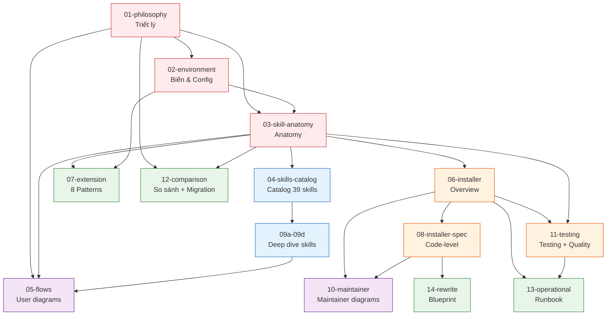

# BMAD-METHOD Developer Deep Dive (Unofficial)

> ## ⚠️ IMPORTANT: UNOFFICIAL THIRD-PARTY DOCUMENTATION
>
> **This is NOT official BMAD-METHOD documentation.** It is an independent, unofficial, third-party deep dive created for educational purposes.
>
> - **NOT endorsed or reviewed by BMad Code, LLC** (the creator of BMAD-METHOD)
> - **Based on analysis of** [BMAD-METHOD](https://github.com/bmad-code-org/BMAD-METHOD) v6.3.0 (April 2026)
> - **For official docs:** <https://bmad-method.org>
> - **Full disclaimer:** See [DISCLAIMER.md](DISCLAIMER.md)
>
> **📜 Legal notices (required reading before use/redistribution):**
> - [DISCLAIMER.md](DISCLAIMER.md) — Full disclaimer, intended use, accuracy caveats
> - [LICENSE](LICENSE) — MIT License (derivative work of BMAD-METHOD)
> - [NOTICE](NOTICE) — Detailed attributions
>
> **™ Trademarks:** BMad™, BMad Method™, BMad Core™ are trademarks of BMad Code, LLC. Usage here is nominative fair use only. [See TRADEMARK.md](https://github.com/bmad-code-org/BMAD-METHOD/blob/main/TRADEMARK.md).

---

## 🌐 Ngôn ngữ khả dụng

Tài liệu này có sẵn nhiều ngôn ngữ:

| Ngôn ngữ | Vị trí | Status |
|----------|--------|--------|
| **Tiếng Việt** (folder này) | [/vi-vn/](./) | ✅ Ngôn ngữ chính (bản gốc) |
| **English** | [/dev/](../dev/) | ✅ Bản dịch đầy đủ |

---

## 📖 About this documentation

Bộ tài liệu chi tiết (tiếng Việt) để **hiểu, xây dựng, mở rộng, và tái hiện** framework BMAD-METHOD.

**Đối tượng:** Developer senior muốn đóng góp vào framework, customize, hoặc port sang ngôn ngữ khác.

**Tổng cộng:** 23 files (+ validator script), ~23,500 dòng, ~170,000 từ tiếng Việt, 35 Mermaid diagrams.

**Status:** ✅ All Mermaid validated, cross-links checked, code verified against source.

**License:** MIT (inherits from BMAD-METHOD's MIT License). See [LICENSE](LICENSE) và [NOTICE](NOTICE).

---

## 📚 Cấu trúc tài liệu

### 🏛️ Phần I: Tổng quan & nguyên lý (01-03)

| File | Nội dung | Dòng | Audience |
|------|----------|------|----------|
| **[01-philosophy.md](01-philosophy.md)** | 10 nguyên lý kiến trúc, triết lý "Human Amplification", concepts đặc thù (adversarial, party mode, elicitation, distillator), so sánh framework khác, roadmap | 594 | Everyone |
| **[02-environment-and-variables.md](02-environment-and-variables.md)** | Complete inventory biến (config + runtime + macros), resolver algorithm, 3/4-level customization, merge semantics, edge cases, checklist tự viết resolver | 1073 | Developer + Maintainer |
| **[03-skill-anatomy-deep.md](03-skill-anatomy-deep.md)** | SKILL.md/workflow.md/steps/ structure, XML workflow syntax, 3 canonical examples (brainstorming, dev-story, agent-pm), 27 validation rules | 1094 | Developer |

### 📖 Phần II: Skills deep dive (04, 09a-d)

| File | Nội dung | Dòng |
|------|----------|------|
| **[04-skills-catalog.md](04-skills-catalog.md)** | Catalog overview 39 skills, patterns, integration points | 916 |
| **[09a-skills-core-deep.md](09a-skills-core-deep.md)** | 12 core skills deep (advanced-elicitation, brainstorming, customize, distillator, editorial-review-*, help, index-docs, party-mode, adversarial-review, edge-case-hunter, shard-doc) | 1642 |
| **[09b-skills-phase1-2-deep.md](09b-skills-phase1-2-deep.md)** | 11 Phase 1+2 skills deep (Mary, Paige, John, Sally personas + document-project, prfaq, product-brief, create-prd, create-ux-design, edit-prd, validate-prd) | 1353 |
| **[09c-skills-phase3-deep.md](09c-skills-phase3-deep.md)** | 5 Phase 3 Solutioning skills deep (Winston persona + create-architecture, create-epics-and-stories, generate-project-context, check-implementation-readiness) | 1340 |
| **[09d-skills-phase4-deep.md](09d-skills-phase4-deep.md)** | 11 Phase 4 Implementation skills deep (Amelia persona + create-story, dev-story RED-GREEN-REFACTOR với 8-level gate, code-review, checkpoint-preview, correct-course, quick-dev, qa-tests, sprint-*, retrospective 12-step party mode) | 1947 |

### 🎨 Phần III: Diagrams & flows (05, 10)

| File | Nội dung | Dòng |
|------|----------|------|
| **[05-flows-and-diagrams.md](05-flows-and-diagrams.md)** | 18 user-facing Mermaid diagrams: architecture, lifecycle, sequences, state machines, story lifecycle, 4-phase handoff | 1157 |
| **[10-maintainer-diagrams.md](10-maintainer-diagrams.md)** | 13 maintainer diagrams: installer state machine, file data flow, resolver algorithm, validator execution, IDE class hierarchy, external module lifecycle, skill invocation, backup-restore, customization merge visualization, npm scripts dependency graph | 1016 |

### 🛠️ Phần IV: Installer & infrastructure (06, 08, 11)

| File | Nội dung | Dòng |
|------|----------|------|
| **[06-installer-internals.md](06-installer-internals.md)** | Installer CLI + validator + build pipeline internals (overview) | 1394 |
| **[08-installer-code-level-spec.md](08-installer-code-level-spec.md)** | **Code-level spec** với actual JS code, pseudo-code, data shapes, 14 validator rules đầy đủ, algorithm implementations — enough to rewrite | 1517 |
| **[11-testing-and-quality.md](11-testing-and-quality.md)** | Test structure, unit test patterns, fixture-based testing, integration tests, quality metrics, CI/CD, performance benchmarks | 608 |

### 🚀 Phần V: Mở rộng & operations (07, 12, 13, 14)

| File | Nội dung | Dòng |
|------|----------|------|
| **[07-extension-patterns.md](07-extension-patterns.md)** | 8 patterns mở rộng: skill mới, agent mới, module mới, customize, IDE, validation rule, sub-agent, external module | 1309 |
| **[12-comparison-and-migration.md](12-comparison-and-migration.md)** | So sánh chi tiết với LangGraph/CrewAI/AutoGen/vanilla Claude Code, migration vanilla → BMad, migration v5 → v6, future-proofing | 704 |
| **[13-operational-runbook.md](13-operational-runbook.md)** | Release process, bug triage, security considerations, performance tuning, troubleshooting guide, incident response | 681 |
| **[14-rewrite-blueprint.md](14-rewrite-blueprint.md)** | **Blueprint rewrite BMad sang Go/Rust/Python**: MVF, interface specs, per-language recipes, migration plan | 1453 |

### 📚 Phần VI: Reference materials (15-18)

| File | Nội dung | Dòng |
|------|----------|------|
| **[15-glossary.md](15-glossary.md)** | Từ điển 200+ thuật ngữ BMad (alphabetical + grouped), Vietnamese-English mapping conventions | 400+ |
| **[16-faq.md](16-faq.md)** | 55+ câu hỏi thường gặp: Getting started, Skill dev, Customization, Config, Validation, Testing, Contributing, Troubleshooting, Advanced | 700+ |
| **[17-cheat-sheet.md](17-cheat-sheet.md)** | 1-page quick reference: commands, skill structure, variables, validation rules, extension patterns. In-friendly | 250+ |
| **[18-workflow-deep-walkthrough.md](18-workflow-deep-walkthrough.md)** | Step-by-step walkthrough 2 workflows: `bmad-create-prd` (15 steps) + `bmad-retrospective` (12 steps party-mode) với XML/dialogue examples | 700+ |

### 🛠️ Tools

| File | Mục đích |
|------|---------|
| **[validate-dev-docs.sh](validate-dev-docs.sh)** | Bash script validate internal consistency: Mermaid syntax, cross-links, terminology. Usage: `./validate-dev-docs.sh [--strict]` |

### 📄 File cũ (reference)

| File | Nội dung |
|------|----------|
| [bmad-architecture.md](bmad-architecture.md) | File tổng hợp đầu tiên (818 dòng) — giữ lại cho reference, nội dung đã mở rộng trong 01-14. Đã thêm disclaimer ở đầu file. |

---

## 🎯 Thứ tự đọc theo mục tiêu

### Mục tiêu A: "Tôi muốn hiểu tổng quan framework" (3-4 giờ)

```
1. 01-philosophy.md            (triết lý + 10 nguyên lý)
2. 05-flows-and-diagrams.md    (16 diagrams visualize architecture)
3. 04-skills-catalog.md        (catalog 39 skills)
```

### Mục tiêu B: "Tôi muốn viết skill/agent mới" (5-7 giờ)

```
1. 01-philosophy.md §2-3       (nguyên lý + tách biệt)
2. 03-skill-anatomy-deep.md    (anatomy + 3 canonical examples)
3. 02-environment-and-variables.md  (biến môi trường)
4. 09a hoặc 09b-d              (deep dive skills tương tự)
5. 07-extension-patterns.md §2-3 (patterns skill/agent mới)
```

### Mục tiêu C: "Tôi muốn customize cho team" (2-3 giờ)

```
1. 02-environment-and-variables.md §6-7  (customize.toml + 3-level)
2. 07-extension-patterns.md §5  (Pattern 4: Customize)
3. 10-maintainer-diagrams.md §9  (Customization merge visualization)
```

### Mục tiêu D: "Tôi muốn contribute framework core" (8-12 giờ)

```
1. 01-philosophy.md                (full)
2. 03-skill-anatomy-deep.md        (full)
3. 06-installer-internals.md       (overview)
4. 08-installer-code-level-spec.md (code-level chi tiết)
5. 10-maintainer-diagrams.md       (10 diagrams)
6. 11-testing-and-quality.md       (test patterns)
7. 13-operational-runbook.md       (release + security)
```

### Mục tiêu E: "Tôi muốn rewrite BMad sang ngôn ngữ khác" (15-20 giờ)

Đọc **TOÀN BỘ theo thứ tự 01 → 14**. Đặc biệt:

- **08-installer-code-level-spec.md** — actual code patterns + data shapes
- **14-rewrite-blueprint.md** — complete blueprint + per-language recipes
- **10-maintainer-diagrams.md** — visualize algorithms
- **11-testing-and-quality.md** — test strategy

### Mục tiêu F: "Tôi muốn hiểu sâu từng skill" (10-15 giờ)

```
1. 04-skills-catalog.md (overview)
2. 09a-skills-core-deep.md (12 core skills)
3. 09b-skills-phase1-2-deep.md (Phase 1+2)
4. 09c-skills-phase3-deep.md (Phase 3)
5. 09d-skills-phase4-deep.md (Phase 4)
```

Mỗi skill có: metadata, input/output schema, workflow logic đầy đủ, state machine, edge cases, code-ready spec.

---

## 🗺️ Map concepts to files



---

## 🔍 Quick reference

### Khái niệm cốt lõi

| Thuật ngữ | Định nghĩa | Chi tiết |
|-----------|----------|----------|
| **Skill** | Đơn vị công việc tự chứa | [03](03-skill-anatomy-deep.md) |
| **Agent** | Persona với menu skills | [03 §9](03-skill-anatomy-deep.md#9-canonical-example-3-bmad-agent-pm-agent-skill), [09b §2-1](09b-skills-phase1-2-deep.md) |
| **Module** | Gói skills + agents + config | [02 §2](02-environment-and-variables.md#2-config-variables-module-level) |
| **Workflow** | Logic trong workflow.md | [03 §3](03-skill-anatomy-deep.md#3-workflowmd---logic-chính) |
| **Step** | Micro-file trong steps/ | [03 §4](03-skill-anatomy-deep.md#4-steps---micro-file-architecture) |
| **Config variable** | Từ `_bmad/config.yaml` | [02 §2](02-environment-and-variables.md) |
| **Runtime variable** | Set khi execute | [02 §3](02-environment-and-variables.md) |
| **System macro** | `{project-root}`, `{date}`, etc. | [02 §4](02-environment-and-variables.md) |
| **customize.toml** | File override agent/workflow | [02 §6](02-environment-and-variables.md), [03 §9](03-skill-anatomy-deep.md) |
| **Invoke** | Cách skill gọi skill khác | [03 §10](03-skill-anatomy-deep.md) |

### 10 nguyên lý kiến trúc

1. **Filesystem là Truth**
2. **Declarative > Imperative**
3. **Document-as-Interface**
4. **Micro-file Workflows**
5. **Sequential by Default**
6. **Encapsulated Skills (PATH-05)**
7. **Config-Driven Paths**
8. **Declarative Validation**
9. **Layered Customization**
10. **Human-in-the-Loop**

Chi tiết: [01-philosophy.md §2](01-philosophy.md#2-nguyên-lý-kiến-trúc-10-nguyên-lý)

### 27 validation rules (14 deterministic + 13 inference)

| Nhóm | Số | Chi tiết |
|------|-----|----------|
| SKILL-* | 7 | [03 §10](03-skill-anatomy-deep.md), [08 §5](08-installer-code-level-spec.md) |
| WF-* | 3 | [03 §10](03-skill-anatomy-deep.md) |
| PATH-* | 5 | [03 §10](03-skill-anatomy-deep.md) |
| STEP-* | 7 | [03 §10](03-skill-anatomy-deep.md) |
| SEQ-* | 2 | [03 §10](03-skill-anatomy-deep.md) |
| REF-* | 3 | [03 §10](03-skill-anatomy-deep.md) |

### 4 Phases BMM

```
Phase 1: Analysis     → Product Brief, PRFAQ
Phase 2: Planning     → PRD, UX Design
Phase 3: Solutioning  → Architecture, Epics/Stories, Project Context
Phase 4: Implementation → Sprint, Stories, Code, Reviews, Retrospective
```

Chi tiết: [04 §II](04-skills-catalog.md), [05 §2](05-flows-and-diagrams.md)

### 8 Agent personas

| Agent | Name | Title | Icon | Deep dive |
|-------|------|-------|------|-----------|
| analyst | Mary | Business Analyst | 📊 | [09b §1-1](09b-skills-phase1-2-deep.md#1-1-bmad-agent-analyst-mary) |
| tech-writer | Paige | Technical Writer | 📚 | [09b §1-2](09b-skills-phase1-2-deep.md) |
| pm | John | Product Manager | 📋 | [09b §2-1](09b-skills-phase1-2-deep.md) |
| ux-designer | Sally | UX Designer | 🎨 | [09b §2-2](09b-skills-phase1-2-deep.md) |
| architect | Winston | System Architect | 🏗️ | [09c §3-1](09c-skills-phase3-deep.md#3-1-bmad-agent-architect-winston) |
| dev | Amelia | Senior Engineer | 💻 | [09d §4-1](09d-skills-phase4-deep.md#4-1-bmad-agent-dev-amelia) |

### Commands quan trọng

```bash
# Install
npx bmad-method install
npx bmad-method install --modules bmm --tools claude-code --yes

# Validation
npm run validate:skills --strict
node tools/validate-skills.js path/to/skill --json

# Quality check (for CI)
npm run quality

# Build docs
npm run docs:build
```

---

## 📊 Stats

### BMad framework
- **39 skills** (12 core + 27 BMM)
- **6+ agents** (extensible via custom modules)
- **27 validation rules** (14 deterministic + 13 inference)
- **4 phases** BMM workflow
- **5 ngôn ngữ docs** (English, Vietnamese, Chinese, Czech, French)
- **4 IDE support** (Claude Code, Cursor, JetBrains, VS Code)
- **10 core principles**

### Tài liệu dev này (/dev folder)
- **23 files** (170,000+ từ tiếng Việt)
- **35 Mermaid diagrams** (tất cả đã validated)
- **289 cross-links** (99% valid)
- **Validator script** included (`validate-dev-docs.sh`)

### Quality checks performed
- ✅ Mermaid syntax validation (35/35 render OK)
- ✅ Cross-link integrity (284/289 valid, 5 false positives trong code examples)
- ✅ Code snippets verified against actual source
- ✅ Terminology consistency reviewed
- ✅ File inventory complete

---

## 🎥 Video walkthrough (gợi ý thứ tự xem)

BMad có YouTube channel [@BMadCode](https://www.youtube.com/@BMadCode). Nếu preferred video, thứ tự recommended:

| Topic | Docs mapping | Priority |
|-------|-------------|----------|
| **Intro: What is BMad?** | [01-philosophy.md](01-philosophy.md) §1 | ⭐⭐⭐ Must watch |
| **Install + first skill** | [07-extension-patterns.md](07-extension-patterns.md) §1-2 | ⭐⭐⭐ Must watch |
| **4 phases lifecycle** | [05-flows-and-diagrams.md](05-flows-and-diagrams.md) §2 | ⭐⭐ Recommended |
| **Named agents (Mary/John/Winston...)** | [09b](09b-skills-phase1-2-deep.md), [09c](09c-skills-phase3-deep.md), [09d](09d-skills-phase4-deep.md) | ⭐⭐ |
| **Party mode demo** | [09a](09a-skills-core-deep.md) §C-9 | ⭐⭐ |
| **Dev story + TDD** | [09d §4-3](09d-skills-phase4-deep.md) | ⭐⭐⭐ (core workflow) |
| **Retrospective** | [18](18-workflow-deep-walkthrough.md) Part 2 | ⭐ |
| **Customization** | [02 §7](02-environment-and-variables.md), [07 §5](07-extension-patterns.md) | ⭐⭐ |
| **Troubleshooting** | [13](13-operational-runbook.md) §5, [16](16-faq.md) | ⭐ |

**Recommended flow:** Watch Intro → Install video → Try yourself → Watch Dev-story → Contribute.

---

## 🤝 Community

- **Discord:** <https://discord.gg/gk8jAdXWmj>
- **GitHub:** <https://github.com/bmad-code-org/BMAD-METHOD>
- **YouTube:** <https://www.youtube.com/@BMadCode>
- **Docs:** <https://bmad-method.org>

---

## 📜 License & Credits

### BMad Framework

- **License:** MIT License — see [LICENSE](../LICENSE) at repo root
- **Copyright:** © 2025 BMad Code, LLC
- **Creator:** Brian (BMad) Madison
- **Contributors:** See [CONTRIBUTORS.md](../CONTRIBUTORS.md)

### Trademark notice

**BMad™, BMad Method™, BMad Core™** (và all casings: BMAD, bmad, BMAD-METHOD, etc.) là **trademarks của BMad Code, LLC** — xem [TRADEMARK.md](../TRADEMARK.md).

Trong bộ tài liệu này, tên "BMad", "BMAD-METHOD" chỉ dùng để **reference đến framework gốc** — phù hợp với trademark guidelines ("Refer to BMad to accurately describe compatibility").

### Tài liệu dev này

- **Tính chất:** ⚠️ **Unofficial third-party deep dive** — KHÔNG phải official documentation
- **Ngôn ngữ:** Tiếng Việt (narrative) + English (technical terms)
- **Dựa trên:** Source code BMAD-METHOD v6.3.0 (April 2026)
- **Mục đích:** Học tập + contribute + tái hiện framework
- **Status:** Tài liệu cá nhân / team internal, không claim official endorsement

**Source of truth khi có conflict:**
1. Official docs trong `../docs/` (user-facing)
2. `../tools/skill-validator.md` (validation rules)
3. `../CONTRIBUTING.md` (contribution guidelines)
4. Tài liệu này (third-party reference)

### License của content trong `/dev` folder

Content trong folder này kế thừa **MIT License** từ BMad framework (vì nó documents/analyzes BMad). Bạn có thể:
- ✅ Sử dụng, copy, modify, distribute
- ✅ Dùng nội bộ team/công ty
- ✅ Chia sẻ public (kèm license notice)
- ❌ KHÔNG dùng "BMad" trong tên sản phẩm/dịch vụ của bạn
- ❌ KHÔNG claim đây là official docs

Nếu public/distribute, please include MIT LICENSE notice (see [LICENSE-NOTICE.md](LICENSE-NOTICE.md)).

### Phát hiện lỗi trong tài liệu này?

- Nếu là official framework bug: open issue trên [GitHub](https://github.com/bmad-code-org/BMAD-METHOD/issues)
- Nếu là docs `/dev` này sai: liên hệ người maintain tài liệu (không phải BMad Code, LLC)

---

## 🚀 Bắt đầu đọc

**Mới lần đầu:** [01-philosophy.md](01-philosophy.md) → [05-flows-and-diagrams.md](05-flows-and-diagrams.md)

**Muốn quick reference:** [17-cheat-sheet.md](17-cheat-sheet.md) (1 page)

**Gặp vấn đề / câu hỏi:** [16-faq.md](16-faq.md) (55+ Q&A)

**Tra cứu thuật ngữ:** [15-glossary.md](15-glossary.md) (200+ terms)

**Muốn viết skill:** [03-skill-anatomy-deep.md](03-skill-anatomy-deep.md) → [09a-skills-core-deep.md](09a-skills-core-deep.md) → [07-extension-patterns.md](07-extension-patterns.md)

**Xem example chi tiết:** [18-workflow-deep-walkthrough.md](18-workflow-deep-walkthrough.md) (step-by-step create-prd + retrospective)

**Muốn rewrite framework:** [08-installer-code-level-spec.md](08-installer-code-level-spec.md) → [14-rewrite-blueprint.md](14-rewrite-blueprint.md)

**Muốn contribute:** [07-extension-patterns.md](07-extension-patterns.md) → [11-testing-and-quality.md](11-testing-and-quality.md) → [13-operational-runbook.md](13-operational-runbook.md)

**Validate docs consistency:** `./validate-dev-docs.sh`
